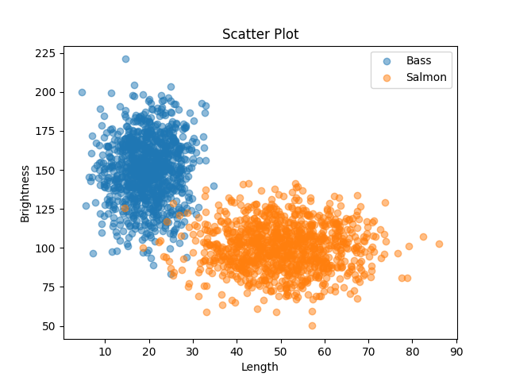
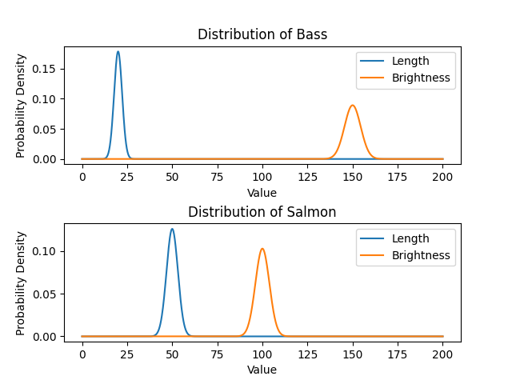
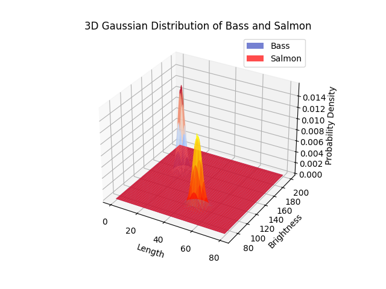

# 第一次作业


PS. 因为中文会出现方框，所以图例都是用英文的

### 第一题

#### 结果


#### 代码

```python
import numpy as np
import matplotlib.pyplot as plt

x = np.linspace(0, 2 * np.pi, 200)
y1 = np.sin(x)
y2 = np.cos(x)

plt.plot(x, y1, label='sin')
plt.plot(x, y2, label='cos')

plt.annotate(xy=(np.pi * 2 / 3, np.sin(np.pi * 2 / 3)), text=str(np.sin(2 * np.pi * 2 / 3)), xytext=(2, 0.5),
             weight='bold', color='green', arrowprops=dict(arrowstyle='-|>', connectionstyle='arc3', color='red'),
             bbox=dict(boxstyle='round,pad=0.5', fc='yellow', ec='k', lw=1, alpha=0.4))
plt.annotate(xy=(np.pi * 2 / 3, np.cos(np.pi * 2 / 3)), text=str(np.cos(2 * np.pi * 2 / 3)), xytext=(2, -1.0),
             weight='bold', color='green', arrowprops=dict(arrowstyle='-|>', connectionstyle='arc3', color='red'),
             bbox=dict(boxstyle='round,pad=0.5', fc='yellow', ec='k', lw=1, alpha=0.4))
plt.title("sin & cos")
plt.legend(loc='upper right')
plt.show()

```


### 第二题

#### 第一问

##### 结果



#### 第二问

##### 结果



#### 第三问

##### 结果



#### 代码

```python
from math import sqrt, pi

import matplotlib.pyplot as plt
import numpy as np

np.random.seed(2333)
n_samples = 1000

# 鲈鱼的数据
length_bass = np.random.normal(20, 5, n_samples)
brightness_bass = np.random.normal(150, 20, n_samples)

# 鲑鱼的数据
length_salmon = np.random.normal(50, 10, n_samples)
brightness_salmon = np.random.normal(100, 15, n_samples)

# 绘制散点图
plt.scatter(length_bass, brightness_bass, label='Bass', alpha=0.5)
plt.scatter(length_salmon, brightness_salmon, label='Salmon', alpha=0.5)
plt.xlabel('Length')
plt.ylabel('Brightness')
plt.title('Scatter Plot')
plt.legend()
plt.show()


def n_dist(x, miu, sigma):
    sigma = sqrt(sigma)
    return np.exp(-(x - miu) ** 2 / (2 * (sigma ** 2))) / (sqrt(2 * pi) * sigma)


# 绘制高斯曲线图像
x = np.linspace(0, 200, 1000)
plt.subplot(211)
plt.plot(x, n_dist(x, 20, 5), label='Length')
plt.plot(x, n_dist(x, 150, 20), label='Brightness')
plt.xlabel('Value')
plt.ylabel('Probability Density')
plt.title('Distribution of Bass')
plt.legend()
plt.subplot(212)
plt.plot(x, n_dist(x, 50, 10), label='Length')
plt.plot(x, n_dist(x, 100, 15), label='Brightness')
plt.xlabel('Value')
plt.ylabel('Probability Density')
plt.title('Distribution of Salmon')
plt.legend()
plt.subplots_adjust(hspace=0.5)
plt.show()

# 绘制三维高斯函数图像
ax = plt.subplot(111, projection='3d')

x = np.linspace(0, 80, 1000)
y = np.linspace(70, 200, 1000)
X, Y = np.meshgrid(x, y)

Z_bass = n_dist(X, 20, 5) * n_dist(Y, 150, 20)
Z_salmon = n_dist(X, 50, 10) * n_dist(Y, 100, 15)

# 绘制鲈鱼的高斯函数图像
ax.plot_surface(X, Y, Z_bass, cmap='coolwarm', alpha=0.7, label='Bass')

# 绘制鲑鱼的高斯函数图像
ax.plot_surface(X, Y, Z_salmon, cmap='autumn', alpha=0.7, label='Salmon')

ax.set_xlabel('Length')
ax.set_ylabel('Brightness')
ax.set_zlabel('Probability Density')
ax.set_title('3D Gaussian Distribution of Bass and Salmon')
ax.legend()
plt.show()

```

