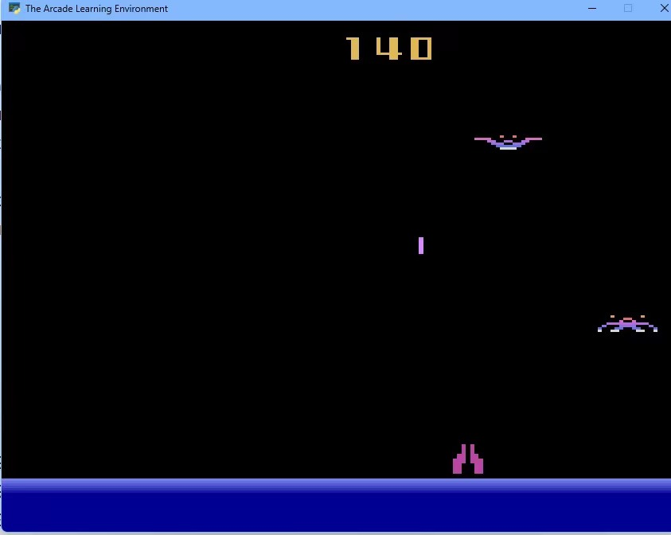
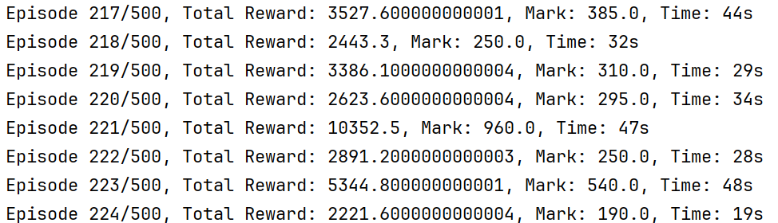
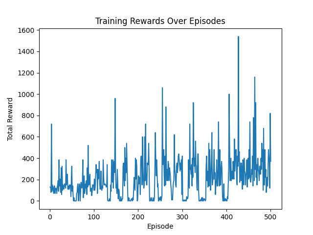

# 基于DQN强化学习的《Demon Attack》智能体

## 引言

随着深度学习和强化学习在计算机视觉领域的不断发展，我致力于开发一个基于**深度 Q 网络**（DQN）的智能体，旨在通过训练学会在给定环境中执行动作以最大化累积奖励。这一工作对于解决复杂任务和在实际场景中执行智能决策具有重要意义。

这样的强化学习系统可应用于多个领域，其中一个典型应用是在视频游戏中训练智能体。通过强化学习，我的智能体可以学会在游戏中执行各种动作，最终达到最大化累积奖励的目标。这次我训练的智能体的目标是能够较好的游玩在雅达利游戏机上十分经典的雅达利游戏  *Demon Attack* ，这个项目旨在帮助我理解强化学习的本质。因为强化学习不需要很多的实验数据，这是我选择做强化学习项目的重要原因，而且虽然这次强化学习项目的智能体只在游戏中和游戏进行交互，但是如果条件允许，智能体是可以和现实世界进行交互的，这就给了智能体无限的可能性。

## 相关工作

#### 强化学习在计算机视觉中的应用

强化学习在计算机视觉领域的应用已经取得了显著的进展。之前的工作已经探索了在类似任务中使用强化学习的可能性，但这些方法可能受到一些限制。比如说没法对模型进行有**效的引导**，我的工作旨在通过引入深度 Q 网络来改进这些方法。前人已经试过用强化学习游玩各种游戏，但是没有公布他们具体的奖励函数，这次我重新设计了一个奖励函数，我认为让我对模型达到了不错的效果。

与传统的强化学习方法相比，我的系统引入了深度学习的元素，通过卷积神经网络对状态进行建模，从而提高了对复杂环境的建模能力。相较于其他类似系统，我采用了一种更灵活的 Q-network 架构，以适应 *Demon Attack* 的游玩。

## 系统介绍

我的系统采用深度 Q 网络结构，包括卷积层和全连接层。卷积层用于提取输入状态的特征，全连接层用于学习状态与动作之间的映射关系。这种结构使得系统能够有效地处理高维输入，并在训练过程中学到适应不同环境的策略。

###  环境介绍

我使用了一个由 `openai` 创建的强化学习训练库 `gymnasium` ，选取了其中的 `ALE/DemonAttack-v5` 环境来供 AI 学习与训练。下面是我创建环境的代码：

```python
# manual config
game = "ALE/DemonAttack-v5"
show = False
rgb = False
obs_shape = (210, 160)
output_size = 6
down_scale = 2
num_episodes = 500

# auto config
render_mode = 'human' if show else 'rgb_array'
obs_type = 'rgb' if rgb else 'grayscale'

env = gym.make(game, render_mode=render_mode, obs_type=obs_type, difficulty=1, mode=1)
```

这个 *Demon Attack* 的输入空间为 $6$ ，下面是输入和其表示的意思：

| Value | Meaning     |
| ----- | ----------- |
| `0`   | `NOOP`      |
| `1`   | `FIRE`      |
| `2`   | `RIGHT`     |
| `3`   | `LEFT`      |
| `4`   | `RIGHTFIRE` |
| `5`   | `LEFTFIRE`  |

### 模型介绍

为了提高运算的效率，我的输入选择了灰度的输入方式，每帧的分辨率是 $210\times 160$ ,然后在输入的时候，我在对图像进行两倍的下取样，所以我的模型的输入大小是 $105\times 80$ ，下面是我的模型代码：包含三层卷积和两个全连接层。

```python
class QNetwork(nn.Module):
    def __init__(self, output_size):
        super(QNetwork, self).__init__()
        # 1 * 105 * 80
        self.conv1 = nn.Sequential(
            nn.Conv2d(1, 32, kernel_size=8, stride=4, padding=4),
            nn.ReLU()
        )
        # 32 * 27 * 21
        self.conv2 = nn.Sequential(
            nn.Conv2d(32, 64, kernel_size=4, stride=2, padding=2),
            nn.ReLU()
        )
        # 64 * 14 * 11
        self.conv3 = nn.Sequential(
            nn.Conv2d(64, 64, kernel_size=3, stride=1, padding=1),
            nn.ReLU()
        )
        # 64 * 14 * 11
        self.fc1 = nn.Linear(64 * 14 * 11, 128)
        self.relu = nn.ReLU()
        self.fc2 = nn.Linear(128, output_size)

    def forward(self, x):
        x = self.conv1(x)
        x = self.conv2(x)
        x = self.conv3(x)
        x = x.view(1, -1)
        x = self.fc1(x)
        x = self.relu(x)
        q_values = self.fc2(x)
        return q_values
```

在每次执行动作的时候，都以一定的概率选择随机的操作，或者使用模型得到结果：其中 `epsilon` 会随着模型的训练变动

```python
def select_action(self, state):
	if np.random.rand() < self.epsilon: # 随机选择操作
        x = np.random.choice(self.output_size)
        # print(f'a.{x}')
        return x
    else:
        with torch.no_grad():# 使用模型得到结果
            state = torch.tensor(state, dtype=torch.float32).unsqueeze(0)
            q_values = self.q_network(state.to(device))
            x = torch.argmax(q_values).item()
            # print(f'b.{q_values}, {x}')
            return x
```

### 训练过程

每次对 *Demon Attack* 的环境做出动作，每次做出动作之后得到当前的状态（State），得到的奖励（reward），是否结束（term & trunc）和一些信息。代码：

```python
action = agent.select_action(state)
next_state, reward, term, trunc, info = env.step(action)
```

然后我们就能使用得到的信息更新网络：

1. 执行动作 $a_t$ 并观察奖励 $r_t$ 和图像 $x_{t+1}$：在环境中执行选择的动作，观察得到的**奖励和下一时刻的图像**。
2. 设置下一时刻状态 $s_{t+1}$，动作 $a_t$，和预处理后的状态序列 $φ_{t+1}$：将当前状态、动作和下一时刻图像等信息**保存为下一时刻的状态信息**。
3. 将转换$(\varphi_t, a_t, r_t, \varphi_{t+1})$存储在 replay memory D 中：
4. 从 D 中随机抽样一个小批次（minibatch）的转换$(\varphi_t, a_j, r_j, \varphi_{j+1})$：
    - 从 replay memory D 中随机抽样一小批次的经验。
5. 计算目标 Q 值 $y_j$：对于每个抽样的经验，计算目标 Q-value，其中对于终止状态，$y_j = r_j$，对于非终止状态，$y_j = r_j + γ * maxa' Q(φ_j+1, a'; θ)$ 。

将这过程写成代码就是：

```python
def train(self, state, action, reward, next_state, done):
    # print(state.shape)
    state = torch.tensor(state, dtype=torch.float32).unsqueeze(0).to(device)
    next_state = torch.tensor(next_state, dtype=torch.float32).unsqueeze(0).to(device)
    action = torch.tensor(action)
    reward = torch.tensor(reward, dtype=torch.float32)
    done = torch.tensor(done, dtype=torch.float32)
    
    # print(state.shape)  
    # Calculate Q-values
	q_values = self.q_network(state)
	next_q_values = self.target_q_network(next_state)

    # Update the Q-value for the selected action
    target_q = reward + (1 - done) * self.gamma * torch.max(next_q_values)
    loss = nn.MSELoss()(q_values[0, action], target_q)
    
    # Perform a gradient descent step
    self.optimizer.zero_grad()
    loss.backward()
    self.optimizer.step()
    
    # Update the target Q-network
    self.soft_update_target_network()
    # Decay epsilon
    self.epsilon = max(self.epsilon * self.epsilon_decay, self.epsilon_min)

def soft_update_target_network(self, tau=0.001): # 考虑过去的影响
    for target_param, param in zip(self.target_q_network.parameters(), self.q_network.parameters()):
        target_param.data.copy_((1.0 - tau) * target_param.data + tau * param.data)
```

### 奖励函数的设置

在训练的过程中，我发现 AI 似乎会停在某一个地方，等着敌人撞子弹，虽然这算是一个比较不错的得分策略，但是收敛的速度实在是太慢了，于是我鼓励 AI 向敌人移动，来主动攻击敌方。然后每次失去一条生命就扣10分，击落一个敌人加100分。下面是实现的代码：

```python
if lives > info['lives']:
    reward -= 10
    lives = info['lives']
reward += pos_calc(state, action, cnt) # 如果远离敌人就扣分
```


## 实验

### 实验环境

我使用了 `openai` 的gym库，这个库提供了我用于训练AI的 *Demon Attack* 环境。在GPU环境下进行训练，采用了 `PyTorch` 深度学习框架。训练过程中，我们使用了 `Adam` 优化器来更新网络参数。我们通过累积奖励等指标来评估系统的性能。这些指标能够反映智能体在训练过程中的学习效果和决策能力。

### 实验结果分析

训练过程：





每次训练得分的统计：可以发现，训练到后面的时候，取得高分的几率高了，而且不会取得极低的分数。



实验结果显示，我们的系统在训练过程中逐渐提高累积奖励，表明智能体能够有**效地学习到在环境中执行动作的策略**。通过分析训练过程中的奖励变化，我们可以观察到系统的收敛情况和稳定性。不过游戏本身的情况比较随机，所以训练过程中的震荡比较大，但是整体上看还是能得到更高的游戏的分。

### 系统运行情况

系统在训练过程中表现出良好的收敛性和稳定性，证明了深度 Q 网络在强化学习中的有效性。通过合理的训练策略，我们的系统能够在给定环境中学到有效的决策策略。

## 总结与展望

通过引入深度 Q 网络和强化学习技术以及CNN的识别技术，我的系统在 *Demon Attack* 环境中展现出了强大的学习能力。系统的设计和训练方法使得智能体能够在复杂环境中做出高效的决策。未来的研究方向包括进一步优化系统性能、扩展到更复杂的任务和环境、以及与其他深度学习技术的结合。通过这些改进，可以这个模型可以更广泛的应用领域中取得更好的性能和适应性。

