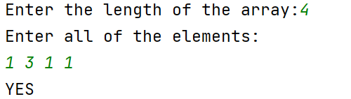
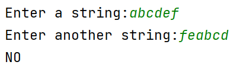

# 第一章作业

## 一、证明

1. $$\theta$$是指同阶，于是使用主方法：$$\lim_{n->\infin}\frac{10n^2-2n}{n^2}=\lim_{n->\infin}\frac{20n-2}{2n}=10$$所以说等式成立
2. 使用主方法：$$\lim_{n->\infin}\frac{2^{n+1}}{2^n-2}=\lim_{n->\infin}\frac{2}{1-\frac{2}{2^n}}=2$$关系为同阶
3. 假设$$O(f(n))>O(g(n))$$则等式的右边为$$O(f(n))$$，等式左右边使用主方法求阶得：$$\lim_{n->\infin}\frac{f(n)+g(n)}{f(n)}=\lim_{n->\infin}\frac{1+0}{1}=1$$所以等式成立

## 二、算法设计与编码实现

1. 含有n个元素的数组

    1. 设计思想：对数组排序，在数组中间的数才有可能满足条件，于是遍历一次数组，统计数组中间数的出现次数。

    2. 源码：

        ```c++
        #include<bits/stdc++.h>
        
        using namespace std;
        
        int main() {
            int x;
            cout << "Enter the length of the array:";
            cin >> x;
            vector<int> v(x);
            cout << "Enter all of the elements:\n";
            for (auto &i: v) cin >> i;
            std::sort(v.begin(), v.end());
            int cnt = 0;
            for (int &i: v)if (i == v[(x >> 1)]) cnt++;
            if (cnt > (x >> 1)) cout << "YES\n";
            else cout << "NO\n";
        }
        ```

    3. 测试运行截图：

        1. 
        2. 
        3. 

    4. 分析算法性能：使用了库函数的排序，如果快排递归次数过多，会换成堆排序，整体的时间复杂度是$$O(n\log n)$$加上最后遍历一次数组，最终为$$\theta(n\log n+n)=O(\log n)$$

2. 含*的字符串

    1. 设计思想：新建一个相同长度的字符串。从源字符串后面开始的第一个字符串开始，将非\*字符从后往前放入新字符串中，在遍历完一次之后，再用\*填满字符串。

    2. 源码

        ```c++
        #include<bits/stdc++.h>
        
        using namespace std;
        
        int main() {
            string str, buf;
            cout << "Enter a string:";
            cin >> str;
            buf = str;
            auto its = str.rbegin(), itb = buf.rbegin();
            while (its < str.rend()) {
                if (*its != '*') {
                    *itb = *its;
                    itb++;
                }
                its++;
            }
            while (itb < buf.rend()) {
                *itb = '*';
                itb++;
            }
            cout << buf;
        }
        ```

    3. 运行测试截图

        1. 
        2. 

    4. 分析算法性能：只扫了一遍字符串，但是占用了多一倍的内存。时间复杂度是$$O(n)$$，空间复杂度是$$O(n)$$。

3. 旋转词

    1. 设计思想：先判断两个字符串的长度是否相等，相等的话把一个单词两个拼接在一起，然后在拼接完成的字符串中找另外一个，可以使用KMP加快速。但是如果字符串每个字都不一样的话，其实快不了多少（绝对不是我不会写

    2. 源码

        ```c++
        #include<bits/stdc++.h>
        
        using namespace std;
        
        int main() {
            string a, b;
            cout << "Enter a string:";
            cin >> a;
            cout << "Enter another string:";
            cin >> b;
            if (a.length() != b.length()) cout << "NO\n";
            else {
                a += a;
                for (int i = 0; i < a.length(); i++) {
                    if (a[i] == b[0] && i + b.length() <= a.length()) {
                        bool flag = true;
                        for (int ii = 1; ii < b.length(); ii++) {
                            if (a[i + ii] != b[ii]) {
                                flag = false;
                                break;
                            }
                        }
                        if (flag) {
                            cout << "YES\n";
                            return 0;
                        }
                    }
                }
                cout << "NO\n";
            }
        
        }

    3. 运行测试截图

        1. 
        2. 

    4. 分析算法性能：时间的话是$$O(n^2)$$空间的话，因为一个字符串的长度延长了一倍，所以应该是$$O(n)$$。如果换KMP算法的话应该能将平均时间复杂度降到$$O(n\log n)$$。

4. 排序

    1. 设计思想：先建一个桶，然后统计每个数字出现的次数，然后将数据排序后输出。也可以使用堆来维护，但是大概的时间复杂度都是$$O(n\log n)$$，还是排序吧方便一点。

    2. 源码

        ```C++
        #include<bits/stdc++.h>
        
        using namespace std;
        
        int main() {
            cout << "Enter the number of element:";
            int n;
            cin >> n;
            array<int, 1001> cnt{0};
            cout << "Enter the elements\n";
            vector<pair<int, int>> v;
            v.reserve(n);
            while (n--) {
                int tmp;
                cin >> tmp;
                cnt[tmp]++;
            }
            for (int i = 0; i < 1001; i++)
                if (cnt[i])v.emplace_back(i, cnt[i]);
            sort(v.begin(), v.end(), [&](auto &a, auto &b) {
                return a.second > b.second;
            });
            cout << "Elem\tFreq\n";
            for (auto &p: v) cout << p.first << '\t' << p.second << '\n';
        }
        ```

    3. 运行测试截图

        1. 
        2. 

    4. 分析算法性能：首先统计个数用了1000个空间，n的时间。后面排序的元素小于等于n。总的来说时间复杂度是$$O(n\log n)$$，空间复杂度是$$O(n)$$。