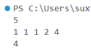
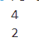

# 第二章作业（第二次作业）

## 一、


## 二、

**思路**

二分查找，先取中间的查看，如果元素大于下标就向左找，元素小于下标就向右找。

**代码**

```cpp
#include<bits/stdc++.h>

#define IO ios::sync_with_stdio(false); \
            cin.tie(nullptr);           \
            cout.tie(nullptr)
using namespace std;
using pii = pair<int, int>;
using i64 = long long;

int main() {
    int n;
    cin >> n;
    vector<int> v(n);
    for (int& i : v)cin >> i;
    function<int* (int, int)> go = [&](int l, int r)->int* {
        if (r < l) return nullptr;
        int mid = l + r >> 1;
        if (v[mid] == mid) return &v[mid];
        int* ans;
        if (v[mid] > mid) {
            ans = go(l, mid);
            if (ans != nullptr) return ans;
        }
        else return go(mid + 1, r);
        return nullptr;
    };
    auto ans = go(0, n);
    cout << (ans == nullptr ? -1 : *ans);
}
```

**结果**




## 三、

**思路**

对大于等于2且小于等于 x 的数 i，判断是否 i 能被当前的数整除，能整除就递归当前数字除以 i。如果当前数字等于1的时候，说明分解完成，计数器加一。

**代码**

```cpp
#include<bits/stdc++.h>

#define IO ios::sync_with_stdio(false); \
            cin.tie(nullptr);           \
            cout.tie(nullptr)
using namespace std;
using pii = pair<int, int>;
using i64 = long long;

int main() {
    int x;
    cin >> x;
    int cnt = 0;
    function<void(int)> go = [&](int n) {
        if (n == 1)cnt++;
        else
            for (int i = n;i > 1;i--) {
                if (n % i == 0) go(n / i);
            }
    };
    go(x);
    cout << cnt;
}
```

**结果**




## 四、

**思路**

用快速排序的思想，先将第一个作为枢纽元素，然后将比枢纽大的放在左边，比枢纽小的放在右边。如果枢纽元素的下标和需求的下标相等，直接返回枢纽元素。如果枢纽的下标小于目标就对右边排序，如果大于目标就将左边的部分排序。

**代码**

```cpp
#include<bits/stdc++.h>

#define IO ios::sync_with_stdio(false); \
            cin.tie(nullptr);           \
            cout.tie(nullptr)
using namespace std;
using pii = pair<int, int>;
using i64 = long long;

int main() {
    int n;
    cin >> n;
    vector<int> v(n);
    for (auto& i : v)cin >> i;
    function<int(int, int, int)> go = [&](int l, int r, int x) {
        if (r <= l) return -1;
        int ll = l, rr = r;
        while (ll < rr) {
            while (ll < r && v[++ll] < v[l]);
            while (rr > l && v[--rr] > v[l]);
            if (ll < rr)swap(v[ll], v[rr]);
            else break;
        }
        swap(v[l], v[rr]);
        // for (auto& i : v) cout << i << ' ';
        // cout << endl << rr << ' ' << x << endl;
        if (rr == x) return v[rr];
        if (rr > x) return go(l, rr, x);
        else return go(rr + 1, r, x);
    };
    int x;
    cin >> x;
    cout << go(0, n, x - 1);
}
```

**结果**


## 五、

**思路**

用归并排序的思想，先将数组不断切分，然后在重新组合的时候，因为左右都有序，所以将右边大于左边的部分加到计数变量里面即可。

**代码**

```cpp
#include<bits/stdc++.h>

#define IO ios::sync_with_stdio(false); \
            cin.tie(nullptr);           \
            cout.tie(nullptr)
using namespace std;
using pii = pair<int, int>;
using i64 = long long;

int main() {
	int n;
	cin >> n;
	vector<int> v(n);
	for (auto& i : v) cin >> i;
	auto go = [&](int l, int r) {
		static vector<int> tmp(v.size());
		static int cnt = 0;
		int mid = (l + r + 1) >> 1;
		for (int i = l;i < r; i++) tmp[i] = v[i];

		int ll = l, rr = mid, p = l;
		while (ll < mid && rr < r) {
			if (tmp[ll] <= tmp[rr]) v[p++] = tmp[ll++];
			else v[p++] = tmp[rr++], cnt += mid - ll;
		}
		while (ll < mid) v[p++] = tmp[ll++];
		while (rr < r) v[p++] = tmp[rr++];
		return cnt;
	};
	function<int(int, int)> div = [&](int l, int r) {
		if (r - l < 2) return 0;
		int mid = (l + r + 1) >> 1;
		div(l, mid);
		div(mid, r);
		return go(l, r);
	};
	cout << div(0, n);
}
```


**结果**


## 六、

**思路**

用分治的思想，将比赛的赛程拆分到只有两个人比赛，先填入1和2的赛程，将它变成左上角，就能扩展出左下、右下、右上的部分。

**代码**

```cpp
#include<bits/stdc++.h>

#define IO ios::sync_with_stdio(false); \
            cin.tie(nullptr);           \
            cout.tie(nullptr)
using namespace std;
using pii = pair<int, int>;
using i64 = long long;

int main() {
	int x;
	cin >> x;
	int l = 31;
	while (!((x >> --l) & 1));
	for (int i = 0;i < l;i++) {
		if ((x >> i) & 1) {
			cout << "Invalid number!";
			return 0;
		}
	}
	vector<vector<int>> grid(x + 1, vector<int>(x + 1));
	auto go = [&] {
		int n = 2;
		grid[1][1] = grid[2][2] = 1;
		grid[1][2] = grid[2][1] = 2;
		for (int t = 1; t < l; t++) {
			int pre = n;
			n <<= 1;
			for (int i = pre + 1; i <= n; i++)
				for (int j = 1; j <= pre; j++)
					grid[i][j] = grid[i - pre][j] + pre;

			for (int i = 1; i <= pre; i++)
				for (int j = pre + 1; j <= n; j++)
					grid[i][j] = grid[i + pre][(j + pre) % n];

			for (int i = pre + 1; i <= n; i++)
				for (int j = pre + 1; j <= n; j++)
					grid[i][j] = grid[i - pre][j - pre];
		}
	};
	go();
	for (int i = 1;i <= x;i++) {
		for (int ii = 2;ii <= x;ii++) cout << grid[i][ii] << ' ';
		cout << '\n';
	}
}
```


**结果**

