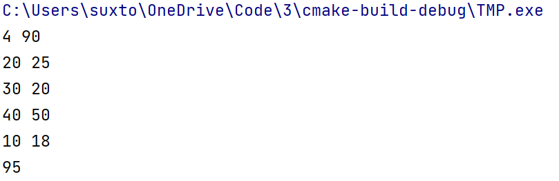
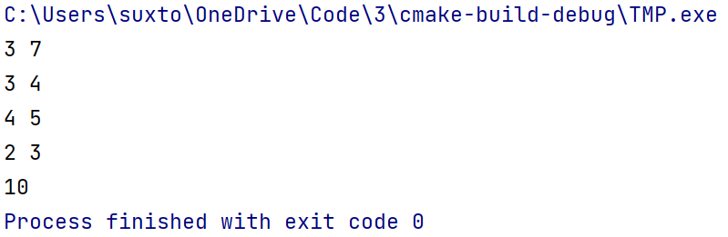
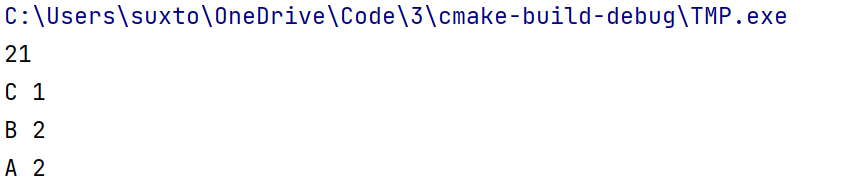
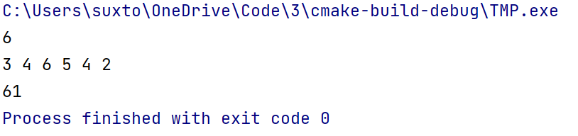
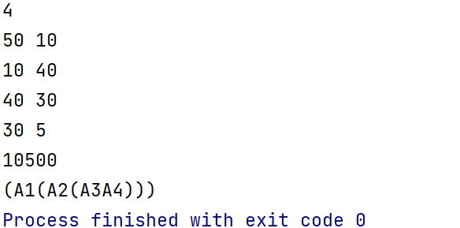

# 第三章 动态规划

## 一

**思路**

状态转移方程： $dp[i]=max(dp[i],dp[i-v[j]]+w[j])$ 其中$v[j]$是第 $j$ 个菜品所用的价格， $w[j]$ 是第 $j$ 个菜品的评价，$i$ 代表当前使用的预算。于是 $dp[i]$表示在预算为 $i$ 的情况下，能得到的最高评分。因为01背包问题，防止一个物品被多次使用，于是从后向前遍历。

**代码**

```c++
#include <bits/stdc++.h>

#define IO                                                                     \
    ios::sync_with_stdio(false);                                               \
    cin.tie(nullptr);                                                          \
    cout.tie(nullptr)
using namespace std;
using pii = pair<int, int>;
using i64 = long long;
using u64 = unsigned long long;

int main() {
    int n, m;
    cin >> n >> m;
    vector<int> dp(m + 1);
    vector<pii> v(n);
    for (auto &[a, b]: v) cin >> a >> b;
//    sort(v.begin(), v.end(), [&](pii &a, pii &b) {
//        return a < b;
//    });
    for (int i = 0; i < n; i++) {
        for (int j = m; j >= v[i].first; j--) {
            dp[j] = max(dp[j], dp[j - v[i].first] + v[i].second);
        }
    }
    cout << dp[m];
}


```

**结果**



## 二

**思路**

状态转移方程： $dp[i]=max(dp[i],dp[i-v[j]]+w[j])$ 其中$v[j]$是第 $j$ 个菜品所用的价格， $w[j]$ 是第 $j$ 个菜品的评价，$i$ 代表当前使用的预算。于是 $dp[i]$表示在预算为 $i$ 的情况下，能得到的最高评分。因为完全背包问题，一个物品可以被多次使用，于是从前向后遍历。

**代码**

```c++
#include <bits/stdc++.h>

#define IO                                                                     \
    ios::sync_with_stdio(false);                                               \
    cin.tie(nullptr);                                                          \
    cout.tie(nullptr)
using namespace std;
using pii = pair<int, int>;
using i64 = long long;
using u64 = unsigned long long;

int main() {
    int n, m;
    cin >> n >> m;
    vector<int> dp(m + 1);
    vector<pii> v(n);
    for (auto &[a, b]: v) cin >> a >> b;//cost value
    for (int i = 0; i < n; i++) {
        for (int j = v[i].first; j <= m; j++) {
            dp[j] = max(dp[j], dp[j - v[i].first] + v[i].second);
        }
    }
    cout << dp[m];
}


```

**结果**



## 三

**思路**

使用二维 `dp` ， $dp[i][j]$ 的意思是前 i 个商店放置 j 个人的最大收益。转移方程为 $dp[i][j]=\max(dp[i][j],dp[i-1][j-k]+v[i][k])$，在计算的时候枚举 $k（k\in [1,j])$ ，得到第 i 个商店选择 k 个人的利润。同时再建立一个 track 数组来记录 i 的每一个 j 值中 选择了 k 个 i，最后输出的时候从 $track[N][M]$ 开始向前遍历就行。

**代码**

```c++
#include <bits/stdc++.h>

#define IO                                                                     \
    ios::sync_with_stdio(false);                                               \
    cin.tie(nullptr);                                                          \
    cout.tie(nullptr)
using namespace std;
using pii = pair<int, int>;
using i64 = long long;
using u64 = unsigned long long;

#define M 3
#define N 5    //商店数为M,总人数为N
int v[M + 1][N + 1] = {{0, 0, 0,  0,  0,  0},
                       {0, 3, 7,  9,  12, 13},
                       {0, 5, 10, 11, 11, 11},
                       {0, 4, 6,  11, 12, 12}
};


int main() {
    vector<vector<int>> dp(M + 1, vector<int>(N + 1));
    auto track = dp;
    for (int i = 1; i <= M; i++) {
        for (int j = 1; j <= N; j++) {
            for (int k = 1; k <= j; k++) {
                int tmp = dp[i - 1][j - k] + v[i][k];
                if (tmp > dp[i][j]) {
                    dp[i][j] = tmp;
                    track[i][j] = k;
                }
            }
        }
    }
    int n = N;
    cout << dp[M][N] << '\n';
    for (int i = M; i > 0; i--) {
        cout << static_cast<char>('A' + i - 1) << ' ' << track[i][n] << '\n';
        n -= track[i][n];
    }
}


```

**结果**



## 四

**思路**

区间dp，设 $dp[l][r]$为 从 $l$ 到 $r$ 之间的最小值，于是我们就可以得到转移方程：$dp[l][r]=\min(dp[l][r],dp[l][k]+dp[k+1][r]+pre[r]-pre[i-1])$ 其中枚举 $k\in(l,r)$ 就能得到区间的最小值，pre是前缀和，为了能更快的得到 $l$ 和 $r$ 之间的和。需要注意的是，$l

**代码**

```c++
#include <bits/stdc++.h>

#define IO                                                                     \
    ios::sync_with_stdio(false);                                               \
    cin.tie(nullptr);                                                          \
    cout.tie(nullptr)
using namespace std;
using pii = pair<int, int>;
using i64 = long long;
using u64 = unsigned long long;


int main() {
    int n;
    cin >> n;
    vector<int> v(n + 1), pre(n + 1);
    vector<vector<int>> dp(n + 1, vector<int>(n + 1, 1e9));
    for (int i = 1; i <= n; i++) {
        cin >> v[i];
        pre[i] = v[i] + pre[i - 1];
        dp[i][i] = 0;
    }
    for (int gap = 1; gap <= n; gap++) {
        for (int l = 1; l <= n - gap; l++) {
            int r = l + gap;
            for (int k = l; k < r; k++) {
                dp[l][r] = min(dp[l][r], dp[l][k] + dp[k + 1][r] + pre[r] - pre[l - 1]);
            }
        }
    }
    cout << dp[1][n];
}


```

**结果**



## 五

**思路**

也是区间dp，和上题思路基本上一样。枚举k就行。需要注意的点是，矩阵相乘的次数为最左边的行数乘以断点的列数乘以最右边的列数。

**代码**

```c++
#include <bits/stdc++.h>

#define IO                                                                     \
    ios::sync_with_stdio(false);                                               \
    cin.tie(nullptr);                                                          \
    cout.tie(nullptr)
using namespace std;
using pii = pair<int, int>;
using i64 = long long;
using u64 = unsigned long long;


int main() {
    int n;
    cin >> n;
    vector<int> pre(n + 1);
    vector<vector<int>> m(n + 1, vector<int>(n + 1, 1e9));
    vector<vector<int>> s(n + 1, vector<int>(n + 1, 1e9));
    cin >> pre.front();
    for (int i = 1; i <= n; i++) {
        cin >> pre[i];
        int t;
        if (i != n)cin >> t;
        m[i][i] = 0;
//        if (i == n) pre[i] = t;
    }
//    for (int &i: pre)cout << i << ' ';
//    cout << endl;
    for (int gap = 1; gap <= n; gap++) {
        for (int l = 1; l <= n - gap; l++) {
            int r = l + gap;
            for (int k = l; k < r; k++) {
                //m[l][r] = min(m[l][r],
                int tmp = m[l][k] + m[k + 1][r] + pre[l - 1] * pre[k] * pre[r];
                if (tmp < m[l][r]) {
                    m[l][r] = tmp;
                    s[l][r] = k;
                }
            }
        }
    }
    cout << m[1][n] << '\n';
    function<void(int, int)> go = [&](int l, int r) {
        if (l == r)cout << 'A' << l;
        else {
            cout << '(';
            go(l, s[l][r]);
            go(s[l][r] + 1, r);
            cout << ')';
        }
    };
    go(1, n);
}


```


**结果**


