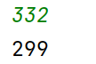

# 第四章作业

### 一、

**思路**

每一天股票持有都是两种状态，一种是持有，另一种是不持有。对于持有的状态来说，可以选择卖出，或者是继续持有，这两种操作对于资金的影响来说是不变和增加前一天持有的钱数加上当前卖出的股票减去手续费。而在不持有的状态中，可以选择继续不持有，或者是买入股票，这两个操作对不持有的天数的资金影响分别为不变和前一天不持有状态（在卖出之前不能加仓）减去购买需要的钱数。最后转换成公式就是：设资金的数组为 $v$，当前要持有的资金变量为 $hold$ ，不准备持有的资金变量为 $not\_hold$ 。对于每天来说，转移方程为 $hold=\max(hold,not\_hold-v[i])$，$not\_hold=\max(not\_hold,hold+v[i]-fee)$

**结果**


**代码**

```cpp
#include <bits/stdc++.h>

#define IO                                                                     \
    ios::sync_with_stdio(false);                                               \
    cin.tie(nullptr);                                                          \
    cout.tie(nullptr)

using namespace std;
using pii = pair<int, int>;
using i64 = long long;
using u64 = unsigned long long;


int main() {
    int n, f;
    cin >> n >> f;
    vector<int> v(n);
    for (auto &i: v) cin >> i;
    int hold = -v.front(), not_hold = 0;
    for (int i = 1; i < n; i++) {
        int pre_hold = hold;
        hold = max(hold, not_hold - v[i]);
        not_hold = max(not_hold, v[i] + pre_hold - f);
    }
    cout << max(hold, not_hold);
}


```


### 二、

**思路**

先设第一个同学的糖果为1，如果一直是递增的话，那就一直给同学更多的糖果。如果相邻的两个同学分数一样的话，可以直接给第二个同学1个糖果，如果前面的同学比后面的同学分数高的话，将后面的同学的糖果设为1，将前面比他大的同学的糖果全部加一，这里可以维护一个最近下降起点来降低时间复杂度。

**结果**


**代码**

```cpp
#include <bits/stdc++.h>

#define IO                                                                     \
    ios::sync_with_stdio(false);                                               \
    cin.tie(nullptr);                                                          \
    cout.tie(nullptr)

using namespace std;
using pii = pair<int, int>;
using i64 = long long;
using u64 = unsigned long long;


int main() {
    int n;
    cin >> n;
    vector<int> v(n);
    for (auto &i: v) cin >> i;
    int down = 0, now = 1, ans = 1;
    for (int i = 1; i < n; i++) {
        if (v[i - 1] < v[i]) ++now, down = i;
        else if (v[i - 1] > v[i]) {
            ans += i - down;
            now = 1;
        } else now = 1;
        ans += now;
    }
    cout << ans;
}


```


### 三、

**思路**

开一个数组，记录当前的5元和10元的个数，因为20元没法用于找零，就不记录了。如果收入10元且没有5元的话输出false，如果收入20元没有一张10元和一张5元或者没有3张5元的话输出false（因为10元只能用来找零20的，所以优先使用10元）

**结果**


**代码**

```cpp
#include <bits/stdc++.h>

#define IO                                                                     \
    ios::sync_with_stdio(false);                                               \
    cin.tie(nullptr);                                                          \
    cout.tie(nullptr)

using namespace std;
using pii = pair<int, int>;
using i64 = long long;
using u64 = unsigned long long;


int main() {
    int n;
    cin >> n;
    vector<int> v(n);
    for (auto &i: v) cin >> i;
    array<int, 2> num{0};
    for (auto i: v) {
        if (i == 5)num[0]++;
        else if (i == 10) {
            if (num[0]) num[0]--, num[1]++;
            else {
                cout << "false";
                return 0;
            }
        } else {
            if (num[0] && num[1]) num[0]--, num[1]--;
            else if (num[0] > 2)num[0] -= 2;
            else {
                cout << "false";
                return 0;
            }
        }
    }
    cout << "true";
    return 0;
}


```


### 四、

**思路**

直接从n往9找，找到了输出就行。

**结果**




**代码**

```cpp
#include <bits/stdc++.h>

#define IO                                                                     \
    ios::sync_with_stdio(false);                                               \
    cin.tie(nullptr);                                                          \
    cout.tie(nullptr)

using namespace std;
using pii = pair<int, int>;
using i64 = long long;
using u64 = unsigned long long;


int main() {
    int n;
    cin >> n;
    n++;
    while (--n >= 9) {
        int i = n;
        bool flag = true;
        int pre = i % 10;
        i /= 10;
        while (i > 0) {
            if (i % 10 > pre) {
                flag = false;
                break;
            }
            pre = i % 10;
            i /= 10;
        }
        if (flag) {
            cout << n;
            return 0;
        }
    }
    return 0;
}


```


### 五、

**思路**

按照结束的坐标排序，只要当前的射箭的位置小于当前的气球起点坐标，就将射箭个数加一，并将射箭位置移动到当前气球的终点处。如果大于起点坐标说明能射中当前的气球，继续判断下一个气球就行。

**结果**


**代码**

```cpp
#include <bits/stdc++.h>

#define IO                                                                     \
    ios::sync_with_stdio(false);                                               \
    cin.tie(nullptr);                                                          \
    cout.tie(nullptr)

using namespace std;
using pii = pair<int, int>;
using i64 = long long;
using u64 = unsigned long long;


int main() {
    int n;
    cin >> n;
    vector<pii> v(n);
    for (auto &[a, b]: v)cin >> a >> b;
    sort(v.begin(), v.end(), [](pii &a, pii &b) {
        return a.second < b.second;
    });
    int ans = 0;
//    int preA = v.front().first, preB = v.front().second;
    int i = 0;
    for (auto &[a, b]: v) {
        if (i < a) {
            ans++;
            i = b;
        }
    }
    cout << ans;
}


```


