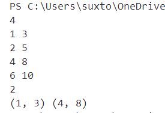
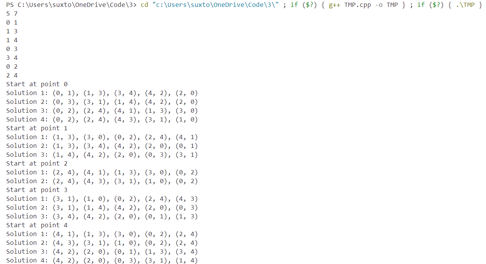
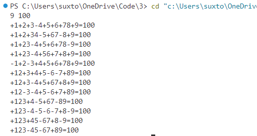
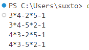
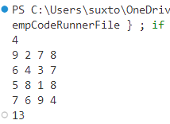

# 第五章作业（第三次）

## 一、

**思路**

由于给出的数据是根据起始时间排序的，就可以直接开始深度优先搜索。枚举每个任务选或者不选，最后更新任务个数和结果向量。

**代码**

```cpp
#include<bits/stdc++.h>

#define IO ios::sync_with_stdio(false); \
            cin.tie(nullptr);           \
            cout.tie(nullptr)
using namespace std;
using pii = pair<int, int>;
using i64 = long long;
using u64 = unsigned long long;

int main() {
    int n;
    cin >> n;
    vector<pii> v(n);
    for (auto& [a, b] : v)
        cin >> a >> b;
    u64 res = 0;
    vector<pii> ansv;
    function<void(int)> go = [&](int x) {
        static vector<pii> ans;
        if (x >= n - 1) {
            if (ans.size() > res) {
                res = ans.size();
                ansv = ans;
            }
            return;
        }
        if (ans.empty() || ans.back().second < v[x].first) {
            ans.emplace_back(v[x]);
            go(x + 1);
            ans.pop_back();
        }
        go(x + 1);
    };
    go(0);
    cout << res << '\n';
    for (auto& [a, b] : ansv) {
        cout << '(' << a << ", " << b << ") ";
    }
}
```


**结果**



## 二、

**思路**

使用深度优先搜索，在进层的时候标记一个点，并将点加入一个数组，在退层的时候，将数组的最后一个值删除

**代码**

```cpp
#include<bits/stdc++.h>

#define IO ios::sync_with_stdio(false); \
            cin.tie(nullptr);           \
            cout.tie(nullptr)
using namespace std;
using pii = pair<int, int>;
using i64 = long long;

int main() {
    int v, e;
    cin >> v >> e;
    vector<vector<int>> g(v);
    while (e--) {
        int a, b;
        cin >> a >> b;
        g[a].emplace_back(b);
        g[b].emplace_back(a);
    }
    vector<bool> vis(v);
    vector<int> ans;
    int cnt;
    function<void(int, int, int, int)> dfs = [&](int init, int now, int pre, int lay) {
        for (const int& i : g[now]) {
            if (!vis[i] && i != pre) {
                vis[i] = true;
                ans.emplace_back(i);
                dfs(init, i, now, lay + 1);
                ans.pop_back();
                vis[i] = false;
            }
            else if (i == init && lay == v) {
                cout << "Solution " << cnt++ << ": ";
                for (int ii = 0;ii < ans.size() - 1;ii++) {
                    cout << '(' << ans[ii] << ", " << ans[ii + 1] << "), ";
                }
                cout << '(' << ans.back() << ", " << i << ")\n";
            }
        }
    };
    for (int i = 0;i < v;i++) {
        cout << "Start at point " << i << '\n';
        vis[i] = true;
        ans.emplace_back(i);
        cnt = 1;
        dfs(i, i, 0, 1);
        ans.pop_back();
        vis[i] = false;
    }
}
```


**结果**



## 三、

**思路**

用DFS的思想，每次进层的时候加上当前的数字和符号，退层的时候把数字和符号删掉就行。

**代码**

```cpp
#include<bits/stdc++.h>

#define IO ios::sync_with_stdio(false); \
            cin.tie(nullptr);           \
            cout.tie(nullptr)
using namespace std;
using pii = pair<int, int>;
using i64 = long long;

int main() {
    int n, m;
    cin >> n >> m;
    vector<string> ans;
    function<void(int, int)> go = [&](int now, int sum) {
        if (now >= n) {
            if (sum == m) {
                for (auto &s: ans) cout << s;
                cout << '=' << m << '\n';
            }
            return;
        }
        int tmp = 0;
        for (int i = now + 1; i <= n; i++) {
            tmp = tmp * 10 + i;
            ans.emplace_back("+" + to_string(tmp));
            go(i, sum + tmp);
            ans.pop_back();

            ans.emplace_back("-" + to_string(tmp));
            go(i, sum - tmp);
            ans.pop_back();
        }
    };
    go(0, 0);
}
```

**结果**



## 四、

**思路**

只要求出1到5的全排列，带入公式，如果等于1就输出

**代码**

```cpp
#include<bits/stdc++.h>

#define IO ios::sync_with_stdio(false); \
            cin.tie(nullptr);           \
            cout.tie(nullptr)
using namespace std;
using pii = pair<int, int>;
using i64 = long long;

int main() {
    function<void(int)> go = [&](int x) {
        static vector<bool> vis(x + 1);
        static vector<int> track;
        if (track.size() == x) {
            int tmp = track[0] * track[1] - track[2] * track[3] - track[4];
            if (tmp == 1)
                cout << track[0] << '*' << track[1] << '-' << track[2] << '*' << track[3] << '-' << track[4] << '\n';
        }
        for (int i = 1; i <= x; i++) {
            if (!vis[i]) {
                track.emplace_back(i);
                vis[i] = true;
                go(x);
                vis[i] = false;
                track.pop_back();
            }
        }
    };
    go(5);
}
```

**结果**



## 五、

**思路**

深度优先搜索，对每个人做每个工作进行枚举，每次得到的总时长与之前记录的最短时长进行比较，在发现当前时长大于最短时长之后及时剪枝退层。

**代码**

```cpp
#include<bits/stdc++.h>

#define IO ios::sync_with_stdio(false); \
            cin.tie(nullptr);           \
            cout.tie(nullptr)
using namespace std;
using pii = pair<int, int>;
using i64 = long long;

int main() {
    int ans = INT_MAX;
    int n;
    cin >> n;
    vector<vector<int>> v(n + 1, vector<int>(n + 1));
    for (int i = 1;i <= n;i++)
        for (int ii = 1;ii <= n;ii++) cin >> v[i][ii];

    function<void(int)> go = [&](int x) {
        static vector<bool> vis(n + 1);
        static vector<int> rec;
        if (x >= ans) return;
        if (rec.size() == n) {
            ans = x;
            return;
        }
        for (int i = 1;i <= n;i++)
            if (!vis[i]) {
                rec.emplace_back(i);
                vis[i] = true;
                go(x + v[rec.size()][i]);
                vis[i] = false;
                rec.pop_back();
            }
    };
    go(0);
    cout << ans;
}
```

**结果**


