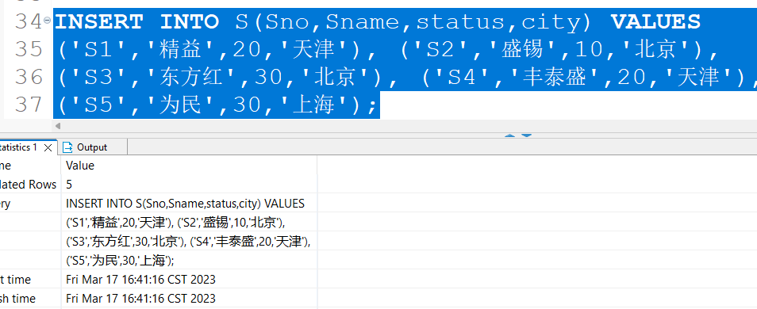
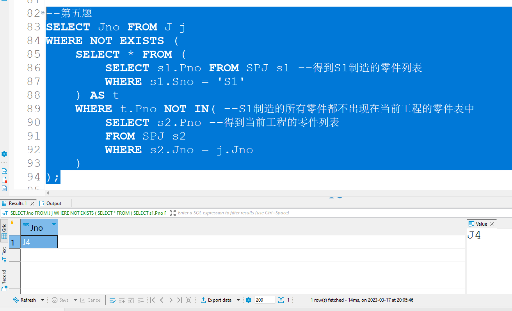

# 第一次实验

## 实验目标


## 实验环境

我在我的电脑上安装了最新的SQL Server 2022开发者版，安装完成后从SQL Server的控制面板启动服务进程。


由于我之前学习过MySQL，所以我决定还是使用我习惯的数据库图形化管理工具来进行实验，我这里使用的工具是 `DBeaver`。

使用 `DBeaver` 连接SQL Server


## 实验过程

1. （第四题）创建四个表，并执行查询操作

    1. 创建表：

        1. 创建S表：

            

        2. 创建P表：

            

        3. 创建J表：

            

        4. 创建SPJ表：

            

    2. 给表插入数据

        1. 向S表插入数据：

            
        2. 向P表插入数据：

            
        3. 向J表插入数据：

            
        4. 向SPJ表插入数据：

            

    3. 开始查询

        1. 供应工程J1零件的供应商号码SNO

            

        2. 供应工程J1零件P1的供应商号码SNO

            

        3. 求供应工程J1零件为红色的供应商号码SNO

            

        4. 求没有使用天津供应商生产的红色零件的工程号码JNO

            

        5. 求至少用了供应商S1所供应的全部零件的工程号JNO

            

    4. 代码汇总

        ```sql
        USE hello;
        
        CREATE TABLE S(
        	Sno VARCHAR(5) PRIMARY KEY,
        	Sname VARCHAR(20),
        	status int,
        	city VARCHAR(20)
        );
        
        CREATE TABLE P(
        	Pno VARCHAR(5) PRIMARY KEY,
        	Pname VARCHAR(20),
        	color VARCHAR(10),
        	weight int
        );
        
        CREATE TABLE J(
        	Jno VARCHAR(5) PRIMARY KEY,
        	Jname VARCHAR(20),
        	city VARCHAR(20)
        );
        
        CREATE TABLE SPJ(
        	Sno VARCHAR(5),
        	Pno VARCHAR(5),
        	Jno VARCHAR(5),
        	qty int,
        	PRIMARY KEY(Sno,Pno,Jno),
        	FOREIGN KEY(Sno) REFERENCES S(Sno),
        	FOREIGN KEY(Pno) REFERENCES P(Pno),
        	FOREIGN KEY(Jno) REFERENCES J(Jno)
        );
        
        INSERT INTO S(Sno,Sname,status,city) VALUES 
        ('S1','精益',20,'天津'), ('S2','盛锡',10,'北京'),
        ('S3','东方红',30,'北京'), ('S4','丰泰盛',20,'天津'),
        ('S5','为民',30,'上海');
        
        
        INSERT INTO P(Pno,Pname,color,weight) VALUES
        ('P1','螺母','红',12), ('P2','螺栓','绿',17),
        ('P3','螺丝刀','蓝',14), ('P4','螺丝刀','红',14),
        ('P5','凸轮','蓝',40), ('P6','齿轮','红',30);
        
        INSERT INTO J(Jno,Jname,city) VALUES
        ('J1','三建','北京'), ('J2','一汽','长春'),
        ('J3','弹簧厂','天津'), ('J4','造船厂','天津'),
        ('J5','机车厂','唐山'),('J6','无线电厂','常州'),
        ('J7','半导体厂','南京');
        
        INSERT INTO SPJ(Sno,Pno,Jno,qty) VALUES
        ('S1','P1','J1',200), ('S1','P1','J3',100),
        ('S1','P1','J4',700), ('S1','P2','J2',100),
        ('S2','P3','J1',400), ('S2','P3','J2',200),
        ('S2','P3','J4',500), ('S2','P3','J5',400),
        ('S2','P5','J1',400), ('S2','P5','J2',100),
        ('S3','P1','J1',200), ('S3','P3','J1',200),
        ('S4','P5','J1',100), ('S4','P6','J3',300),
        ('S4','P6','J4',200), ('S5','P2','J4',100),
        ('S5','P3','J1',200), ('S5','P6','J2',200),
        ('S5','P6','J4',500);
        
        --第一题
        SELECT SNO FROM SPJ 
        WHERE JNO = 'J1';
        
        --第二题
        SELECT Sno FROM SPJ 
        WHERE Jno = 'J1' AND Pno = 'P1'; 
        
        --第三题
        SELECT Sno 
        FROM SPJ JOIN P ON SPJ.Pno = P.Pno
        WHERE Jno = 'J1' AND COLOR = '红';
        
        --第四题
        SELECT Jno
        FROM SPJ JOIN P ON SPJ.Pno = P.Pno
        JOIN S ON S.Sno = SPJ.Sno
        WHERE color = '红' AND city <> '天津';
        
        --第五题
        SELECT Jno FROM J j
        WHERE NOT EXISTS (
        	SELECT * FROM (
        		SELECT s1.Pno FROM SPJ s1 --得到S1制造的零件列表
        		WHERE s1.Sno = 'S1'
        	) AS t 
        	WHERE t.Pno NOT IN( --S1制造的所有零件都不出现在当前工程的零件表中
        		SELECT s2.Pno --得到当前工程的零件列表
        		FROM SPJ s2
        		WHERE s2.Jno = j.Jno
        	)
        );
        ```

        

2. （第五题）

    1. 找出所有供应商的姓名和所在城市

        

    2. 找出所有零件的名称、颜色、重量

        

    3. 找出使用供应商 S1所供应零件的工程号码

        

    4. 找出工程项目J2 使用的各种零件的名称及其数量

        

    5. 找出上海厂商供应的所有零件号码

        

    6. 找出使用上海产的零件的工程名称

        

    7. 找出没有使用天津产的零件的工程号码

        

    8. 把全部红色零件的颜色改成蓝色

        

    9. 由S5供给J4的零件P6改为由S3供应，请作必要的修改

        

    10. 从供应商关系中删除 S2 的记录，并从供应情况关系中删除相应的记录

        

    11. 请将(S2,J6,P4,200)插入供应情况关系

         

    12. 完整代码

         ```sql
         USE hello;
         
         --1.
         SELECT Sname, city
         FROM S;
         
         --2.
         SELECT Pname, color, weight
         FROM P;
         
         --3.
         SELECT Jno 
         FROM SPJ 
         WHERE Sno = 'S1';
         
         --4.
         SELECT p.Pname, s.qty
         FROM SPJ s join P p on s.Pno = p.Pno
         WHERE s.Jno = 'J2';
         
         --5.
         SELECT p.Pno
         FROM P p
         WHERE p.Pno IN (
             SELECT sp.Pno
             FROM SPJ sp join S s on sp.Sno = s.Sno
             WHERE s.city = '上海'
         );
         
         --6.
         SELECT j.Jno
         FROM J j
         WHERE EXISTS (
             SELECT *
             FROM (
                 SELECT spj1.Sno
                 FROM SPJ spj1
                 WHERE spj1.Jno = j.Jno
             ) AS tmp
             WHERE tmp.Sno IN(
                 SELECT DISTINCT spj.Sno 
                 FROM SPJ spj JOIN S s ON spj.Sno = s.Sno
                 WHERE s.city = '上海'
             )
         )
         
         --7.
         SELECT j.Jno
         FROM J j
         WHERE NOT EXISTS (
             SELECT *
             FROM (
                 SELECT spj1.Sno
                 FROM SPJ spj1
                 WHERE spj1.Jno = j.Jno
             ) AS tmp
             WHERE tmp.Sno IN(
                 SELECT DISTINCT spj.Sno 
                 FROM SPJ spj JOIN S s ON spj.Sno = s.Sno
                 WHERE s.city = '天津'
             )
         )
         
         --8.
         UPDATE P 
         SET color = '蓝'
         WHERE color = '红';
         
         --9.
         UPDATE SPJ 
         SET Sno = 'S3'
         WHERE Sno = 'S5' AND Jno = 'J4';
         
         --10.
         DELETE FROM SPJ
         WHERE Sno = 'S2';
         DELETE FROM S
         WHERE Sno = 'S2';
         
         --11.
         INSERT INTO S(Sno,Sname,status,city) VALUES
         ('S2','盛锡',10,'北京');
         INSERT INTO SPJ(Sno,Jno,Pno,qty) VALUES
         ('S2','J6','P4',200);
         ```

         