# 作业三、四、五

1. 查询‘1’系的全体学生的学号、姓名和宿舍情况，结果按宿舍号升序排列。

    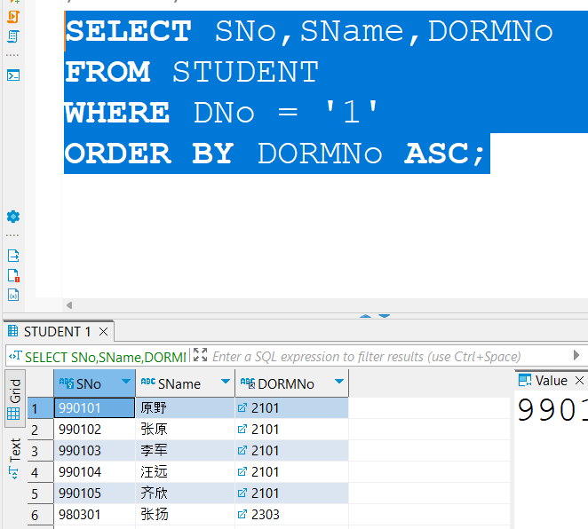

2. 查询‘1’系的全体学生的详细记录，结果按性别升序、年龄降序排列。

    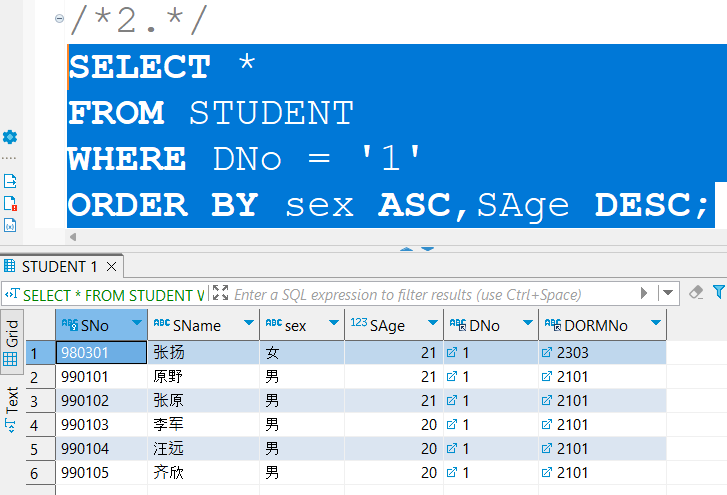

3. 查询‘2’系的姓名和其出生年月(以 2003 年为标准)，并用“BIRTHDAY”改变结果标题。

    

4. 查询 GRADE 表中所有被学生选修课程号。

    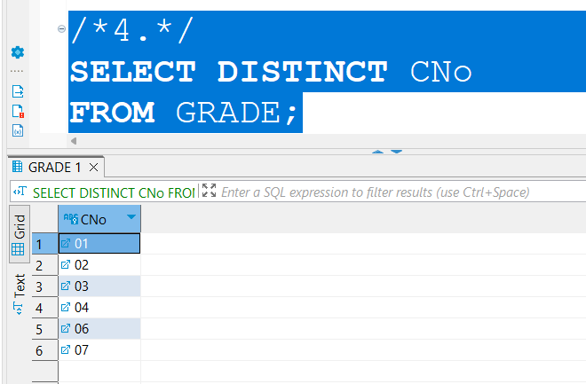

5. 查询年龄在 21-23 之间（包括 21 和 23）的学生姓名，宿舍号。

    

6. 查询‘2’系、‘3’系和‘4’系的学生姓名。

    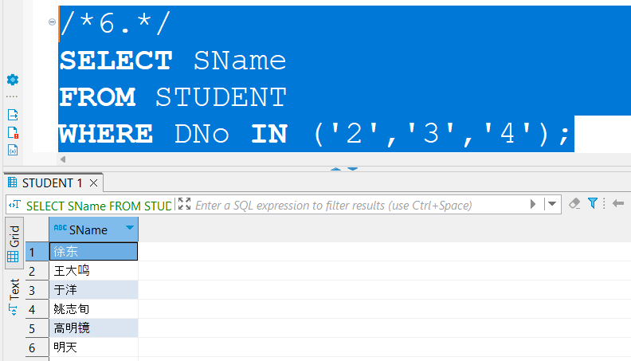

7. 查询所有姓‘张’的学生情况。

    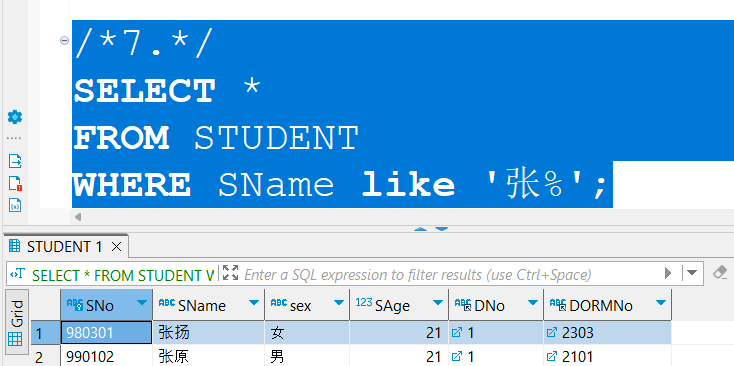

8. 查询姓名中第二个字为“明”的学生情况

    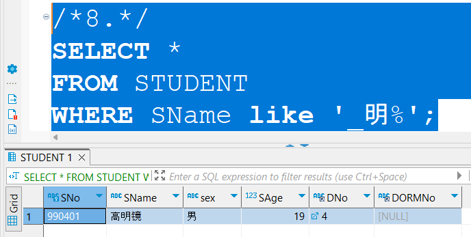

9. 查询 COURSE 表中没有先修课程的课程名和教师情况

    

10. 查询‘1’系的所有男学生的信息

    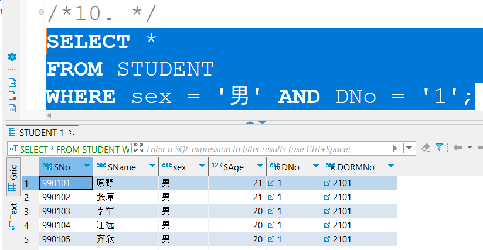

11. 查询所有‘1’系的学生人数。

     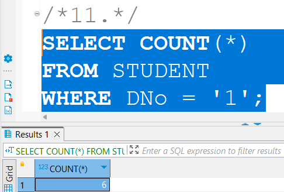

12. 查询‘1’系选修‘01’号课程的最高分、最低分和平均分。

     

13. 查询选修了 4 门以上课程的学生学号、姓名。

     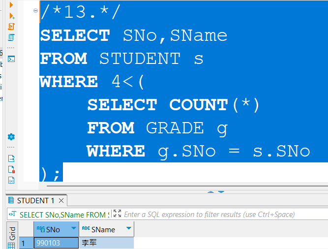

14. 给出所有院系领导检查学生宿舍的所有可能。

     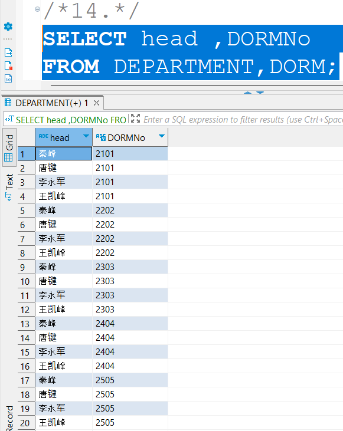

15. 查询所有学生及其宿舍情况。

     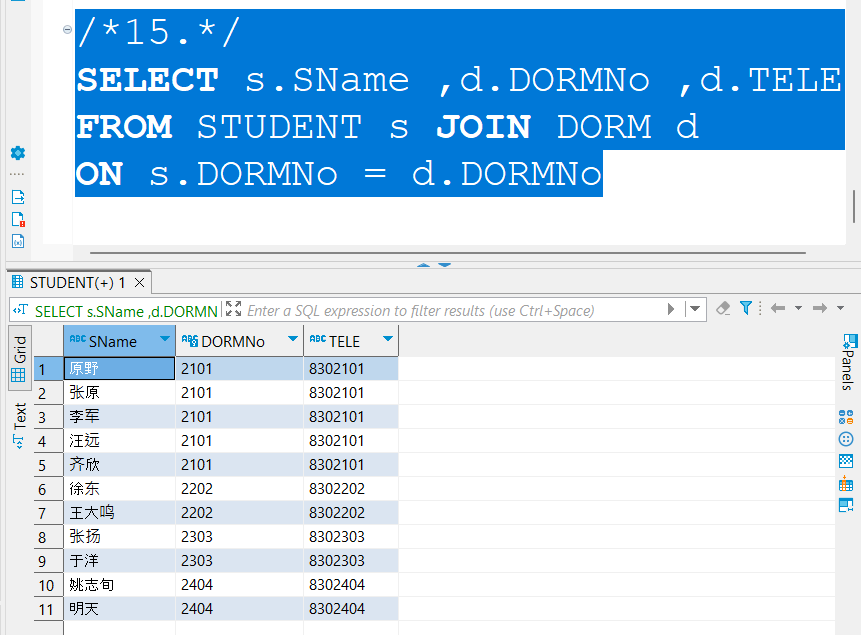

16. 查询所有课程的间接先修课。

     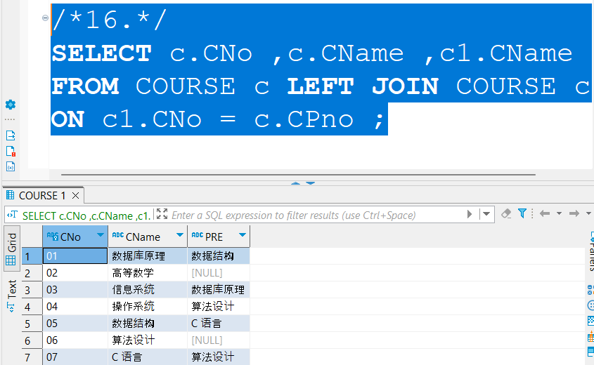

17. 查询所有学生及其选修课程情况。

     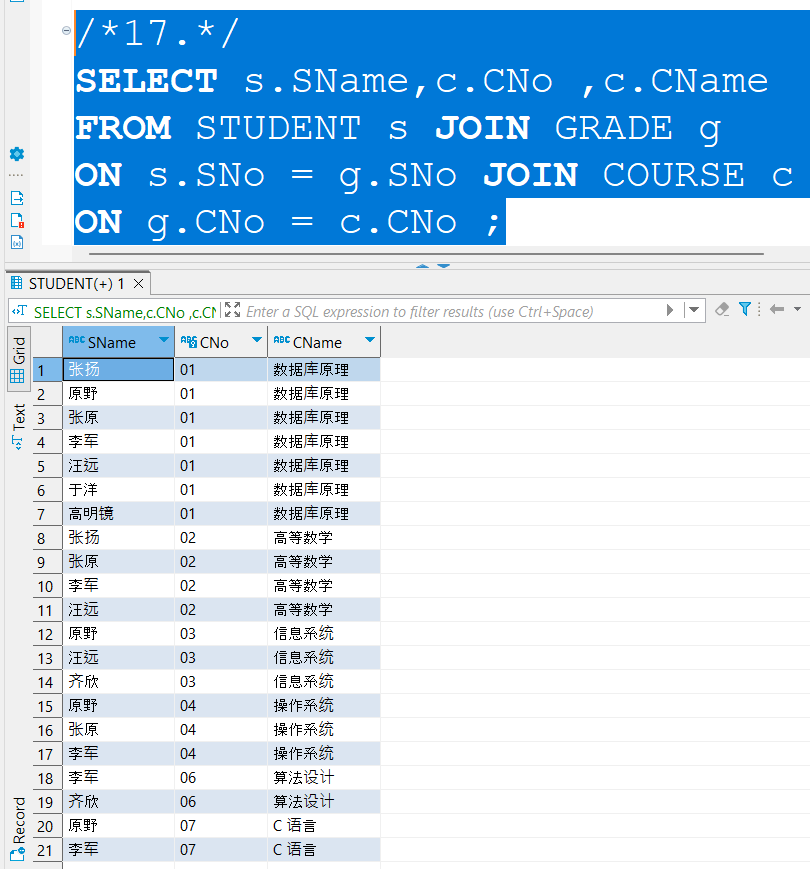

18. 查询所有已选修课程的学生的学号、姓名、选修的课程名和授课教师信息。

     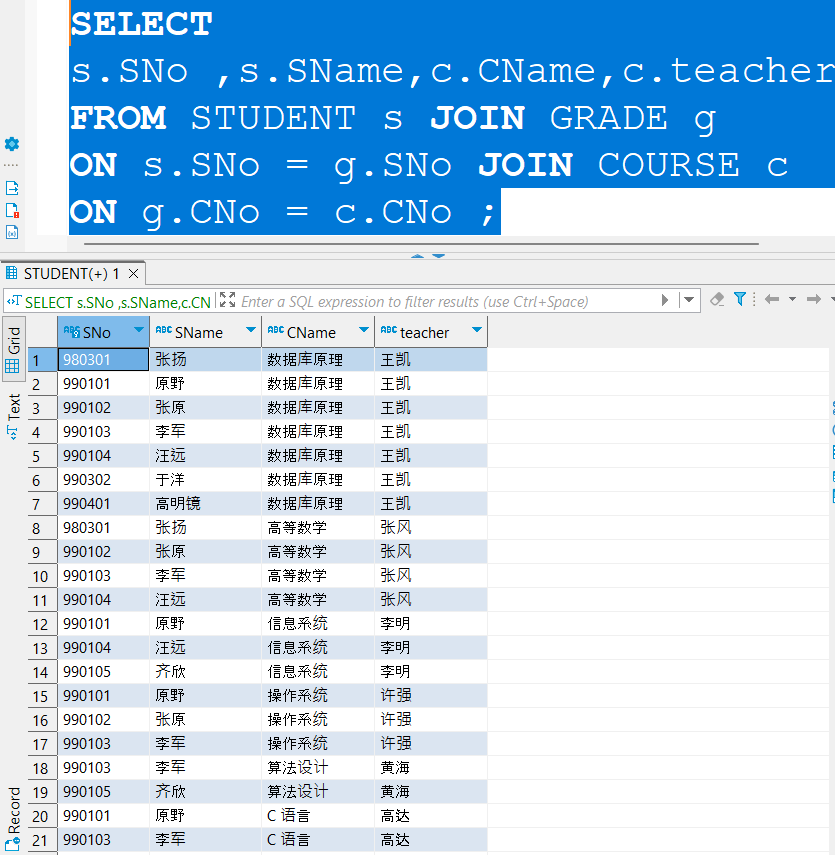

19. 查询是系主任‘秦峰’的学生的姓名和宿舍联系电话。

     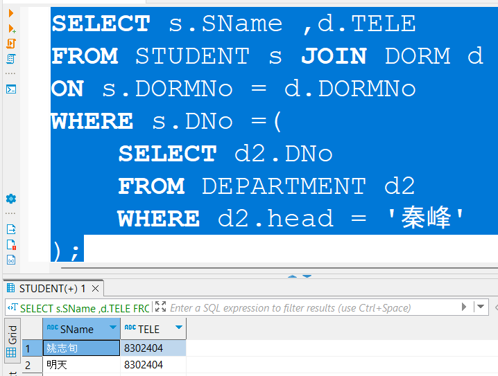

20. 查询其他系比‘计算机系’所有学生年龄大的学生姓名和年龄。

     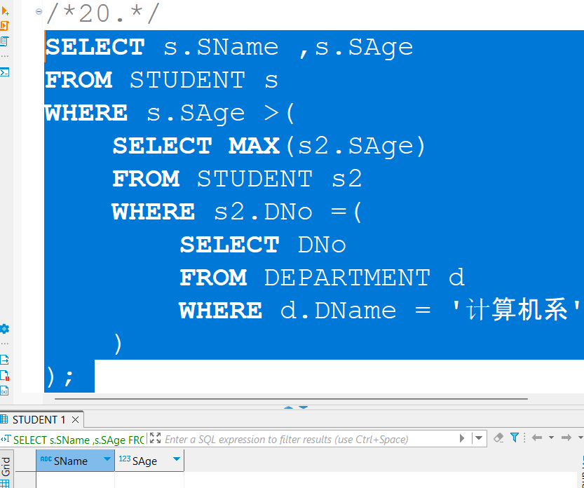

21. 查询选修课程库没有不及格分数的学生。

     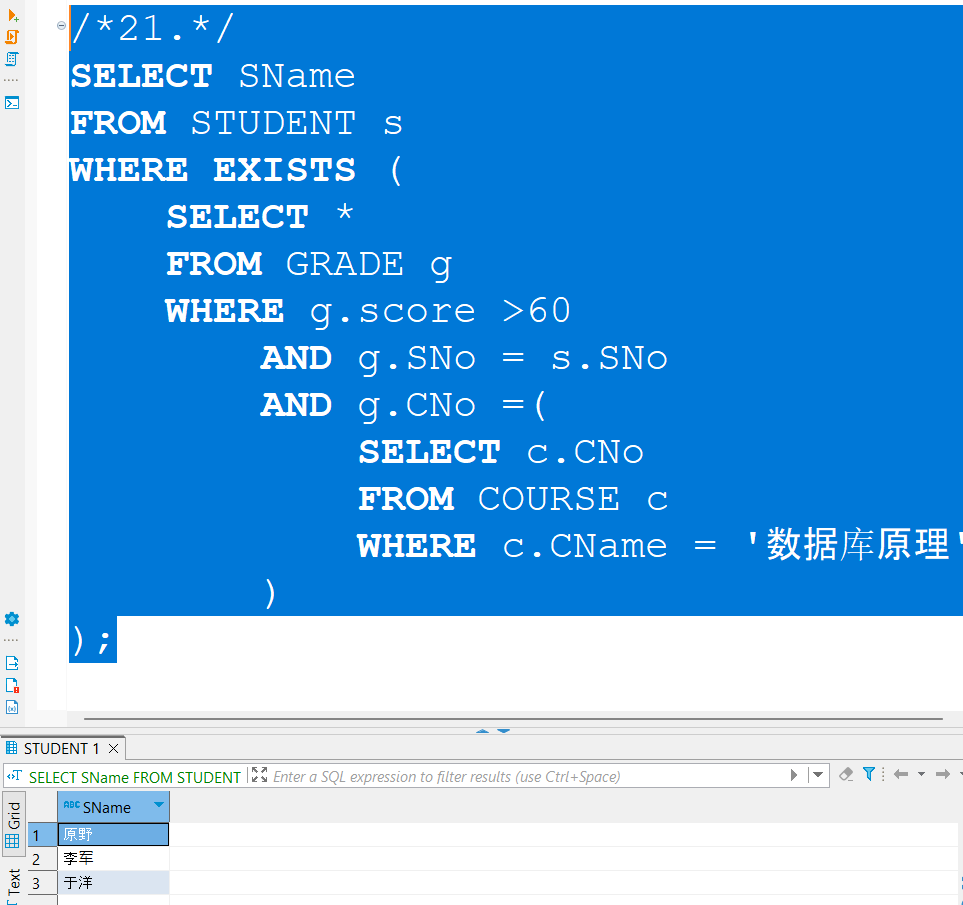

22. 查询至少选修了‘1’号和‘2’号课程的学生号码。

     

23. 查询至少选修了‘990102’学生的全部课程的学生学号。

     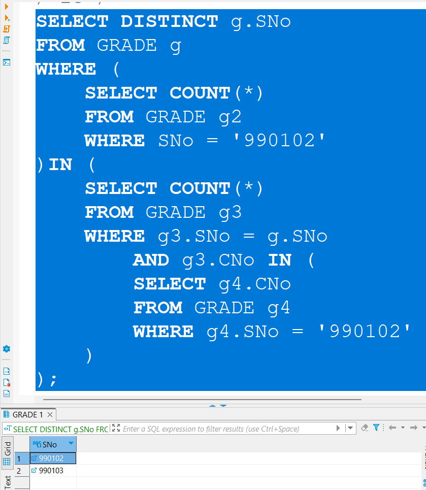

24. 查询‘1’系的学生与年龄大于 20 岁的学生的差集。

     

25. 查询选修“数据库原理”的学生与选修“高等数学”的学生的交集。

     

     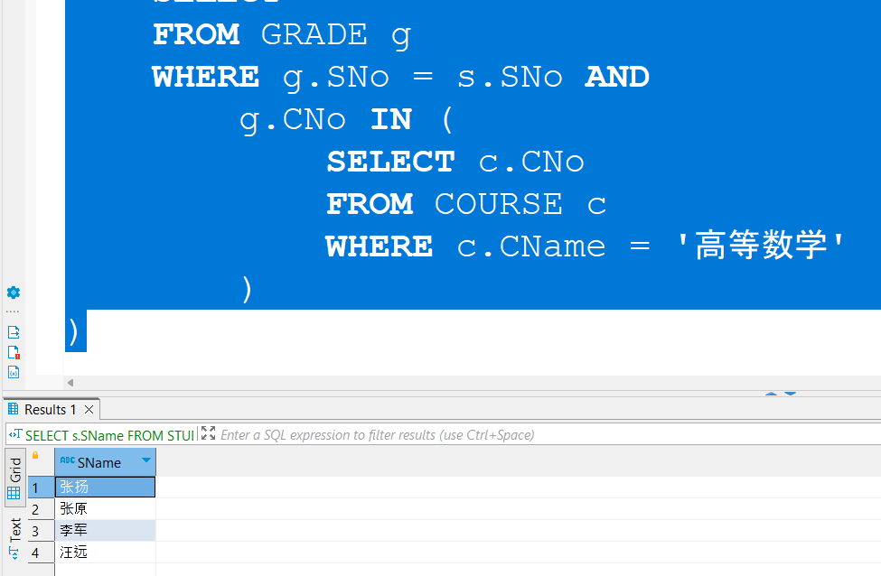

26. 创建“计算机”系的所有男生的视图 VIEW_1（要求反映出学生的出生年份）。

     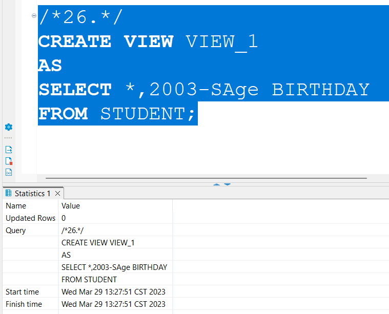

27. 在视图 VIEW_1 中找出名字中有“原”字的学生的学号、姓名、宿舍号。

     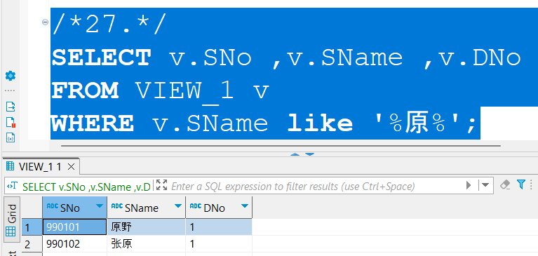

28. 修改视图 VIEW_1 中的学生“李军”的年龄为 23，宿舍号为“2202”。

     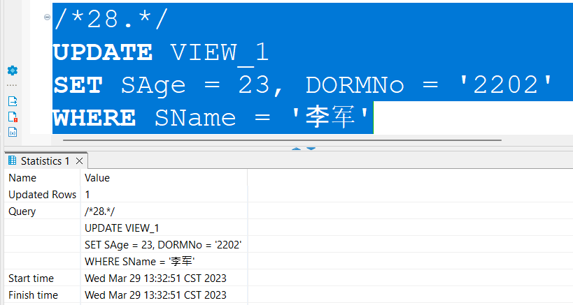


### 代码汇总

```sql
/*1.*/
SELECT SNo,SName,DORMNo 
FROM STUDENT
WHERE DNo = '1'
ORDER BY DORMNo ASC;

/*2.*/
SELECT * 
FROM STUDENT 
WHERE DNo = '1'
ORDER BY sex ASC,SAge DESC;

/*3.*/
SELECT SName, 2003-SAge BIRTHDAY
FROM STUDENT s 
WHERE DNo = '2';

/*4.*/
SELECT DISTINCT CNo 
FROM GRADE;

/*5.*/
SELECT SName,DORMNo
FROM STUDENT 
WHERE SAge BETWEEN 21 AND 23;

/*6.*/
SELECT SName
FROM STUDENT
WHERE DNo IN ('2','3','4');

/*7.*/
SELECT * 
FROM STUDENT
WHERE SName like '张%';

/*8.*/
SELECT * 
FROM STUDENT
WHERE SName like '_明%';

/*9.*/
SELECT CName ,teacher
FROM COURSE 
WHERE CPno IS NULL ;

/*10.*/
SELECT *
FROM STUDENT 
WHERE sex = '男' AND DNo = '1';

/*11.*/
SELECT COUNT(*)
FROM STUDENT
WHERE DNo = '1';

/*12.*/
SELECT 
 MAX(score),MIN(score),AVG(score)
FROM GRADE

/*13.*/
SELECT SNo,SName
FROM STUDENT s
WHERE 4<(
	SELECT COUNT(*)
	FROM GRADE g  
	WHERE g.SNo = s.SNo 
);

/*14.*/
SELECT head ,DORMNo
FROM DEPARTMENT,DORM;

/*15.*/
SELECT s.SName ,d.DORMNo ,d.TELE 
FROM STUDENT s JOIN DORM d 
ON s.DORMNo = d.DORMNo

/*16.*/
SELECT c.CNo ,c.CName ,c1.CName PRE
FROM COURSE c LEFT JOIN COURSE c1
ON c1.CNo = c.CPno ;


/*17.*/
SELECT s.SName,c.CNo ,c.CName  
FROM STUDENT s JOIN GRADE g 
ON s.SNo = g.SNo JOIN COURSE c 
ON g.CNo = c.CNo ;

/*18.*/
SELECT 
s.SNo ,s.SName,c.CName,c.teacher  
FROM STUDENT s JOIN GRADE g 
ON s.SNo = g.SNo JOIN COURSE c 
ON g.CNo = c.CNo ;

/*19.*/
SELECT s.SName ,d.TELE 
FROM STUDENT s JOIN DORM d 
ON s.DORMNo = d.DORMNo 
WHERE s.DNo =(
	SELECT d2.DNo 
	FROM DEPARTMENT d2
	WHERE d2.head = '秦峰'
);

/*20.*/
SELECT s.SName ,s.SAge 
FROM STUDENT s 
WHERE s.SAge >(
	SELECT MAX(s2.SAge)
	FROM STUDENT s2 
	WHERE s2.DNo =(
		SELECT DNo 
		FROM DEPARTMENT d 
		WHERE d.DName = '计算机系'
	)
); 

/*21.*/
SELECT SName
FROM STUDENT s 
WHERE EXISTS (
	SELECT * 
	FROM GRADE g 
	WHERE g.score >60 
		AND g.SNo = s.SNo 
		AND g.CNo =(
			SELECT c.CNo 
			FROM COURSE c
			WHERE c.CName = '数据库原理'
		)
);

/*22.*/
SELECT g.SNo
FROM GRADE g 
WHERE g.CNo = '01'
INTERSECT 
SELECT g2.SNo 
FROM GRADE g2 
WHERE g2.CNo = '02';

/*23*/
SELECT DISTINCT g.SNo 
FROM GRADE g 
WHERE (
	SELECT COUNT(*)
	FROM GRADE g2 
	WHERE SNo = '990102'
)IN (
	SELECT COUNT(*)
	FROM GRADE g3 
	WHERE g3.SNo = g.SNo 
		AND g3.CNo IN (
		SELECT g4.CNo 
		FROM GRADE g4 
		WHERE g4.SNo = '990102'
	)
);

/*24.*/
SELECT s.SName 
FROM STUDENT s 
WHERE s.DNo = '1'
EXCEPT 
SELECT s2.SName 
FROM STUDENT s2 
WHERE s2.SAge >20;

/*25.*/
SELECT s.SName 
FROM STUDENT s 
WHERE EXISTS (
	SELECT *
	FROM GRADE g 
	WHERE g.SNo = s.SNo AND 
		g.CNo IN (
			SELECT c.CNo 
			FROM COURSE c
			WHERE c.CName = '数据库原理'
		)
)
INTERSECT
SELECT s.SName 
FROM STUDENT s 
WHERE EXISTS (
	SELECT *
	FROM GRADE g 
	WHERE g.SNo = s.SNo AND 
		g.CNo IN (
			SELECT c.CNo 
			FROM COURSE c
			WHERE c.CName = '高等数学'
		)
)

/*26.*/
CREATE VIEW VIEW_1
AS
SELECT *,2003-SAge BIRTHDAY
FROM STUDENT;

/*27.*/
SELECT v.SNo ,v.SName ,v.DNo  
FROM VIEW_1 v 
WHERE v.SName like '%原%';

/*28.*/
UPDATE VIEW_1 
SET SAge = 23, DORMNo = '2202'
WHERE SName = '李军'


```

