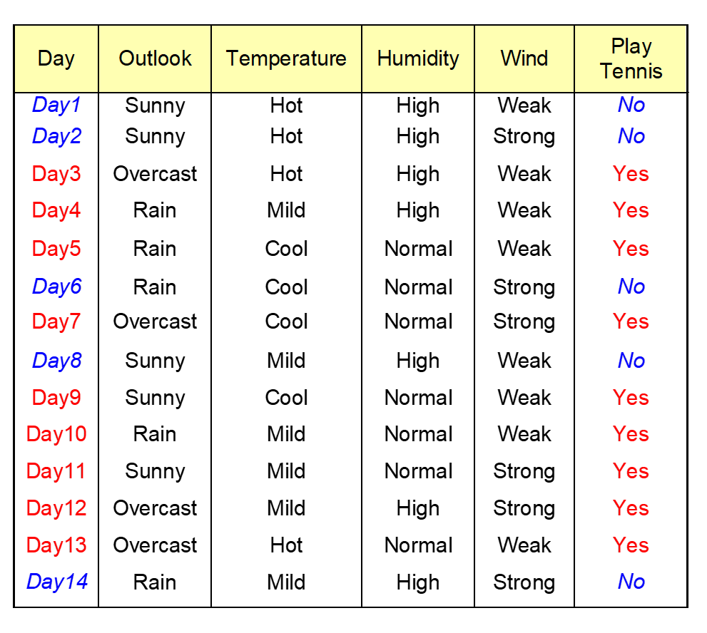

# 10月24作业

1. 分类器的评估方法有哪些。
    1. **Holdout集合**：将数据D分为测试集和训练集，其中 $$D=D_{train}\cup D_{test}~~~~~\empty =D_{train}\cap D_{test}$$一般两个集合的比例是50：50或者$$\frac{2}{3}$$训练，$$\frac{1}{3}$$用来测试。
    1. **多次随机采样：**多次进行测试集和训练集的划分，生成多个测试集和训练集，得到$$n$$个精度，然后计算这些精度的**平均值**。
    1. **交叉验证：**将数据分为 $$n$$ 个不相交的集合，将其中的 $$n-1$$ 个集合用作训练值，1个作为测试集。得到n个精度的**平均值**

2. 查准率和查全率的含义。

    1. **查准率** $$p=\frac{TP}{TP+FP}$$，找出的**分类正类**里面，**正确分类正类**的比例。

    2. **查全率** $$r=\frac{TP}{TP+FN}$$，找出**实际正类**中，**正确分类正类**的比例。

3. ROC曲线需要计算哪些指标，简述画ROC曲线的过程。

    1. 先将分类器的输出值**降序排列**。

    2. 计算**真阳率** $$TPR=\frac{TP}{TP+FN}$$，找出**实际正类**中，**正确分类正类**的比例。

    3. 计算**假阳率** $$FPR=\frac{FP}{TN+FP}$$，找出**实际负类**中，**错误分类正类**的比例。

    4. 将**假阳率**作为**横轴**，**真阳率**作为纵轴，描点画图。

4. 简述提升曲线的计算过程。

    1. 先将测试用例按照**正类的似然率降序**排序。

    2. 列出每个测试用例的正类比例，并计算出**累计正类比例**

    3. 将测试样例的**累计占比**作为**横轴**，将**累计正类比率**作为**纵轴**，描点画图。

5. 简述朴素贝叶斯分类器的基本原理。

    1. 朴素贝叶斯分类的公式是 

        1. $$
            \Pr(C=c_j|A_1=a_1,\cdots,A_{|A|}=a_{|A|})=\frac{\Pr(A_1=a_1,\cdots,A_{|A|}=a_{|A|}|C=c_j)\Pr(C=c_j)}{\Pr(A_1=a_1,\cdots,A_{|A|}=a_{|A|})}
            $$

        2. 由于分母都一样，所以可以通过 $$\Pr(A_1=a_1,\cdots,A_{|A|}=a_{|A|}|C=c_j)$$来预测当前的样本属于什么分类。

        3. $$Pr(C=c_j)$$是类别$$c_j$$的先验概率，可以用样本内的比例来估计。

    2. **条件独立假设**：假设所有属性都是条件**独立于类别** $$C=c_j$$。于是有:
        $$
        \Pr(A_1=a_1,\cdots,A_{|A|}=a_{|A|})=\prod_{i=1}^{|A|}\Pr(A_i=a_i|C=c_j)
        $$

    3. 计算 $$c=\arg_{c_j} \max Pr(C=c_j)\prod_{i=11}^{|A|}\Pr(A_i=a_i|C=c_j)$$ 即可得到分类。

6. 根据下图数据，用朴素贝叶斯分类方法预测` < Outlook= sunny,Temperature = cool,Humidity= high,Wind = strong > `的类标（写出计算过程）。

    

    1. 计算辅助数据
        $$
        \Pr(C=No)=\frac{5}{14}~~~~~~~~\Pr(C=Yes)=\frac{9}{14}\\\Pr(Ott=Sun|C=No)=\frac{3}{5}~~~~~~~~~\Pr(Ott=Sun|C=Yes)=\frac{2}{9}\\\Pr(Tmp=cool|C=No)=\frac{1}{5}~~~~~~~~~\Pr(Tmp=cool|C=Yes)=\frac{3}{9}\\\Pr(Hum=High|C=No)=\frac{4}{5}~~~~~~~~~\Pr(Hum=High|C=Yes)=\frac{3}{9}\\\Pr(Win=Str|C=No)=\frac{3}{5}~~~~~~~~~\Pr(Win=Str|C=Yes)=\frac{3}{9}
        $$

    2. 计算两个类标的可能性

        1. 计算 $$C=Yes$$ 时 $$c_{Yes}=\Pr(C=Yes)\Pr(Ott=Sun|C=Yes)\Pr(Tmp=cool|C=Yes)\Pr(Hum=High|C=Yes)\Pr(Win=Str|C=Yes)=\frac{1}{189}=0.005$$

        2. 计算 $$C=No$$ 时 $$c_{No}=\Pr(C=No)\Pr(Ott=Sun|C=No)\Pr(Tmp=cool|C=No)\Pr(Hum=High|C=No)\Pr(Win=Str|C=No)=\frac{18}{875}=0.02057$$

    3. 最终得到分类为  $$C=No$$

    

7. 尝试编写贝叶斯分类器，用UCI网站上提供的Adult数据对分类器进行测试。可只用Adult数据集中的离散属性进行分类。数据见附件，其中`adult.data`是训练数据，`adult.test`是测试数据，数据中有一些属性是连续的(continuous)，可以不用这些属性。该测试集的任务是**预测人员的收入是否超过50K**，数据的**最后一列是标签，其余列是属性**。具体问题描述可在该网址查看https://archive.ics.uci.edu/dataset/2/adult

    我用`rust`写了一个分类器，没有用连续的属性值，忽略了所有带问号的数据。代码作为压缩包提交，下面是结果：在测试集**准确率是0.73424**

    

​	**代码**：

```cpp
use std::{
    collections::HashMap,
    fs::File,
    io::{BufRead, BufReader},
};
use std::fmt::{Debug, Formatter};

type DiscreteMap = HashMap<String, Vec<i32>>;

fn main() {
    let data_set = "adult";
    let (mut attrs, mut mark) = read_names(data_set);
    train(data_set, &mut attrs, &mut mark);
    let accu = test(data_set, &attrs, &mark);
    println!("The accuracy {accu}");
}

fn test(name: &str, attrs: &Vec<Attr>, mark: &Mark) -> f64 {
    let path = format!("data/{}.test", name);
    let file = File::open(path).unwrap();
    let reader = BufReader::new(file);

    let mark_num = mark.mark_vals.len();
    let mut cnt = vec![1.0; mark_num];
    let num = mark.mark_vals.iter().fold(0, |acc, (_, (idx, num))| {
        cnt[*idx] = *num as f64;
        acc + num
    });
    // cnt.iter_mut().for_each(|x| *x /= num as f64);
    let mut all = 0;
    let mut correct = 0;
    for line in reader.lines() {
        all += 1;
        let str = line.unwrap();
        if str.is_empty() || str.contains("?") {
            continue;
        }
        let len = str.len();
        let str = str[..len - 1].to_string();
        let mut strs: Vec<_> = str.split(',').into_iter().map(|x| x.trim()).collect();
        let class_idx = mark.mark_vals.get(strs.pop().unwrap()).unwrap().0;
        let mut cnt_now = cnt.clone();
        (0..mark_num).for_each(|i| {
            cnt_now[i] /= num as f64;
            for (idx, x) in strs.iter().enumerate() {
                match &attrs[idx].attr_type {
                    AttrType::Continuous => (),// todo!("Continuous values not supported!"),
                    AttrType::Discrete(map) => {
                        cnt_now[i] *= map.get(*x).unwrap()[i] as f64 / cnt[i];
                    }
                }
            }
        });
        let max_idx = cnt_now
            .iter()
            .enumerate()
            .fold(0, |cur, (idx, x)| if cnt_now[cur] < *x { idx } else { cur });
        if max_idx == class_idx {
            correct += 1;
        }
    }
    return correct as f64 / all as f64;
}

fn train(name: &str, attrs: &mut Vec<Attr>, mark: &mut Mark) {
    let path = format!("data/{}.data", name);
    let file = File::open(path).unwrap();
    let reader = BufReader::new(file);
    for line in reader.lines() {
        let str = line.unwrap();
        if str.is_empty() || str.contains("?") {
            continue;
        }
        let mut strs: Vec<_> = str.split(',').into_iter().map(|x| x.trim()).collect();
        let mark_idx = mark.mark_vals.get_mut(strs.pop().unwrap()).unwrap();
        mark_idx.1 += 1;
        let mark_idx = mark_idx.0;
        strs.iter()
            .enumerate()
            .for_each(|(idx, x)| match &mut attrs[idx].attr_type {
                AttrType::Continuous => (),
                //todo!("Continuous values not supported!"),
                AttrType::Discrete(map) => map.get_mut(*x).unwrap()[mark_idx] += 1,
            });
    }
}

fn read_names(name: &str) -> (Vec<Attr>, Mark) {
    let path = format!("data/{}.names", name);
    let file = File::open(path).unwrap();
    let reader = BufReader::new(file);

    let mut mark_num = 0;
    let mut attrs: Vec<Attr> = vec![];
    let mut mark: Mark = Mark {
        mark_name: "mark".to_string(),
        mark_vals: HashMap::new(),
    };
    for line in reader.lines() {
        let now = line.unwrap();
        if now.is_empty() || now.starts_with('|') {
            continue;
        }
        let len = now.len();
        let now = now[..len - 1].to_string();
        if mark_num == 0 {
            now.split(',').into_iter().for_each(|x| {
                let idx = mark.mark_vals.len();
                mark.mark_vals.insert(x.trim().to_owned(), (idx, 0));
            });
            mark_num = mark.mark_vals.len();
        } else {
            let strs: Vec<_> = now.split(':').collect();
            let name = strs[0].trim().to_string();
            if strs[1].trim() == "continuous" {
                attrs.push(Attr {
                    attr_name: name,
                    attr_type: AttrType::Continuous,
                });
                continue;
            }
            let mut map: DiscreteMap = HashMap::new();
            strs[1].split(',').into_iter().for_each(|x| {
                map.insert(x.trim().to_owned(), vec![0; mark_num]);
            });
            attrs.push(Attr {
                attr_name: name,
                attr_type: AttrType::Discrete(map),
            });
        }
    }
    println!("{} mark type read:", mark.mark_vals.len());
    mark.mark_vals.iter().for_each(|x| print!("{} ", x.0));
    println!();
    println!("{} attribute read", attrs.len());
    attrs.iter().for_each(|x| println!("{:?}", x));
    return (attrs, mark);
}

#[derive(Debug)]
struct Attr {
    attr_name: String,
    attr_type: AttrType,
}

enum AttrType {
    Continuous,
    Discrete(DiscreteMap),
}

impl Debug for AttrType {
    fn fmt(&self, f: &mut Formatter<'_>) -> std::fmt::Result {
        match self {
            AttrType::Continuous => write!(f, "continuous"),
            AttrType::Discrete(map) => {
                let mut s = String::new();
                map.iter().for_each(|x| {
                    s.push_str(x.0);
                    s.push(',');
                });
                write!(f, "Discrete: {}", s)
            }
        }
    }
}

struct Mark {
    mark_name: String,
    mark_vals: HashMap<String, (usize, i32)>, //(idx,cnt)
}
