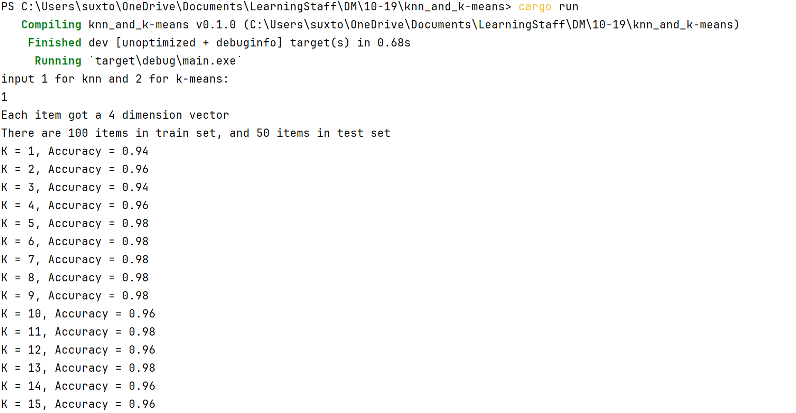
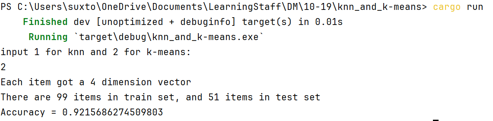

## 10-19作业

1. 什么是支持向量。
    1. 一些在边缘超平面（$H_+$和 $H_-$）上的数据点，他们决定了**边缘超平面的位置**。
    2. 对这些点有 $y_i(<\bold{w}\cdot \bold{x}>+b)-1=0$

2. 什么是**特征空间**和**输入空间**。
    1. **特征空间**是将原始的输入数据变换到的**另一个空间**（通常是更高维度的空间）。在这个新的空间中通过线性决策边界分割正例和负例。
    2. **输入空间**是变换之前的**原始的数据空间**。

3. 简述支持向量机的原理。
    1. 通过寻找一个线性函数$f(x)=<\bold{w}\cdot\bold{x}>+b$，将两类样本分开，正类$f(x)\ge 0$负类$f(x)<0$
    2. 寻找$<\bold{w}\cdot\bold{x}>+b=0$超平面与$<\bold{w}\cdot\bold{x}>+b=1$和$<\bold{w}\cdot\bold{x}>+b=-1$两个边缘超平面距离最大
    3. 通过拉格朗日乘子法和Wolfe对偶得到线性函数$f(x)$

4. 线性SVM如何处理不可分的情况。
    1. 通过放松边距的约束 $\xi_i\ge0$ 允许数据出现误差，使得：
        1. 正类的判定变成 $<\bold{w}\cdot\bold{x_i}>+b\ge 1-\xi_i$
        2. 负类的判定变成 $<\bold{w}\cdot\bold{x_i}>+b\le\xi_i-1$
    2. 和可分的情况同样的方式计算他们的 $\bold{w} $和 $b$
    3. 通过调节参数 $C$ 控制宽松度

5. 简述非线性SVM的核心思想。
    1. 通过将原始数据（输入空间）**非线性** 映射到另一个能够用 **线性决策** 边界分割正负例的空间（特征空间）。
    2. 通过 **核函数** 替代计算特征空间内的 **点积** $K(\bold{x},\bold{z})=<\phi(\bold{x})\cdot\phi(\bold{z})>$，从而避免了计算特征空间内的巨大向量，也无需关心映射函数 $\phi$。
    3. 其余的与软边界SVM做法一致

6. 简述K-近邻分类的步骤。
    1. 计算 测试样例$d$ 和 训练数据集$D$ 中所有样例的距离
    2. 从 $D$ 中选取 $k$ 个距离 $d$ 最近的样本
    3. 在这些样本里面，选择 **最常出现** 的类别赋值给 $d$

7. 用k-近邻分类算法对Iris(见附件，最后一列为标签，其余列为特征)数据进行分类，测试数据比例不限。分析**k值对分类精度**的影响。

    在终端中选择文件夹之后，运行 `cargo run` 运行程序，输入1运行 `knn` 算法：

    在这里的结果中，我分了**三分之一**的样例来当作测试用例，下面列举了不同 $k$ 取值的准确度，看起来 $k\in[5,10]$比较合适，代码文件我会打包上传

    截图：

    

8. 简述Bagging和Boosting的思想或流程。
    1. **Bagging**
        1. 生成 $k$ 份样本，用**每份样本训练一个分类器**，每个分类器用同样的基本算法得到
        2. 分类的时候由**投票**决定，输出占多数的类别。
    2. **Boosting**
        1. 给每个样例加上一个权重，初始化为 $\frac{1}{n}$，后一个分类器依赖前一个分类器，之前分类错误的样例被赋予更高的权重
        2. 如果错误过多，就删去新的迭代并退出
        3. 分类的时候由**加权投票**得到结果 

9. 简述监督学习和无监督学习的区别。
    1. 监督学习的数据分好了类别，无监督学习的数据没有分类信息

10. 叙述K-means和硬盘版本的K-means聚类算法的步骤。
    1. **内存版本**
        1. 随机选择 $k$ 个数据点作为初始的聚类中心
        2. 将每个数据点分配到距离最近的聚类中
        3. 重新计算聚类中心
    2. **硬盘版本**
        1. 每个循环的时候，先将当前样例的向量加到目标类别的临时向量上，并维护每个类别的样例个数
        2. 在循环结束的时候通过计算临时向量和样例个数的商得到每个类别新的聚类中心的样例

11. 用k-means算法对Iris数据进行聚类，并计算聚类的准确率，每一聚类的标签为该聚类内占比最大的类别，其余类别按聚类错误处理。

    在终端中选择文件夹之后，运行 `cargo run` 运行程序，输入2运行 `kmeans` 算法：

    在这里的结果中，我分了**三分之一**的样例来当作测试用例，代码文件我会打包上传

    截图：

    

