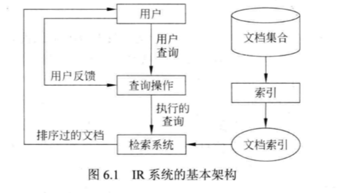

# 11 - 6作业

1. **请说明信息检索时用户查询的主要形式有哪些？**
    1. 关键词查询：用户用一组或至少一个 **关键词** 表达他所需要的信息，这些关键词用 AND 关键词链接
    2. 布尔查询：用布尔操作符（AND，OR，NOT）组成复杂的查询
    3. 短语查询：包含一些词的一个短语或者句子
    4. 近邻查询：短语查询的宽松形式，允许查询词之间有 **其他词的间隔**
    5. 全文搜索：得到与文档的相似页面
    6. 自然语言查询：用户用 **自然语言** 表达自己的想法。

2. **信息检索模型有哪些，简要描述其主要思想？解释向量空间模型中的TF及TF-IDF的含义。**

    1. 布尔模型：
        1. 文档表示：文档和查询都表示为**一组词**，将词用**布尔操作符链接**在一起。
        2. 文档检索：输入布尔查询，返回满足布尔表达式为真的文档。这里属于**精确查找**。
    2. 向量空间模型：
        1. 文档表示：文档被表示为一个权值向量，每个权值通过TF或者TD-IDF表示
            1. TF：**词频表**，在这里文档向量 $\vec{d_j}$ 中的 $t_i$ 权值就是这个词在文档中出现的次数。没有考虑有些词出现在大多数文档中，可能影响匹配精度。
            2. TD-IDF：逆向文档频率表，$df_i$ 是含有至少一次 $t_i$ 的文档数目，$f_{ij}$  是词 $t_i$ 出现在文档 $d_j$ 的次数，最终使用 $tf_{ij}=\frac{f_{uh}}{\max(f_{1j}\cdots f_{nj})}$ 得到正规化词频率，再计算 $idf_i=\log\frac{N}{df_i}$ 得到逆向文档频率，最终计算权值 $w_{ij}=tf_{ij}\times idf_{i}$
        2. 文档检索：计算 **向量夹角余弦相似度** ：$cisine(\vec{d_j},\vec{q})=\frac{<\vec{d_j}\cdot\vec{q}>}{|d_j|\times|q|}$ 。
    3. 统计语言模型
        1. 文档表示：通过频率估计概率，使用贝叶斯定理计算。
        2. 文档检索：实际上是计算 $\Pr(d_j|q)=\frac{\Pr(q|d_j)\Pr(d_j)}{\Pr(q)}$
            1. $\Pr(q)$ 对每个文档都是相同的，且 $\Pr(d_j)$ 是统一的，只用计算 $\Pr(q|d_j)$。
            2. 假设 **每个词都是独立产生的**，有 $\Pr(\vec{q}=q_1q_2\cdots q_m|d_j)=\prod^m_{i=1}\Pr(q_i|d_j)=\prod_{i=1}^{|v|}\Pr(t_i|d_j)^{f_iq}$ 
            3. 其中 $f_{iq}$ 是 $q$ 中出现 $t_i$ 的次数，满足 $\sum^{|v|}_{i=1}\Pr(t_i|d_j)=1$
            4. 其中 $\Pr(t_i|d_j)=\frac{f_{ij}}{d_j}$ ，$f_{ij}$ 是在文档 $d_j$ 中 $t_i$ 出现的次数。
            5. 使用平滑技术避免未知词的影响：$\Pr_add(t_i|d_j)=\frac{\lambda+f_{ij}}{\lambda|V|+|d_j|}$

3. **简述信息检索算法的几种评估方法。**

    1. 查全率（Recall）：$r(i)=\frac{s_i}{|D_q|}$，其中 $s_i$ 是在前 $i$ 次查找中相关的文档数，$|D_q|$ 是相关文档总数。

    2. 查准率（Precision）：$p(i)=\frac{s_i}{i}$

    3. 平均查准率：
        $$
        P_{avg}=\frac{\sum_{d\in D_q}p(i)}{|D_q|}
        $$

    4. PR曲线：纵坐标为查准率，横坐标为查全率，画出 **10个点** （$r_i$ 分别为10%到100%）得到图像。

    5. F-score：
        $$
        F(i)=\frac{2}{\frac{1}{r(i)}+\frac{1}{p(i)}}=\frac{2p(i)r(i)}{p(i)+r(i)}
        $$
        

4. **简要叙述IR（Information Retrieval 信息检索）系统的基本架构和工作原理。**

    1. **基本架构**
    1. **原理：**要查询信息的用户需要通过 **查询操作**(Query Operations)模块发送一个查询到 **检索系统**(Retrieval System)。检索模块使用 **文档索引**(Document Index) 找到包含这些查询词的文档(这些文档很可能与查询相关)，并且计算这些文档的相关度分数，然后根据分数给这些文档排序。经过排序的文档返回给用户

5. **简述关联反馈的目的。简述对`Rocchio`方法中对查询q的更新公式的含义。**

    1. 目的是筛选出用户满意的结果
    2. `Rocchio`算法是：扩展向量 $\vec{q_e}=\alpha\vec{q}+\frac{\beta}{|D_r|}\sum_{d_r\in D_r}\vec{d_r}-\frac{\gamma}{|D_{ir}|}\sum_{d_{ir}\in D_{ir}}\vec{d_{ir}}$ ，其中 $\vec{q}$ 是原始向量，$D_r$是相关文档，$D_{ir}$ 是不相关文档。含义是，加强对相关元素的匹配，减少对不相干元素的匹配。
