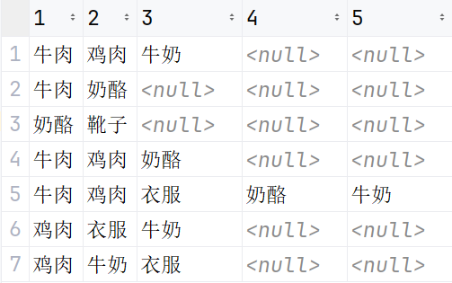
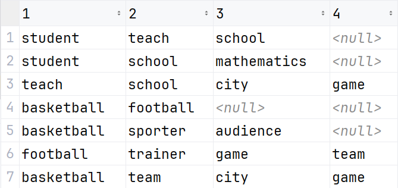
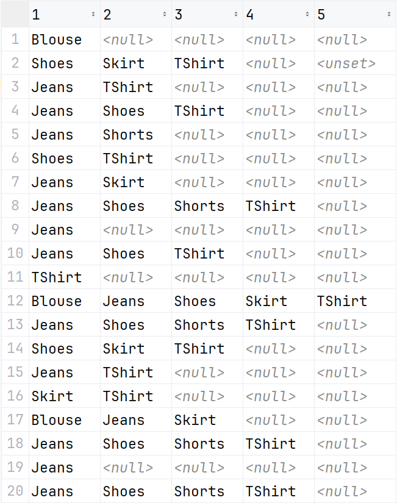

# 9-11作业

##### 1.在关联规则挖掘中两个主要的指标分别是什么？它们是如何定义的？

两个指标分别是**支持度（Support Count）**和**置信度（Confidence）**

+ 规则$$X\rightarrow Y$$的**支持度**是“$$T$$中包含$$X\cup Y$$的事务的百分比”
    + $$Supp=\frac{(X\cup Y).count}{n}$$


+ 规则$$X\rightarrow Y$$的**置信度**是“既包含了$$X$$又包含$$Y$$的事务数量占有包含了$$X$$事务的百分比”
    + $$Conf=\frac{(X\cup Y).count}{X.count}$$


##### 2.给出经典的APRIORI算法描述，并结合实例说明算法的运行过程及结果。

 设有文档数据集T={t1, t2, t3, t4, t5, t6, t7}

 其中t1 = {student, teach, school}

   t2 = {student, school, mathematics}

   t3 = {teach, school, city, game}

   t4 = {basketball, football}

   t5 = {basketball, sporter, audience}

   t6 = {football, trainer, game, team}

   t7 = {basketball, team, city, game}

 **最小支持度20%，最小置信度60%**，试找出所有的关联规则。

1. 找出只包含**一个项目**的频繁项集，因为 $$7\times 20\% = 1.4$$ ，所以只要出现**2次及以上**都行。

    $$C_1:$${{"basketball"}: 3, {"city"}: 2, {"football"}: 2, {"game"}: 3, {"school"}: 3, {"student"}: 2, {"teach"}: 2, {"team"}: 2}

2. 找出包含**两个项目**的频繁项集，而且这些项集要满足**支持度**大于20%

    $$C_2:$${{"city", "game"}: 2, {"game", "team"}: 2, {"school", "student"}: 2,{"school", "teach"}: 2}

3. 无法找到包含**三个项目**的频繁项集，于是开始推理关联规则。先生成满足置信率的单后项规则：

    {"game"} => {"city"} supp=0.286,conf=0.667
    {"city"} => {"game"} supp=0.286,conf=1.000
    {"team"} => {"game"} supp=0.286,conf=1.000
    {"game"} => {"team"} supp=0.286,conf=0.667
    {"student"} => {"school"} supp=0.286,conf=1.000
    {"school"} => {"student"} supp=0.286,conf=0.667
    {"teach"} => {"school"} supp=0.286,conf=1.000
    {"school"} => {"teach"} supp=0.286,conf=0.667

4. 接下来因为**没有包含三个项目**的频繁项集，于是停止。


##### 3.编程实现APRIORI算法（编程语言任选），用上述第二题的数据和附件中的数据进行测试。

我使用最近在学的`rust`语言来实现这个算法。

数据都放在`csv`文件中，其中`data.csv`是作业的数据集，为了验证算法，我又将书上的数据集放入了`data1.csv`。经过测试，我的程序在这两个数据集下都是正确的。

###### 测试1：书上数据(支持度=0.3，置信度=0.8)

+ 数据：

    ​	

+ 结果：

```
C_1 {{"奶酪"}: 4, {"牛奶"}: 4, {"牛肉"}: 4, {"衣服"}: 3, {"鸡肉"}: 5}
C_2 {{"奶酪", "牛肉"}: 3, {"牛奶", "衣服"}: 3, {"牛奶", "鸡肉"}: 4, {"牛肉", "鸡肉"}: 3, {"衣服", "鸡肉"}: 3}
C_3 {{"牛奶", "衣服", "鸡肉"}: 3}

{"衣服"} => {"牛奶"} supp=0.429,conf=1.000
{"鸡肉"} => {"牛奶"} supp=0.571,conf=0.800
{"牛奶"} => {"鸡肉"} supp=0.571,conf=1.000
{"衣服"} => {"鸡肉"} supp=0.429,conf=1.000
{"衣服", "鸡肉"} => {"牛奶"} supp=0.429,conf=1.000
{"牛奶", "衣服"} => {"鸡肉"} supp=0.429,conf=1.000
{"衣服"} => {"牛奶", "鸡肉"} supp=0.429,conf=1.000
```

###### 测试二：问题二中的数据（支持度=0.2，置信度=0.6）

+ 数据：

​	

+ 结果：

    ```
    C_1 {{"basketball"}: 3, {"city"}: 2, {"football"}: 2, {"game"}: 3, {"school"}: 3, {"student"}: 2, {"teach"}: 2, {"team"}: 2}
    C_2 {{"city", "game"}: 2, {"game", "team"}: 2, {"school", "student"}: 2, {"school", "teach"}: 2}
    
    {"game"} => {"city"} supp=0.286,conf=0.667
    {"city"} => {"game"} supp=0.286,conf=1.000
    {"team"} => {"game"} supp=0.286,conf=1.000
    {"game"} => {"team"} supp=0.286,conf=0.667
    {"student"} => {"school"} supp=0.286,conf=1.000
    {"school"} => {"student"} supp=0.286,conf=0.667
    {"teach"} => {"school"} supp=0.286,conf=1.000
    {"school"} => {"teach"} supp=0.286,conf=0.667
    ```

###### 测试三：附件数据（支持度=0.2，置信度=0.6）

+ 数据：

    

+ 结果：

    ```
    C_1 {{"Jeans"}: 14, {"Shoes"}: 10, {"Shorts"}: 5, {"Skirt"}: 6, {"TShirt"}: 14}
    C_2 {{"Jeans", "Shoes"}: 7, {"Jeans", "Shorts"}: 5, {"Jeans", "TShirt"}: 9, {"Shoes", "Shorts"}: 4, {"Shoes", "TShirt"}: 10, {"Shorts", "TShirt"}: 4, {"Skirt", "TShirt"}: 4}
    C_3 {{"Jeans", "Shoes", "Shorts"}: 4, {"Jeans", "Shoes", "TShirt"}: 7, {"Jeans", "Shorts", "TShirt"}: 4, {"Shoes", "Shorts", "TShirt"}: 4}
    C_4 {{"Jeans", "Shoes", "Shorts", "TShirt"}: 4}
    
    {"Shoes"} => {"Jeans"} supp=0.350,conf=0.700
    {"Shorts"} => {"Jeans"} supp=0.250,conf=1.000
    {"TShirt"} => {"Jeans"} supp=0.450,conf=0.643
    {"Jeans"} => {"TShirt"} supp=0.450,conf=0.643
    {"Shorts"} => {"Shoes"} supp=0.200,conf=0.800
    {"TShirt"} => {"Shoes"} supp=0.500,conf=0.714
    {"Shoes"} => {"TShirt"} supp=0.500,conf=1.000
    {"Shorts"} => {"TShirt"} supp=0.200,conf=0.800
    {"Skirt"} => {"TShirt"} supp=0.200,conf=0.667
    {"Shoes", "Shorts"} => {"Jeans"} supp=0.200,conf=1.000
    {"Jeans", "Shorts"} => {"Shoes"} supp=0.200,conf=0.800
    {"Shorts"} => {"Jeans", "Shoes"} supp=0.200,conf=0.800
    {"Shoes", "TShirt"} => {"Jeans"} supp=0.350,conf=0.700
    {"Jeans", "TShirt"} => {"Shoes"} supp=0.350,conf=0.778
    {"Jeans", "Shoes"} => {"TShirt"} supp=0.350,conf=1.000
    {"Shorts", "TShirt"} => {"Jeans"} supp=0.200,conf=1.000
    {"Jeans", "Shorts"} => {"TShirt"} supp=0.200,conf=0.800
    {"Shorts"} => {"Jeans", "TShirt"} supp=0.200,conf=0.800
    {"Shorts", "TShirt"} => {"Shoes"} supp=0.200,conf=1.000
    {"Shoes", "Shorts"} => {"TShirt"} supp=0.200,conf=1.000
    {"Shorts"} => {"Shoes", "TShirt"} supp=0.200,conf=0.800
    {"Shoes", "Shorts", "TShirt"} => {"Jeans"} supp=0.200,conf=1.000
    {"Jeans", "Shorts", "TShirt"} => {"Shoes"} supp=0.200,conf=1.000
    {"Jeans", "Shoes", "Shorts"} => {"TShirt"} supp=0.200,conf=1.000
    {"Shorts", "TShirt"} => {"Jeans", "Shoes"} supp=0.200,conf=1.000
    {"Shoes", "Shorts"} => {"Jeans", "TShirt"} supp=0.200,conf=1.000
    {"Jeans", "Shorts"} => {"Shoes", "TShirt"} supp=0.200,conf=0.800
    {"Shorts"} => {"Jeans", "Shoes", "TShirt"} supp=0.200,conf=0.800
    ```

###### 代码：（我也会上传工程作为附件）

```rust
use csv::ReaderBuilder;
use std::collections::{BTreeMap, BTreeSet};
use std::error::Error;

const MIN_SUPP: f64 = 0.2;
const MIN_CONF: f64 = 0.6;

fn read_csv(file_path: &str) -> Result<Vec<BTreeSet<String>>, Box<dyn Error>> {
    let mut rdr = ReaderBuilder::new().from_path(file_path)?;
    let mut data = Vec::new();
    for result in rdr.records() {
        let record = result?;
        let trans: BTreeSet<String> = record.iter()
            .filter_map(|s| if s.is_empty() { None } else { Some(s.to_string()) })
            .collect();
        data.push(trans);
    }
    Ok(data)
}

fn main() {
    let mut t: Vec<BTreeSet<String>> = read_csv("data/data2.csv").unwrap();
    // println!("{:?}", t);
    let mut candidates: Vec<BTreeMap<BTreeSet<String>, i32>> = vec![];
    get_c1(&mut t, &mut candidates);
    while candidates.last().unwrap().len() > 1 {
        get_next_c(&mut t, &mut candidates);
    }
    if candidates.last().unwrap().len() == 0 {
        candidates.pop();
    }
    gen_rules(&t, &candidates);
}

fn get_c1(t: &mut Vec<BTreeSet<String>>, candidates: &mut Vec<BTreeMap<BTreeSet<String>, i32>>) {
    let num: i32 = (t.len() as f64 * MIN_SUPP).ceil() as i32;
    let mut cnt: BTreeMap<BTreeSet<String>, i32> = BTreeMap::new();

    for ts in t.iter() {
        for str in ts.iter() {
            let mut tmp: BTreeSet<String> = BTreeSet::new();
            tmp.insert(str.clone());
            *cnt.entry(tmp).or_insert(0) += 1;
        }
    }
    candidates.push(
        cnt.iter()
            .filter(|(_, n)| **n >= num)
            .map(|(k, v)| (k.clone(), *v))
            .collect(),
    );
    println!("C_{} {:?}", candidates.len(), candidates.last().unwrap());
}

fn get_next_c(
    t: &Vec<BTreeSet<String>>,
    candidates: &mut Vec<BTreeMap<BTreeSet<String>, i32>>,
) {
    let num: i32 = (t.len() as f64 * MIN_SUPP).ceil() as i32;
    let pre = candidates.last().unwrap();

    let mut now: BTreeMap<BTreeSet<String>, i32> = BTreeMap::new();
    for (key1, (strs1, _)) in pre.iter().enumerate() {
        for (key2, (strs2, _)) in pre.iter().enumerate() {
            if key1 >= key2 {
                continue;
            }
            if strs1
                .iter()
                .rev()
                .skip(1)
                .zip(strs2.iter().rev().skip(1))
                .fold(true, |acc, (a, b)| acc & (*a == *b))
            {
                let mut tmp: BTreeSet<String> = strs1.clone();
                tmp.insert(strs2.last().unwrap().clone());
                let val = count_supp(t, &tmp);
                if val >= num && is_valid(&mut tmp, pre) {
                    now.insert(tmp, val);
                }
            }
        }
    }
    candidates.push(now);
    println!("C_{} {:?}", candidates.len(), candidates.last().unwrap());
}

fn count_supp(t: &Vec<BTreeSet<String>>, tmp: &BTreeSet<String>) -> i32 {
    t.iter().fold(0, |acc, strs| {
        if tmp.len()
            == tmp.iter()
            .fold(0, |ac, str| if strs.contains(str) { ac + 1 } else { ac })
        {
            acc + 1
        } else {
            acc
        }
    })
}

fn is_valid(tmp: &BTreeSet<String>, pre: &BTreeMap<BTreeSet<String>, i32>) -> bool {
    for (r, _) in pre.iter() {
        for i in 0..tmp.len() {
            let mut cnt = 0;
            for (idx, str) in tmp.iter().enumerate() {
                if idx == i {
                    continue;
                }
                if r.contains(str) {
                    cnt += 1;
                }
            }
            if cnt == r.len() {
                return true;
            }
        }
    }
    false
}

fn cnt_tmp(f: &Vec<BTreeMap<BTreeSet<String>, i32>>, tmp: &BTreeSet<String>) -> i32 {
    f[tmp.len() - 1].iter()
        .find(|(key, _)| key.eq(&tmp))
        .map(|(_, val)| *val)
        .unwrap_or(-1)
}

fn gen_rules(t: &Vec<BTreeSet<String>>, f: &Vec<BTreeMap<BTreeSet<String>, i32>>) {
    for r in f.iter() {
        for (strs, all_cnt) in r.iter() {
            if strs.len() < 2 { continue; }
            let mut h: Vec<BTreeMap<BTreeSet<String>, i32>> = vec![];
            let mut tmp = strs.clone();
            let mut now: BTreeMap<BTreeSet<String>, i32> = BTreeMap::new();
            for str in strs.iter() {
                tmp.remove(str);
                let front_cnt = cnt_tmp(f, &tmp);
                if front_cnt != -1 && *all_cnt as f64 / front_cnt as f64 >= MIN_CONF {
                    let mut st = BTreeSet::new();
                    st.insert(str.clone());
                    println!("{:?} => {:?} supp={:.3},conf={:.3}",
                             tmp, &st, *all_cnt as f64 / t.len() as f64, *all_cnt as f64 / front_cnt
                            as f64
                    );
                    now.insert(st, 0);
                }
                tmp.insert(str.clone());
            }
            h.push(now);
            ap_gen_rules(t, strs, all_cnt, &mut h, f);
        }
    }
}

fn ap_gen_rules(
    t: &Vec<BTreeSet<String>>,
    strs: &BTreeSet<String>,
    all_cnt: &i32,
    h: &mut Vec<BTreeMap<BTreeSet<String>, i32>>,
    f: &Vec<BTreeMap<BTreeSet<String>, i32>>,
) {
    if strs.len() <= h.last().unwrap().len() || h.last().unwrap().is_empty() {
        return;
    }
    get_next_c(t, h);
    let now = h.last_mut().unwrap();
    let mut to_remove = Vec::new();
    for (back, _) in now.iter() {
        let mut tmp = strs.clone();
        back.iter().for_each(|x| { tmp.remove(x); });
        if tmp.is_empty() { continue; }
        let front_cnt = cnt_tmp(f, &tmp);
        if front_cnt != -1 && *all_cnt as f64 / front_cnt as f64 >= MIN_CONF {
            // let st = vec![str.clone()].iter().collect();
            // now.insert(st, 0);
            println!("{:?} => {:?} supp={:.3},conf={:.3}",
                     tmp, back, *all_cnt as f64 / t.len() as f64, *all_cnt as f64 / front_cnt as f64
            );
        } else {
            to_remove.push(back.clone());
        }
    }
    for key in to_remove.iter() {
        if let Some(_) = now.remove(key) {};
    }
    ap_gen_rules(t, strs, all_cnt, h, f);
}

```

##### 4.下载资料中的Weka软件、操作手册和论文，安装并熟悉Weka

已安装


