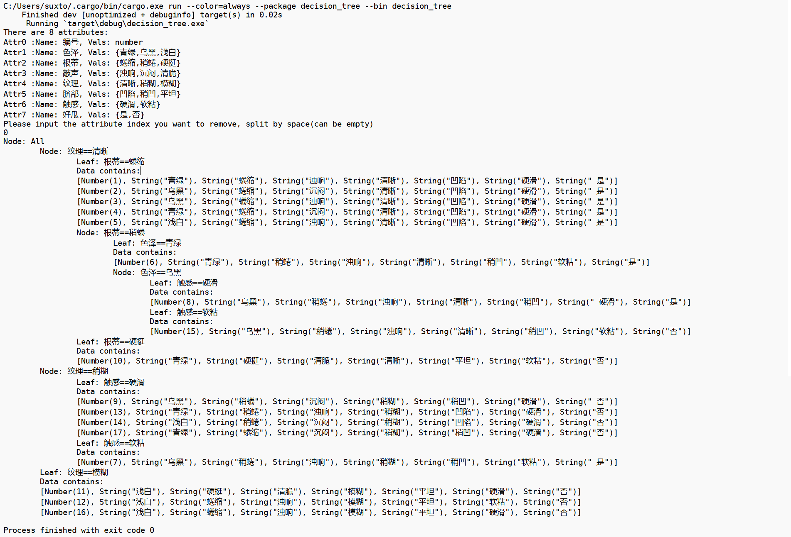
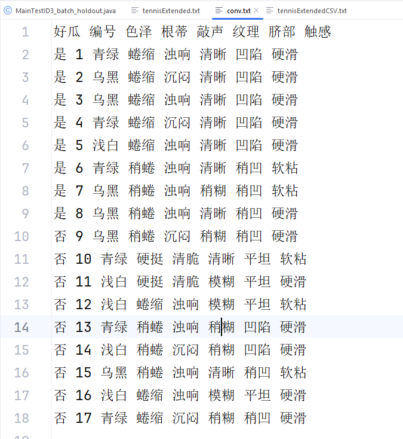
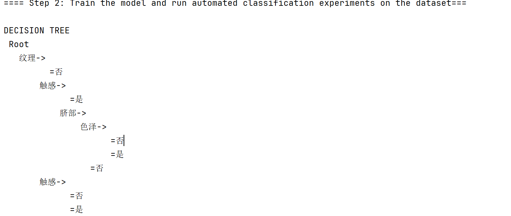

# 9-25作业

##### 1.简述信息增益、信息增益率的计算方式和过程。

+ **信息增益**、**信息增益率**都基于信息熵(entropy)来计算：
    + $$entropy(D)=-\sum_{j=1}^{|C|}Pr(c_j)\log_{2}{Pr(c_j)}$$
    + 如果一个集合中的类比例都相同的时候，$$entropy(D)$$达到最大值$$1$$。
    + 如果一个集合中只有一个类的时候，$$entropy(D)$$达到最小值$$0$$。
+ **信息增益(gain)：**
    + $$entropy_{A_i}(D)=\sum_{j=1}^{v}\frac{|D_j|}{|D|}\times entropy(D_j)$$
    + $$gain(D,A_i)=entropy(D)-entropy_{A_i}(D)$$
    + $$D_i$$是将$$D$$使用属性$$A_i$$分类的子集
+ **信息增益率(`gainRatio`)：**
    + $$gainRatio(D,A_i)=\frac{gain(D,A_i)}{-\sum_{j=1}^{s}(\frac{D_j}{D}\times\log_2\frac{D_j}{D})}$$

##### 2.决策树中处理连续属性值的方式。

+ 将属性$$A_i$$，每个区间可以视为一个离散值，我们需要找一个合适的分割阈值(Threshold)。	
+ 可以对属性的每一个取值都进行一次评价，生成$$A_i\le v_i$$和$$A_i > v_i$$
+ 可以对一个属性进行多次分割

##### 3.过拟合的含义。

训练出一个**很深**的树，但是很多叶子节点只覆盖**很少的训练实例**，预测训练集的精度非常高，但是泛化能力很差，在测试数据上精度很低。

##### 4.实现C4.5决策树算法，使用下表的西瓜数据集进行训练。`arff`格式的数据文件见附件。

我使用`rust`进行编码，**代码在附件的压缩包里面的`src`文件夹下**，使用`cargo run`命令运行，如果你有`rust`环境的话。没有的话建议装一个，`rust`才是未来。

数据放在`data`文件夹下，因为我只写了解析`arff`的函数，所以要测试其他数据的话，最好也使用`arff`文件。

**程序说明：**程序读取`arff`文件之后会列出所有的属性，可以输入属性的下标来去除一些不想用于分类的属性。

**运行结果：**因为结果太大了，我这里贴上截图，这个截图的txt文件也会作为附件上传



##### 5.使用SPMF（http://www.philippe-fournier-viger.com/spmf/index.php）提供的ID3算法对上述西瓜数据进行建树，并与自己写的算法的结果进行对比。

由于构建好的`spmf`不带`ID3`算法，我下载了`spmf` 的源码对其进行测试。下面是过程，**ID3的结果和我的算法得到的一样**。

应为`spmf`不能读取`arff`文件，我写了个函数将文件转换。

```rust
fn conv_file(attr: &Vec<Attribute>, data: &Vec<DataRow>) {
    let file = File::create("data/conv.txt").expect("Cannot create file");
    let mut buf_writer = BufWriter::new(file);
    let col_num = attr.len();
    for i in 0..col_num {
        buf_writer
            .write_all(
                attr[(col_num + i - 1) % col_num]
                    .name
                    .clone()
                    .add(" ")
                    .as_bytes(),
            )
            .expect("Cannot write");
    }
    buf_writer.write_all(b"\n").expect("Cannot write");
    for row in data {
        for i in 0..col_num {
            let str = match &row[(col_num + i - 1) % col_num] {
                AttrVal::String(str) => str.clone(),
                AttrVal::Number(x) => x.to_string(),
            };
            buf_writer
                .write_all(str.add(" ").as_bytes())
                .expect("Cannot write");
        }
        buf_writer.write_all(b"\n").expect("Cannot write");
    }
    buf_writer.flush().expect("Cannot flush");
}
```

**转换后的文件**



**替换成我的数据集**


**ID3的结果**

