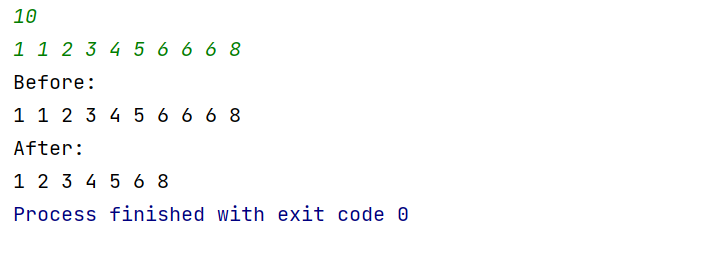
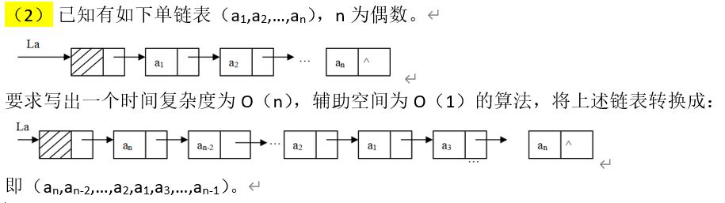
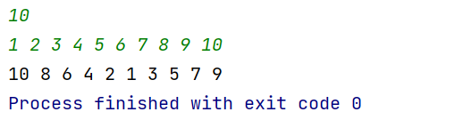
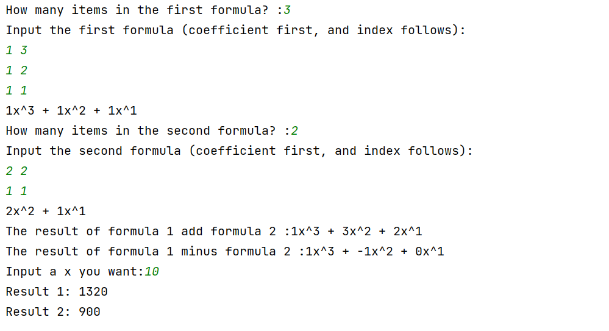

# 实验二：线性表及其运用

## 2.1 顺序表

我选择了 **题目2**

> 编写一个程序，其功能是：在一个非递减的顺序表中，删除所有值相等的多余元素，并输出删除前后的元素。要求时间复杂度为O(n)，空间复杂度为O(1)。 

### 运行截图：



### 代码：

```CPP
#include <bits/stdc++.h>

#define GET static_cast<node *>(malloc(sizeof(node)))
using namespace std;

struct node {
    int val;
    node *next;
};


int main() {
    node *head = GET;
    head->val = 0x1ead;
    head->next = nullptr;
    node *tail = head;
    int x;
    cin >> x;

    function<void(int)> add = [&](int val) {
        node *newNode = GET;
        newNode->val = val;
        newNode->next = nullptr;
        tail->next = newNode;
        tail = newNode;
    };

    while (x--) {
        int val;
        cin >> val;
        add(val);
    }
    cout << "Before:\n";
    node *mv = head->next;
    while (mv != nullptr) {
        cout << mv->val << ' ';
        mv = mv->next;
    }

    cout << "\nAfter:\n";
    mv = head->next;
    while (mv != nullptr) {
        int now = mv->val;
        node *mov = mv->next;
        while (mov != nullptr && mov->val == now) {
            mov = mov->next;
        }
        mv->next = mov;
        cout << mv->val << ' ';
        mv = mv->next;
    }
}
```

## 2.2 链表

我选择了 **第二题**



### 运行截图：



### 代码：

```CPP
#include <bits/stdc++.h>

#define GET static_cast<node *>(malloc(sizeof(node)))
using namespace std;

struct node {
    int val;
    node *next;
};


int main() {
    node *head = GET;
    head->val = 0x1ead;
    head->next = nullptr;
    node *tail = head;
    int x;
    cin >> x;

    function<void(int)> add = [&](int val) {
        node *newNode = GET;
        newNode->val = val;
        newNode->next = nullptr;
        tail->next = newNode;
        tail = newNode;
    };

    function<void(node *)> print = [](node *head) {
        node *mv = head->next;
        while (mv != nullptr) {
            cout << mv->val << ' ';
            mv = mv->next;
        }
    };
    while (x--) {
        int val;
        cin >> val;
        add(val);
    }

//    print(head);

    node *h1 = GET, *h2 = GET, *mv = head->next;
    int cnt = 1;
    tail = h1;
    while (mv != nullptr) {
        node *next = mv->next;
        if (cnt & 1) {
            tail->next = mv;
            tail = mv;
            mv->next = nullptr;
        } else {
            if (cnt == 2)
                mv->next = h1->next;
            else
                mv->next = h2->next;
            h2->next = mv;
        }
        cnt++;
        mv = next;
    }

    print(h2);

}
```

## 2.3 链表应用

>基本要求：
>
>> 输入并建立多项式，并用友好的界面显示多项式，如，8x^3^-6x^2^+8 显示为8x\^3-6x^2+8
>>
>> 计算两个多项式的加法和减法；
>>
>> 给定x，计算多项式在x处的值。

### 运行截图：



### 代码：

```CPP
#include <bits/stdc++.h>

#define GET static_cast<node *>(malloc(sizeof(node)))
using namespace std;

struct node {
    int coe, ind;//xi shu he zhi shu
    node *next;
};


int main() {
    int x;
    node *f1 = GET, *f2 = GET, *f3 = GET, *f4 = GET, *tail = nullptr;
    f1->next = f2->next = f3->next = f4->next = nullptr;

    function<void(int, int)> add = [&](int coe, int ind) {
        node *newNode = GET;
        newNode->coe = coe;
        newNode->ind = ind;
        newNode->next = nullptr;
        tail->next = newNode;
        tail = newNode;
    };

    function<void(node *)> print = [](node *head) {
        node *mv = head->next;
        while (mv->next != nullptr) {
            cout << mv->coe << "x^" << mv->ind << " + ";
            mv = mv->next;
        }
        cout << mv->coe << "x^" << mv->ind << endl;
    };


    cout << "How many items in the first formula? :";
    cin >> x;
    cout << "Input the first formula (coefficient first, and index follows):\n";
    tail = f1;
    while (x--) {
        int ind, coe;
        cin >> coe >> ind;
        add(coe, ind);
    }
    print(f1);

    cout << "How many items in the second formula? :";
    cin >> x;
    cout << "Input the second formula (coefficient first, and index follows):\n";
    tail = f2;
    while (x--) {
        int ind, coe;
        cin >> coe >> ind;
        add(coe, ind);
    }
    print(f2);
    //add two formula
    node *mv1 = f1->next, *mv2 = f2->next;
    tail = f3;
    while (mv1 != nullptr && mv2 != nullptr) {
        if (mv1->ind > mv2->ind) {
            add(mv1->coe, mv1->ind);
            mv1 = mv1->next;
        } else if (mv1->ind < mv2->ind) {
            add(mv2->coe, mv2->ind);
            mv2 = mv2->next;
        } else {
            add(mv1->coe + mv2->coe, mv1->ind);
            mv1 = mv1->next;
            mv2 = mv2->next;
        }
    }
    cout << "The result of formula 1 add formula 2 :";
    print(f3);
    //minus
    mv1 = f1->next, mv2 = f2->next;
    tail = f4;
    while (mv1 != nullptr && mv2 != nullptr) {
        if (mv1->ind > mv2->ind) {
            add(mv1->coe, mv1->ind);
            mv1 = mv1->next;
        } else if (mv1->ind < mv2->ind) {
            add(-mv2->coe, mv2->ind);
            mv2 = mv2->next;
        } else {
            add(mv1->coe - mv2->coe, mv1->ind);
            mv1 = mv1->next;
            mv2 = mv2->next;
        }
    }
    cout << "The result of formula 1 minus formula 2 :";
    print(f4);
    cout << "Input a x you want:";
    cin >> x;
    vector<int> pow(1, 1);
    for (int i = 1; i <= 10; i++) pow.emplace_back(pow[i - 1] * x);

    function<int(node *, int &)> calc = [&pow](node *head, int &x) {
        int ans = 0;
        node *mv = head;
        while (mv != nullptr) {
            ans += mv->coe * pow[mv->ind];
            mv = mv->next;
        }
        return ans;
    };

    cout << "Result 1: " << calc(f3, x) << endl;
    cout << "Result 2: " << calc(f4, x) << endl;
}
```

