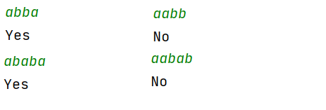
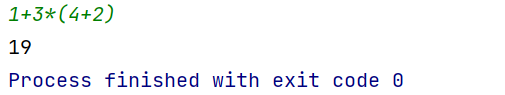
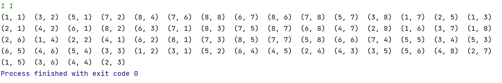
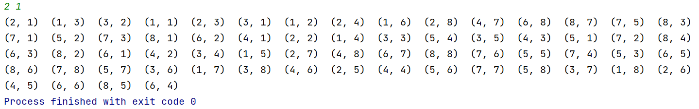

# **实验三** **栈与队列应用**

## 3.1栈的应用

### 3.3-1 回文判断

首先判断下当前的字符串长度，将前半部分入栈，后半部分与栈顶匹配的话说明这是个回文串。

**截图：**

运行了四次的结果



**代码**

```Cpp
#include<bits/stdc++.h>
#define MAXN 100000
using namespace std;

int main() {
	int stack[MAXN], idx = 0;
	string str;
	cin >> str;
	int len = str.length() >> 1;
	int i = 0;
	for(; i < len; i++) {
		stack[idx++] = str[i];
	}
	if(str.length() & 1) i++;
	for(; i < str.length(); i++) {
		if(stack[--idx] != str[i]) {
			cout << "No\n";
			return 0;
		}
	}
	cout << "Yes\n";
}
```

### 3.1-3 四则运算器

使用两个栈，一个栈装符号，另一个栈装数字，存入符号的时候比较运算优先级，如果当前优先级高于栈顶的话，压入符号栈，如果低于或等于的话就先把前面的计算完成后将结果压入数字栈，然后压入符号栈。

**截图：**



**代码：**

```cpp
#include<bits/stdc++.h>

#define MAXN 100000
#define chr str[i]
using namespace std;

template<typename T>
class mystack {
public:
    int topptr = 0;
    T *arr = nullptr;

    explicit mystack(int n) {
        arr = (T *) malloc(n * sizeof(T));
    }

    mystack() = default;

    [[nodiscard]] T ptr() const {
        return *(arr + topptr);
    };

    [[nodiscard]] bool empty() const {
        return topptr == 0;
    }

    void push(int x) {
        topptr++;
        *(arr + topptr) = x;
    }

    T pop() {
        if (topptr == 0) return 0;
        else return *(arr + topptr--);
    }

    friend ostream &operator<<(ostream &o, mystack &s) {
        for (int i = 1; i <= s.topptr; i++) {
            o << s.arr[i] << ' ';
        }
        return o;
    }
};

int operOrder(char ch) {
    if (ch == '*' || ch == '/') return 2;
    if (ch == '+' || ch == '-') return 1;
    return 0;
}

bool isOper(char ch) {
    if (ch == '+' || ch == '-' || ch == '*' || ch == '/' || ch == '(' || ch == ')') {
        return true;
    }
    return false;
}


int main() {
    auto numStack = mystack<int>(1000);
    auto operStack = mystack<char>(1000);
    string str;
    cin >> str;
    int i = 0;

    auto calc = [](int &a, char &op, int &b) {
        if (op == '+') return a + b;
        if (op == '-') return a - b;
        if (op == '*') return a * b;
        if (op == '/') return a / b;
        return 0;
    };

    while (i < str.length()) {
//        char chr = str[i];
        if (isOper(chr)) {
            if (operStack.empty()) {
                operStack.push(chr);
            } else {
                if (chr == ')') {
                    while (operStack.ptr() != '(') {
                        int a = numStack.pop();
                        int b = numStack.pop();
                        char op = operStack.pop();
                        numStack.push(calc(a, op, b));
                    }
                    operStack.pop();
                } else if (chr == '(' || operOrder(operStack.ptr()) < operOrder(chr)) {
                    operStack.push(chr);
                } else {
                    int a = numStack.pop();
                    int b = numStack.pop();
                    char op = operStack.pop();
                    numStack.push(calc(a, op, b));
                    operStack.push(chr);
                }
            }
            i++;
        } else {
            int x = 0;
            while (i < str.length() && !isOper(chr)) {
                x = x * 10 + chr - '0';
                i++;
            }
            numStack.push(x);
        }

    }

    while (!operStack.empty()) {
        int a = numStack.pop();
        int b = numStack.pop();
        char op = operStack.pop();
        numStack.push(calc(a, op, b));
    }

    cout << numStack.ptr();

}
```

## 3.2递归和回溯

### 3.2-2 马走棋盘

对于这个问题，我本来想的是简单一个暴力 `DFS` 就搞定了，但是运行起来的时候有的点（比如从(2,1)开始）很快，有的点很慢（比如从(1,1)开始）。很显然从有的点开始，直接暴力搜索的话，走的弯路比较多，于是经过上网搜索，我发现每次选择走向的时候应该选择下一步出路最小的路径，从而有效的降低试错的次数。

**截图：**





**代码：**

```cpp
#include<iostream>

using namespace std;
bool vis[9][9];
const int dx[] = {2, 2, -2, -2, 1, 1, -1, -1};
const int dy[] = {1, -1, 1, -1, 2, -2, 2, -2};
typedef pair<int, int> pii;

ostream &operator<<(ostream &o, pii p) {
    o << '(' << p.first << ", " << p.second << ")  ";
    return o;
}

template<typename T>
class myStack {
public:
    int topptr = 0;
    T *arr = nullptr;

    explicit myStack(int n) {
        arr = new T[n];
    }

    myStack() = default;

    [[nodiscard]] T ptr() const {
        return *(arr + topptr);
    };

    [[nodiscard]] bool empty() const {
        return topptr == 0;
    }

    void push(T x) {
        topptr++;
        *(arr + topptr) = x;
    }

    T pop() {
//        if (topptr == 0) return 0;
//        else
        return *(arr + topptr--);
    }

    friend ostream &operator<<(ostream &o, myStack &s) {
//        for (int i = 1; i <= s.topptr; i++) {
//            o << s.arr[i] << ' ';
//        }
        while (!s.empty())
            o << s.pop();
        return o;
    }
};

myStack<pii> st;

inline bool good(int nx, int ny) {
    return !vis[nx][ny] && nx < 9 && nx > 0 && ny < 9 && ny > 0;
}

int find(int x, int y) {
    int cnt = 0;
    for (int i = 0; i < 8; i++) {
        int nx = x + dx[i];
        int ny = y + dy[i];
        if (good(nx, ny))
            cnt++;
    }
    return cnt;
}


bool dfs(int x, int y, int cnt) {
    if (cnt == 64) {
        return true;
    }
    pii arr[8];
    int siz = 0;
    for (int i = 0; i < 8; i++) {
        int nx = x + dx[i];
        int ny = y + dy[i];
        if (good(nx, ny)) {
            arr[siz++] = {find(nx, ny), i};
        }
    }

    for (int i = 0; i < siz; i++) {
        for (int j = i + 1; j < siz; j++) {
            if (arr[i].first > arr[j].first) {
                swap(arr[i], arr[j]);
            }
        }
    }

    for (int i = 0; i < siz; i++) {
        int nx = x + dx[arr[i].second];
        int ny = y + dy[arr[i].second];
        vis[nx][ny] = true;
        if (dfs(nx, ny, cnt + 1)) {
            st.push({nx, ny});
            return true;
        }
        vis[nx][ny] = false;
    }

    return false;
}

int main() {
    st = myStack<pii>(100);
    int x, y;
    cin >> x >> y;
    vis[x][y] = true;
    if (!dfs(x, y, 1)) cout << "NO";
    else {
        st.push({x, y});
        cout << st;
    }
}
```
