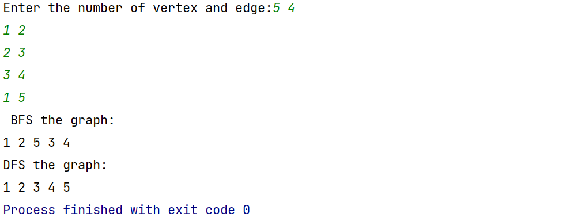
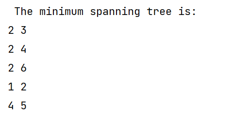

# **实验五** **图的遍历与应用**

## 5.1图的储存与遍历

用邻接矩阵实现图的深度优先遍历，用邻接表实现图广度优先遍历，图的类型不限。

**思路**

1. 深度优先搜索：

    首先在开始之前要建立一个数组，用于存储已经被访问过的节点，从而防止进入死循环。然后从随便一个顶点开始，找寻它所有顶点的邻接点，如果访问过了就跳过，最后到无点访问的时候结束。

2. 广度优先搜索：

    广度优先搜索由于需要搜索同层的内容，于是需要一个队列将同一层的数据先存起来。每次循环让队头的元素出队，然后找寻这个元素的邻接节点，将他们塞入队尾，同时在记录访问的数组中记录。

**运行截图**




**代码**

```cpp
#include <iostream>
#include <vector>
#include <queue>


std::vector<std::vector<int>> *creatMatrix(std::vector<std::vector<int>> &v) {
    auto *mat = new std::vector<std::vector<int>>(v.size(), std::vector<int>(v.size()));
    for (int i = 0; i < v.size(); i++) {
        for (const auto &ints: v[i]) {
            (*mat)[i][ints] = 1;
        }
    }
    return mat;
}

void bfs(std::vector<std::vector<int>> &v) {
    std::vector<bool> vis(v.size());
    std::queue<int> queue;
    queue.push(0);
    vis[0] = true;
    while (!queue.empty()) {
        int now = queue.front();
        std::cout << now + 1 << ' ';
        queue.pop();
        for (const auto &i: v[now]) {
            if (!vis[i]) {
                queue.push(i);
                vis[i] = true;
            }
        }
    }
}

void dfs(std::vector<std::vector<int>> *matrix, int now = 0) {
    static std::vector<bool> vis(matrix->size());
    vis[now] = true;
    std::cout << now + 1 << ' ';
    for (int i = 0; i < matrix->size(); i++) {
        if ((*matrix)[now][i] && !vis[i]) {
            dfs(matrix, i);
        }
    }
//    vis[now] = false;
}

int main() {
    std::cout << "Enter the number of vertex and edge: ";
    int v, e;
    std::cin >> v >> e;
    std::vector<std::vector<int>> table(v);
    for (int i = 0; i < e; i++) {
        int a, b;
        std::cin >> a >> b;
        a -= 1;
        b -= 1;
        table[a].emplace_back(b);
        table[b].emplace_back(a);
    }
    auto matrix = creatMatrix(table);
    std::cout << "BFS the graph:\n";
    bfs(table);
    std::cout << "\nDFS the graph:\n";
    dfs(matrix);
}
```


## 5.2 图的应用

最小生成树

**思路：**

首先将所有的边排序，然后从最短的边开始，通过并查集将新的边加入集合中，当没边可加或者加够了 `n-1` 条边之后结束，当且仅当生成树的边数是点数减一的时候才算最小生成树存在。

**运行截图：**



**代码**

```cpp
#include <iostream>
#include <vector>
#include <numeric>
#include <algorithm>

struct node {
    node(int a, int b, int c) : x(a), y(b), weight(c) {}

    int x, y;
    int weight;
};

int find(std::vector<int> &p, int x) {
    if (p[x] == x)return x;
    else return p[x] = find(p, p[x]);
}

void merge(std::vector<int> &p, int x, int y) {
    p[find(p, x)] = find(p, y);
}

int main() {
    std::cout << "Enter the number of vertex and edges: ";
    int v, e;
    std::cin >> v >> e;
    std::vector<int> p(v + 1);
    std::vector<node> edges;
    std::iota(p.begin(), p.end(), 0);
    for (int i = 0; i < e; i++) {
        int a, b, c;
        std::cin >> a >> b >> c;
        edges.emplace_back(a, b, c);
    }
    std::sort(edges.begin(), edges.end(), [](node &a, node &b) {
        return a.weight < b.weight;
    });
    std::vector<node> ans;
    for (const node &n: edges) {
        if (ans.empty()) {
            ans.emplace_back(n);
            merge(p, n.x, n.y);
        } else {
            if (find(p, n.x) == find(p, n.y)) continue;
            merge(p, n.x, n.y);
            ans.emplace_back(n);
        }
    }
//    std::cout << ans.size();
    if (ans.size() >= v - 1) {
        std::cout << "The minimum spanning tree is:\n";
        for (auto &n: ans) {
            std::cout << n.x << ' ' << n.y << std::endl;
        }
    } else std::cout << "There is no minimum spanning tree in this graph.";

}
//test data
//6 10
//1 2 16
//1 5 19
//1 6 21
//2 6 11
//2 3 5
//2 4 6
//3 4 6
//4 6 14
//4 5 18
//5 6 33
```


