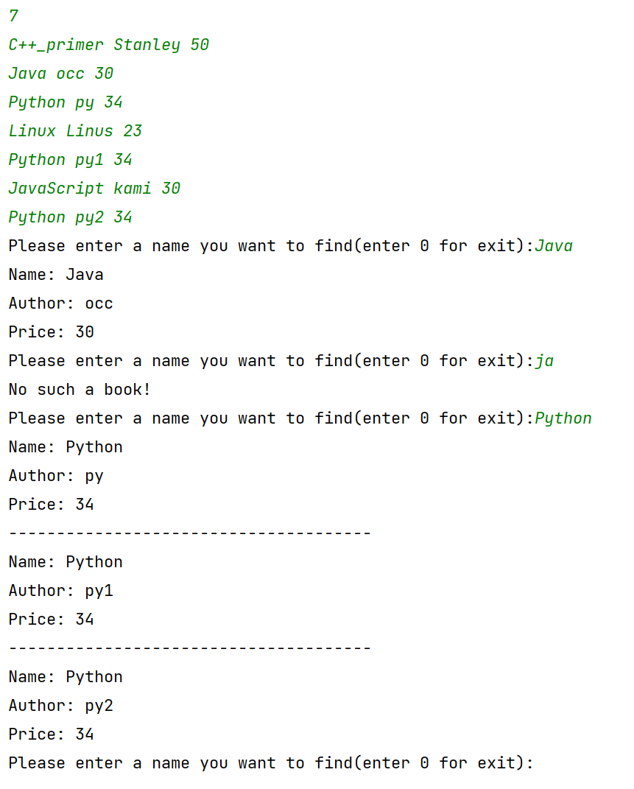
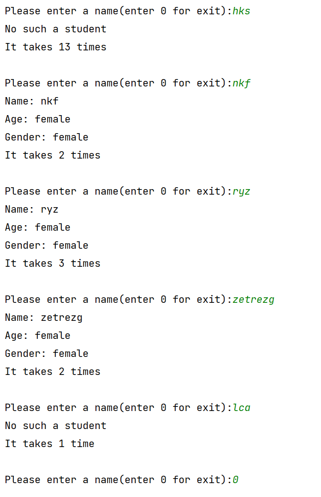
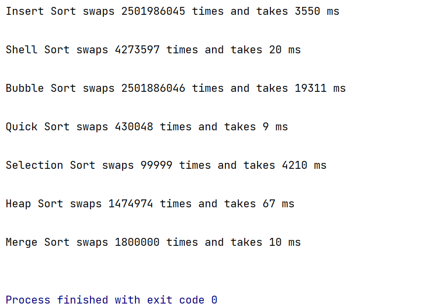

# 实验六 查找与排序

## 6.1二叉排序树的实现

使用二叉树构建二叉排序树，根节点的左边比根节点小，根节点的右边比根节点大。

### 思路：

   由于字符串的比较相对数字来说比较耗时，使用我先将字符串转换为数字，具体方法是将每个字符的ASCII码值加起来之后将总和除以10000007（大质数），通过这个值构建二叉搜索树。

### 运行截图：

前面是输入的数据，后面是查询。如果同名，会将同名全部输出。



### 代码

```cpp
#include<iostream>

using namespace std;

struct node {
    int val = 0;
    string name;
    string author;
    double price;
    node *l = nullptr, *r = nullptr;
};

int getVal(const string &str) {
    int ans = 0;
    for (const char &ch: str) {
        ans += ch;
        ans %= 100000009;
    }
    return ans;
}

node *insert(node *&head, int v) {
    if (head == nullptr) {
        head = new node;
        head->val = v;
        return head;
    }
    if (v < head->val) return insert(head->l, v);
    else return insert(head->r, v);
}

node *find(node *head, const string &name, int v) {
    if (head == nullptr) return nullptr;
    if (v < head->val) return find(head->l, name, v);
    else if (v > head->val) return find(head->r, name, v);
    else {
        if (head->name == name) return head;
        else return find(head->r, name, v);
    }
}

void go(node *head) {
    if (head == nullptr) return;
    go(head->l);
    cout << head->val << ' ';
    go(head->r);
}

void printABook(node *n) {
    if (n == nullptr)return;
    cout << "Name: " << n->name << endl;
    cout << "Author: " << n->author << endl;
    cout << "Price: " << n->price << endl;
}

int main() {
    node *head = nullptr;
    int t;
    cin >> t;
    while (t--) {
        string name, author;
        double price;
        cin >> name >> author >> price;
        int val = getVal(name);
        node *now = insert(head, val);
        now->name = name;
        now->author = author;
        now->price = price;
    }
    while (true) {
        cout << "Please enter a name you want to find(enter 0 for exit):";
        string name;
        cin >> name;
        if (name == "0") break;
        node *now = find(head, name, getVal(name));
        if (now == nullptr) {
            cout << "No such a book!\n";
            continue;
        }
        printABook(now);
        now = now->r;
        while (now != nullptr) {
            if (now->name == name) {
                cout << "--------------------------------------\n";
                printABook(now);
            } else break;
            now = now->r;
        }
    }
}
/*
7
C++_primer Stanley 50
Java occ 30
Python py 34
Linux Linus 23
Python py1 34
JavaScript kami 30
Python py2 34
 */
```


## 6.2 哈希表
构建哈希表存放学生

### 思路：

我先写了一个程序构造随机的学生名字、年龄和性别，存在stu.txt里面，然后将文件读入。随后根据要求使用哈希函数对每个名字取哈希值，然后使用线性探测法处理冲突。

### 运行截图：

输入名称会返回是否找到，并且打印查询次数。




### 代码


## 6.3 排序算法比较
比较各个排序算法的性能。

### 思路：

首先生成一个随机队列，然后将原始的队列拷贝7份给各个算法进行排序，从开始排序的时候计时，完成后结束计时并打印比较次数。

根据我的观察，快速排序一般是最快的，随后是归并排序和堆排序。

### 运行截图：

排序方式 + 交换次数 + 排序用时



### 代码：

```cpp
#include <bits/stdc++.h>

using namespace std;
const int SIZ = 100000;
int *extra = new int[SIZ + 1];
int *cpy = new int[SIZ + 1], *org = new int[SIZ + 1];
using i64 = unsigned long long;
//int cnt;

void getArr() {
    uniform_int_distribution<int> rd(1, SIZ);
    default_random_engine e{random_device{}()};
    for (int i = 0; i < SIZ; i++) org[i] = rd(e);
}

i64 insertSort(int *arr) {
    i64 cnt = 0;
    for (int i = 1; i < SIZ; i++) {
        int p = arr[i], j;
        for (j = i - 1; j >= 0; j--) {
            if (arr[j] <= p) break;
            arr[j + 1] = arr[j];
            cnt++;
        }
        arr[j + 1] = p;
        cnt++;
    }
    return cnt;
}

i64 shellSort(int *arr) {
    i64 cnt = 0;
    for (int len = SIZ >> 1; len > 0; len >>= 1) {
        for (int i = len; i < SIZ; i++) {
            int p = arr[i], j;
            for (j = i - len; j >= 0; j -= len) {
                if (arr[j] <= p) break;
                arr[j + len] = arr[j];
                cnt++;
            }
            arr[j + len] = p;
            cnt++;
        }
    }
    return cnt;
}

i64 bubbleSort(int *arr) {
    i64 cnt = 0;
    for (int i = 0; i < SIZ; i++) {
        for (int j = 0; j < SIZ - 1 - i; j++) {
            if (arr[j] > arr[j + 1]) {
                int t = arr[j];
                arr[j] = arr[j + 1];
                arr[j + 1] = t;
                cnt++;
            }
        }
    }
    return cnt;
}

i64 quickSortGo(int *arr, int l = 0, int r = SIZ) {
    static i64 cnt = 0;
    if (r <= l) return 0;
    int ll = l, rr = r;
    while (ll < rr) {
        while (ll < r && arr[++ll] < arr[l]);
        while (rr > l && arr[--rr] > arr[l]);
        if (ll < rr) {
            int t = arr[ll];
            arr[ll] = arr[rr];
            arr[rr] = t;
            cnt++;
        } else break;
    }
    swap(arr[l], arr[rr]);
    cnt++;
    quickSortGo(arr, l, rr);
    quickSortGo(arr, rr + 1, r);
    return cnt;
}

i64 quickSort(int *arr) {
    return quickSortGo(arr);
}

i64 selectionSort(int *arr) {
    i64 cnt = 0;
    for (int i = 0; i < SIZ - 1; i++) {
        int minPos = i + 1;
        for (int j = minPos; j < SIZ; j++) {
            if (arr[minPos] > arr[j]) minPos = j;
        }
        swap(arr[i], arr[minPos]);
        cnt++;
    }
    return cnt;
}

i64 heapSort(int *arr) {
    i64 cnt = 0, size = SIZ;
//    int *extra = new int[SIZ + 1];
    for (int i = 1; i <= SIZ; i++) extra[i] = arr[i - 1];
    function<void(int)> down = [&](int u) {
        int t = u;
        if ((u << 1) <= size && extra[u << 1] < extra[t]) t = u << 1;
        if (((u << 1) + 1) <= size && extra[(u << 1) + 1] < extra[t]) t = (u << 1) + 1;
        if (u != t) {
            swap(extra[u], extra[t]);
            cnt++;
            down(t);
        }
    };
    for (int i = SIZ >> 1; i > 0; i--) down(i);
    for (int i = 0; i < SIZ; i++) {
        arr[i] = extra[1];
        extra[1] = extra[size--];
        down(1);
    }
//    delete[] extra;
    return cnt;
}

i64 mergeSort(int *arr) {
//    int *extra = new int[SIZ];
    int len = 1;
    i64 cnt = 0;
    auto mergeGo = [&](const int *list, int *sorted) {
        int pos = 0;
        for (int i = 0; i < SIZ; i += len << 1) {
            int p1 = i, p2 = i + len;
            int lim1 = i + len > SIZ ? SIZ : i + len;
            int lim2 = i + (len << 1) > SIZ ? SIZ : i + (len << 1);
            while (p1 < lim1 && p2 < lim2) {
                if (list[p1] < list[p2] || p2 >= lim2)
                    sorted[pos++] = list[p1++];
                else sorted[pos++] = list[p2++];
                cnt++;
            }
            while (p1 < lim1) sorted[pos++] = list[p1++], cnt++;
            while (p2 < lim2) sorted[pos++] = list[p2++], cnt++;
        }
    };
    while (len < SIZ) {
        mergeGo(arr, extra);
        len <<= 1;
        mergeGo(extra, arr);
        len <<= 1;
    }
//    delete[] extra;
    return cnt;
}

void printArr(int *arr) {
    for (int i = 0; i < SIZ; i++) cout << arr[i] << ' ';
    cout << endl;
}

void arrCpy(const int *src, int *des) {
    for (int i = 0; i < SIZ; i++) des[i] = src[i];
}

void tester(const function<i64(int *)> &f) {
    i64 cnt;
    time_t beg, end;
    arrCpy(org, cpy);
    beg = std::clock();
    cnt = f(cpy);
    end = std::clock();
    cout << cnt << " times ";
    cout << "and takes " << end - beg << " ms\n\n";
}

int main() {
    getArr();

    cout << "Insert Sort swaps ";
    tester(insertSort);

    cout << "Shell Sort swaps ";
    tester(shellSort);

    cout << "Bubble Sort swaps ";
    tester(bubbleSort);

    cout << "Quick Sort swaps ";
    tester(quickSort);

    cout << "Selection Sort swaps ";
    tester(selectionSort);

    cout << "Heap Sort swaps ";
    tester(heapSort);

    cout << "Merge Sort swaps ";
    tester(mergeSort);
}
```


