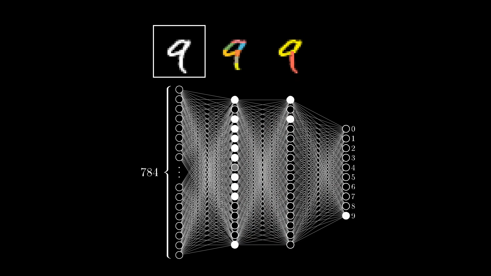
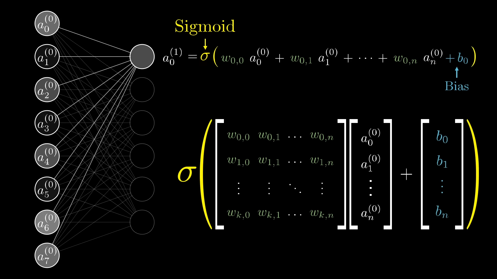
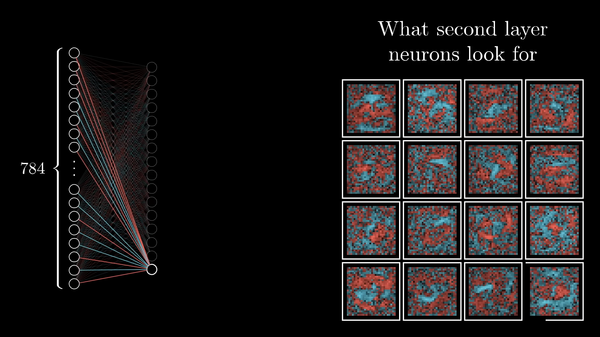

# But what is a neural network? 心得

在看这个系列之前，我看过3b1b的很多视频，每个视频的十分精致，包括这个系列，我将分集讲述我的心得。

### But what is a neural network? | Chapter 1

先从人脑是如何识别数字开始引入神经网络的概念，人脑可以识别不同的样式的数字，哪怕这些数字属于同一类且从微观上看很不相同。

对于输入层来说，每一个像素点都有自己的灰度，灰度值又是激活值，用于激活第一层的神经元。

输入全部的784个变量再将通过一些权重计算之后的结果导向第二层，从而激活某些函数，再导入下一层直到达到输出层，输出层有10个神经元，每一个都代表0-9之间的一个数字。最终的输出层得到的是一个概率，如果当前概率大就说明模型将当前的数字分到当前类。

对于中间的隐藏层来说，它们负责将当前的数字拆分层一个个部分，再从这些部分中找到目标类别所具有的特性，从特性就能判断最终的类别。

中间层的特征提取可以看作是对不同的像素点有不同的权重，例如这个神经元可以提取一段边界分明的横线。通过对中间的权值设置正值，边上的权值设置负值就能得到。

这些东西全部加起来之后，我们可以设置一个权重来控制神经元的激活成都。而且，由于我们需要的结果是处于0-1之间的值，所以还要将这个加和放到sigmoid函数中映射到0-1之间的空间，最后得到的计算公式就是

在视频例子中，作者用了一层784维的输入层，两层16维的隐藏层和最后10维的输出层，这使得我们需要计算大量的参数

由于参数太大，为了方便可以使用矩阵来表示。每一个神经元的激活都可以看作是矩阵运算。

### Gradient descent, how neural networks learn | Chapter 2

对一个模型来说，其运行依靠的是每个神经元的 **权重** 和 **偏差值** ，但是最开始模型什么都不知道，所以可以将他们全部都随机生成。

很显然，随机生成这么多参数并不会有好结果，于是为了评价一个模型，我们需要给他一个损失函数。这个损失函数是每个输出层神经元的输出和预期输出的差的平方之和，这个结果愈大说明模型偏离我们预想的效果就愈远。

但是知道了模型错误的多少还不够，我们还需要知道模型需要如何调整，于是我就引出了梯度下降算法。如果损失函数减小，就说明正确率得到了提高，所以我们只需要求出让损失函数最小的那些参数，就能得到一个可用的模型了。而梯度下降算法就是通过观察函数的斜率，让函数的输出向着斜率下降的方向移动。通过这样的方式可以找到这个函数的局部最小值。

对于多维的函数，可以通过计算梯度达到相似的效果。梯度指示是函数在某个点得到最快增加的移动方向，因此对梯度取负数就能得到最快的下降路径。

对于损失函数，我们可以计算出它在某个点的梯度。梯度也是一个向量，每个元素表明了对于其指示的方向应该增加还是减少且变化的幅度，也就是某个元素的敏感度。

对于多层感知机，似乎并不是像我们最初像的那样分离数字的结构，反而像是一些随机的数据组合，但是最终它的结果还不错。但是显然这个模型对于复杂的情况应该表现不佳，因为它并不能像我们希望的那样提取特征。

### What is backpropagation really doing? | Chapter 3

为了修改权值，反向传播是关键，为了改变最后的结果，有三种修改方式：偏置$b$，权值$w_i$，和上一层的结果$a_i$。

对于权值的修改，我们可以让结果神经元与对目标分类反应更强烈的上一层神经元的权值加大，对反应没那么强烈的上一层神经元权值减小。

对于上一层神经元的输出来说，我们不能直接改变它的值，但是可以通过梯度改变影响它。而且我们不能为了提高某一个值的准确度而牺牲其他值的准确度，所以需要考虑所有输出的梯度改变。我们可以将这些梯度都加起来，得到最后的调整方案。

然后再将后面需要的变化，传播到前面的神经元。

对于每一次训练批次，我们需要调整很多参数，将这些参数应该调整的值加起来就能得到最终的调整方案。

### Backpropagation calculus | Chapter 4

前面只是对反向传播有了一个大概的理解，接下来将进行严格的数学推导：这里的导数是希望求出权值 $w$ 对最终输出的结果$C_0$的影响，这里可以使用链式法则，求出最终的偏导。

### 总结

在看这个视频之前，我也看过很多3B1B的视频，做的都非常出色，对我的理解有很大的帮助。就这个视频来说，我弄懂了多层感知机的预测方式和训练方式，其中最重要的是梯度下降和反向传播，通过链式法则从结果影响过程，这个视频令我受益匪浅。
