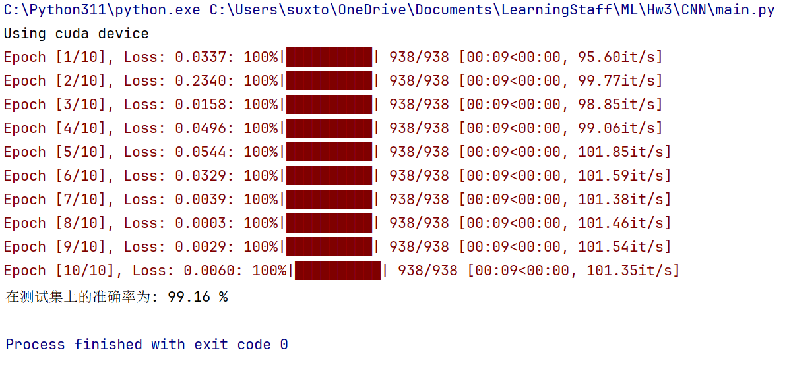
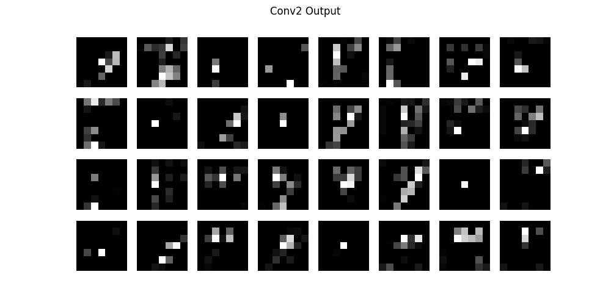

# CNN识别MNIST手写数据集

我使用 `pytorch` 来完成这个任务，因为这个框架是现在最热门，最稳定的框架，而且还支持我电脑上的 **CUDA** 加速。

### 模型搭建

因为这个任务比较简单，使用我只使用了两层卷积层和一层输出层。每张图片的输入是$28\times28$的灰度图像。

#### 函数组成

1. 卷积层1

    1. 卷积核1有16层，大小是$5\times 5$，为了更好的提取边缘的像素，我设置 `padding=2`，于是卷积得到的图像大小为$16\times28\times28$

    2. 然后加入激活函数`ReLU`

    3. 在进行$2\times2$的池化，得到图像为$16\times14\times14$

    4. 具体代码：

        ```python
        self.conv1 = nn.Sequential(  # (1, 28, 28)
                    nn.Conv2d(
                        in_channels=1,
                        out_channels=16, 
                        kernel_size=5, 
                        stride=1, 
                        padding=2,
                    ),  # (16, 28, 28)
                    nn.ReLU(), 
                    nn.MaxPool2d(kernel_size=2),  # (16, 14, 14)
        )
        ```

        

2. 卷积层2

    1. 和卷积层1类似，输出的图像是$32\times7\times7$

    2. 具体代码：

        ```python
        self.conv2 = nn.Sequential(  # (16, 14, 14)
                    nn.Conv2d(16, 32, 5, 1, 2),  # (32, 14, 14)
                    nn.ReLU(),
                    nn.MaxPool2d(2),  # (32, 7, 7)
        )
        ```

        

3. 输出层

    1. 输出层是一个全连接层
    2. 输入是卷积层2的输出，也就需要$32\times7\times7$个输入变量
    3. 输出是10个数字之一
    4. 具体代码：`self.out = nn.Linear(32 * 7 * 7, 10)  # fc layer, output 10 classes`

4. 模型可视化：

    

#### **前向传播**

也就是经过两个卷积层再输出就行

```python
def forward(self, x):
    x = self.conv1(x)
    x = self.conv2(x)
    x = x.view(x.size(0), -1)  # flatten
    output = self.out(x)
    return output
```

#### **超参数设置**

```python
batch_size = 64  # 一批64个
num_epochs = 10  # 10个循环
learning_rate = 0.001  # 学习率
```

#### 可视化设置

我学习了一下`matplotlib`，写了一个`plot_feature`可以画出卷积层中的样子。

### 训练结果

#### 准确度

我使用`Holdout`方法评价模型，最终的准确度达到了$99.16%$，对于这个结果我还是比较满意的。



#### 可视化

1. 数字1

    1. 卷积层1

        

    2. 卷积层2

        

2. 数字2

    1. 卷积层1

        

    2. 卷积层2

        

3. 数字3

    1. 卷积层1

        

    2. 卷积层2

        

4. 数字4

    1. 卷积层1

        

    2. 卷积层2

        

5. 数字5

    1. 卷积层1

        

    2. 卷积层2

        

6. 数字6

    1. 卷积层1

        

    2. 卷积层2

        

7. 数字7

    1. 卷积层1

        

    2. 卷积层2

        

8. 数字8

    1. 卷积层1

        

    2. 卷积层2

        

9. 数字9

    1. 卷积层1

        

    2. 卷积层2

        

10. 数字0

    1. 卷积层1

        

    2. 卷积层2

        

### 总结

这次实验还是相当有意思的，特别是看到我训练出来的卷积层之后。而且我还学会了`torch`框架，我相信这对我日后的实验会有相当大的帮助。