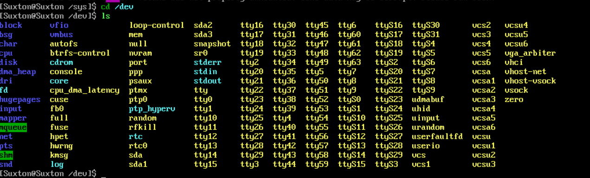
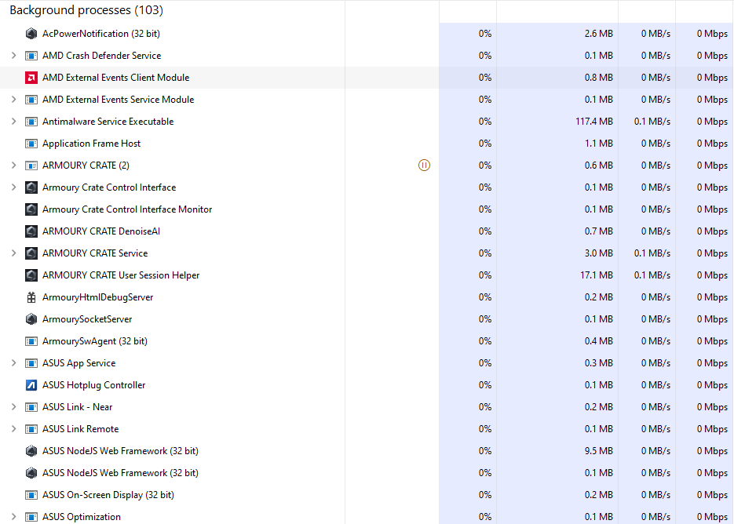
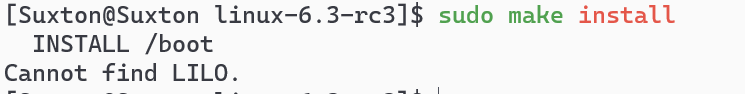

# 实验一：安装Linux并学会简单的使用Linux和Windows命令

## Linux部分

1. **安装Linux**

    在众多的发行版里面，我选择了Arch Linux，因为这个发行版是滚动更新的，可以时时刻刻使用最新的内核。

    我使用的虚拟环境是Windows专业版自带的Hyper-V工具，接下来的演示都是基于Hyper-V虚拟机。

    由于Arch Linux安装的过程过于繁琐，而且我在实验之前就已经完成了安装，所以这里我只放一张安装之后的截图。

    （因为图形化界面没什么用，我就没安装桌面环境。）

    

2. **熟悉Linux系统常用的命令**

    1. ls 命令：用于展示当前目录下的所有的目录和文件，下面的截图展示了我的家目录下的所有文件和目录。

        

    2. cd 命令：用于选择一个目录，下面的截图中我选择了我家目录下的code目录。

        

    3. mkdir 命令：在指定的位置创建一个文件夹，下面的截图在我的家目录下创建了一个hello目录。

        

    4. rmdir 命令：用于删除一个空的目录，下面的截图中我把刚刚创建的hello目录删掉。

        

    5. rm 命令：用于删除文件或目录（加-r），下面的截图中我把我家目录的1.txt删除了。

        

    6. cp 命令：用于复制一个文件，第一个参数是源文件，第二个参数是目标文件名（可以加上目录，默认为当前文件夹）。下面我先创建了一个1.txt，然后把它复制了一遍。

        

    7. tar 命令：用于归档，类似于压缩文件。-cf用于创建一个档案，-xf用于释放档案中的文件。下面的截图中，我先创建了有两个文件的tar，再把两个文件删除，再解压了tar文件。

        

    8. ps命令：用于查看运行的程序

        查看全部进程

        

        查看正在运行的进程

        

    9. dd命令：将一个文件的内容拷贝到另一个文件，可以对数据进行一些处理

        先建立一个文本文件，然后正常拷贝

        

        拷贝的时候将小写转换为大写

        

        拷贝的时候将大写转换为小写

        

3. **前后台执行**

    1. 在终端中直接输入命令就是前台执行，上面所有的截图都是前台执行的。

    2. 在命令后面加上&就能将一个程序放在后台执行。在截图中，我在后台执行了ping命令，终端会输出ping的内容，同时我可以继续执行新的命令。直到我结束了ping程序。

        

4. **环境配置文件**

    Linux的环境配置文件是/etc/profile中，我使用bat（cat的加强版）工具查看。

    

    输入env就能查看环境变量，下面使用管道传入bat查看。

    

5. **用户信息文件**

    用户信息存在/etc/passwd，使用cat查看

    

6. **设备加载信息**

    Linux下所有的设备都会出现在/dev中，下面使用ls查看。

    

7. **系统启动脚本文件**

    我自己写了个脚本，然后执行了一下

    

## Windows部分

1. **了解进程和服务**

    1. 用户的进程

        

    2. 系统的进程（后台运行）

        这里面有华硕还有AMD还有英伟达的驱动程序进程，都是由系统执行的。

        

    3. 系统的服务

        齿轮图标的都是服务进程，其他的是普通进程，都是系统提供的服务。

        

2. **常用命令**

    1. copy 命令：我创建了一个1.txt文件，再用copy命令复制了一遍。可能是我用的Windows11，很多命令被改进了，这个命令和Linux没啥区别。

        

    2. del 命令：我把刚刚创建的1.txt文件删除了，感觉和Linux没啥区别。

        

    3. dir 命令：显示当前的目录下所有文件和目录，相当于ls -a

        

    4. cd 命令：选择一个目录，和Linux差不多

        

## 差异

可能是我使用的是最新的Windows11，Windows的终端饱受诟病，所有可能有优化。我现在发现Linux很多命令在Windows下也可以使用，比如rm，ls，touch等。所有，Windows下的命令我并没有发现和Linux有很大的区别。

不过在Windows下不区分大小写，而Linux严格区分大小写。

## 编译内核

为了方便复制粘贴，我接下来都使用ssh连接虚拟机中的Linux。

1. 下载内核，使用wget命令

    

2. 解压包

    

    

3. 进入文件夹，使用 `make menuconfig `启动图形化界面，并配置内核

    

4. 开始编译

    

    

5.  安装内核

    

    

## 改变用户ID

1. 使用root用户登录

   

2. 创建一个测试用户（不创建用户目录），通过查看passwd文件，得到id为1001

    

    

3. 修改id为1002

    

4. 将上面的功能写为shell，使用cat命令查看

    

5. 测试.sh文件

    可以看见，id已经被成功更改

    