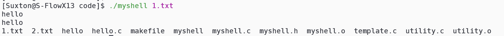

# 实验二 **DEVELOPING A SHELL**

### 构建程序

1. 程序的测试运行环境为 Arch Linux，内核版本5.15

    

2. gcc版本12.2.1

    

3. makefile种定义了两种构建方式，默认是只构建。如果加 run 的话就是编译并运行。

    仅编译

    

    编译运行

    

4. 界面说明：

    在 $ 前面的是当前的工作目录，后面是输入的命令

    

### 内置命令

1. cd

    在没有参数的时候会输出当前的目录，有参数的时候会选择目录或者输出错误信息。

    

    而且pwd命令被无参数的cd替换

    

2. clr

    清楚屏幕信息

    

    

3. dir

    

4. environ

    显示所有环境变量

    

5. echo

    输出后面的参数

    

6. help

    显示帮助手册，使用more输出，这样当终端空间不够的时候可以上下翻页

    

7. pause

    暂停shell，直到空格按下

    

8. quit

    退出myshell

    

### myshell环境

我有一个hello程序，可以输出一段hello，和myshell处于同一个目录下。

红色框中的是可执行文件


现在进入myshell，选择其他的目录，运行hello，成功执行。而且很显然在 当前目录下并没有hello的可执行程序。所以，只要将可执行文件放在myshell目录下就能在任何地方执行。


### 外部命令

外部命令太多了，这里测试几个有代表性的。

1. ls

    

2. make

    

### 后台运行

在结尾加上 & 就能后台执行，后台执行就是不等命令执行完成就回到shell。

下面使用ping命令作为对比

1. 不加 &

    一直没有回到myshell，输入的命令没有任何反应。

    

2. 加上 &

    开始执行之后马上回到 myshell ，而且可以对我输入的其他命令做出响应（图中我演示了 ls 和 killall）。我在 ping 执行的时候使用 killall 命令结束了 ping 的进程。

    

### 重定向输入输出

##### 输入

使用 < 符号来指定重定向输入的文件 ，此处使用cat命令测试


##### 输出

1. 增加文本

    使用 >> 符号指定输出的文件，输出方式为增加。

    使用内置命令echo

    

    使用外部命令ls

    

2. 截断文本

    使用 > 符号指定输出的文件，输出方式为截断。

    使用内置命令echo

    

    使用外部命令ls

    

### 执行批处理脚本

在myshell后面的参数中传入批处理文件就可以执行。

演示的脚本为1.txt


结果：



### 代码

1. `makefile`

    ```makefile
    .PHONY: clear
    
    CC = gcc
    RM = rm
    EXE = myshell
    OBJS = myshell.o utility.o
    
    $(EXE): $(OBJS) 
    	@$(CC) -o $(EXE) $(OBJS)
    run: $(EXE)# clean
    	@./$(EXE)
    myshell.o: myshell.c myshell.h
    	@$(CC) -o myshell.o -c myshell.c
    utility.o: utility.c myshell.h
    	@$(CC) -o utility.o -c utility.c
    clear:
    	@$(RM) $(EXE) $(OBJS)
    clean:
    	@$(RM) $(OBJS)
    ```

    

2. `myshell.c`

    ```c++
    #include "myshell.h"
    char elf_path[BUF_SIZE] = ":";//myshell可执行文件路径
    char env[BUF_SIZE];
    char path[BUF_SIZE];//当前工作路径
    char cmd[BUF_SIZE];//当前命令
    
    int main(int argc, char** argv) {
        int count = readlink("/proc/self/exe", elf_path + 1, BUF_SIZE - 1);//得到myshell的绝对路径
        elf_path[count - 6] = '\0';
        setenv("PATH", strcat(getenv("PATH"), elf_path), 1);//将文件目录加入环境变量
        // printf("export PATH=\"$PATH:%s\"", elf_path);
        // strcat(env, elf_path);
        // system(env);
        getcwd(path, BUF_SIZE);//得到当前工作路径
    
        if (argc == 1) {//没有参数，交互模式
            while (1) {
                printf("%s $ ", path);//展示当前路径
                fgets(cmd, BUF_SIZE, stdin);//读取输入
                if (cmd_analyzer(cmd) == 0)//分析命令行
                    return 0;
            }
        }
        else {//有参数，执行批操作文件
            int fd = open(argv[1], O_RDONLY | O_CREAT, 0666);//重定向输入
            // close(fileno(stdin));
            close(STDIN_FILENO);
            // dup2(fd, fileno(stdin));
            dup2(fd, STDIN_FILENO);//将文件 重定向到stdin
            close(fd);
            while (1) {
                // printf("%s $ ", path);//展示当前路径
                if(fgets(cmd, BUF_SIZE, stdin)==NULL)break;//读取输入,遇到结尾退出
                if (cmd_analyzer(cmd) == 0)//分析命令行
                    return 0;
            }
        }
        return 0;
    }
    
    ```

    

3. `utility.c`

    ```c++
    #include "myshell.h"
    extern char path[BUF_SIZE];//当前工作路径
    extern char elf_path[BUF_SIZE];//myshell可执行文件路径
    // FILE* myin;
    // FILE* myout;
    
    
    char* cmd_list[] = {//命令列表
        "exit",
        "quit",
        "cd",
        "pwd",
        "echo",
        "clr",
        "pause",
        "dir",
        "help",
        "environ"
    };
    int (*func_list[]) (char**) = {//命令函数列表
        &myexit,
        &myexit,
        &mycd,
        &mycd,
        &myecho,
        &myclr,
        &mypause,
        &mydir,
        &myhelp,
        &myenviron
    };
    
    int cmd_analyzer(char* cmd) {//指令分析
        char** divs = (char**)malloc(BUF_SIZE * sizeof(char*));//建立指针数组，存入多个字符串
        char* word = strtok(cmd, DIV_CHARS);//得到第一个字符
        char* in, * out;//重定向文件路径e
        in = out = NULL;
        // myin = stdin;//如果没有重定向默认为stdin
        // myout = stdout;//如果没有重定向默认为stdout
        int pos = 0;
        int singal = 0;
        int fd = STDOUT_FILENO;
        int fd_old = fd;
        while (word != NULL) {
            if (strcmp(word, "&") == 0) {//判断是否需要后台运行
                singal |= BACKGROUND;
                break;
            }
            // else if (strcmp(word, "<") == 0) {//判断是否需要重定向输入
            //     char* pre = word;
            //     word = strtok(NULL, DIV_CHARS);
            //     if (word == NULL) {
            //         divs[pos++] = pre;
            //         break;
            //     }
            //     else {
            //         int fd_in = open(word, O_RDONLY | O_CREAT, 0666);
            //         int fd_in_old = dup(STDIN_FILENO);
            //         dup2(fd_in, STDIN_FILENO);
            //         divs[pos] = (char*)malloc(BUF_SIZE * sizeof(char));
            //         while (scanf("%s", divs[pos]) != EOF) {
            //             pos++;
            //             divs[pos] = (char*)malloc(BUF_SIZE * sizeof(char));
            //         }
            //         free(divs[pos]);
            //         dup2(fd_in_old, STDIN_FILENO);
            //         close(fd_in);
            //         divs[pos] = NULL;
            //         word = strtok(NULL, DIV_CHARS);
            //         continue;
            //     }
            // }
            divs[pos++] = word;
            word = strtok(NULL, DIV_CHARS);
        }
        divs[pos] = NULL;
        for (int i = 1;i < pos;i++) {//检查是否需要重定向
            if (strcmp(divs[i], "<") == 0 && divs[i + 1] != NULL) {//重定向输入
                singal |= REIN;
                in = divs[i + 1];
            }
            else if (strcmp(divs[i], ">") == 0 && divs[i + 1] != NULL) {//重定向截断输出
                singal |= REOUT_TRUNC;
                out = divs[i + 1];
                // fd = open(divs[i + 1], O_WRONLY | O_CREAT | O_TRUNC, 0666);
                // fd_old = dup(STDOUT_FILENO);
                // dup2(fd, STDOUT_FILENO);
            }
            else if (strcmp(divs[i], ">>") == 0 && divs[i + 1] != NULL) {//重定向增加输出
                singal |= REOUT_APPEND;
                out = divs[i + 1];
                // fd = open(divs[i + 1], O_WRONLY | O_CREAT | O_APPEND, 0666);
                // fd_old = dup(STDOUT_FILENO);
                // dup2(fd, STDOUT_FILENO);
            }
            else continue;
            pos = i < pos ? i : pos;//重定向的内容不用传参
            i++;
        }
        divs[pos] = NULL;//标记参数列表结尾
        if (divs[0] == NULL) {//输入为空
            free(divs);
            return 1;
        }
        for (int i = 0;i < CMD_NUM;i++) {//分析是第几个内置函数
            if (!strcmp(divs[0], cmd_list[i])) {
                int status;//保存执行结果
                if (singal & REOUT_TRUNC) {//重定向截断输出
                    fd = open(out, O_WRONLY | O_TRUNC | O_CREAT, 0666);
                    fd_old = dup(STDOUT_FILENO);
                    close(fileno(stdout));
                    dup2(fd, fileno(stdout));
                    close(fd);
                }
                else if (singal & REOUT_APPEND) {//重定向增加输出
                    fd = open(out, O_WRONLY | O_APPEND | O_CREAT, 0666);
                    fd_old = dup(STDOUT_FILENO);
                    close(fileno(stdout));
                    dup2(fd, fileno(stdout));
                    close(fd);
                }
                status = ex_cmd(i, divs);
                free(divs);
                if (fd_old != STDOUT_FILENO) {//如果重定向，输出恢复到stdio
                    dup2(fd_old, STDOUT_FILENO);
                    close(fd);
                }
                return status;
            }
        }
        not_buildin_cmd(singal, divs, in, out);
        free(divs);//释放内存
        return 1;
    }
    int ex_cmd(int n, char** args) {//前台执行命令
        return (*func_list[n])(args);
    }
    
    int not_buildin_cmd(int singal, char** args, char* in, char* out) {//外部命令
        pid_t pid = fork();
        int statue = 1;
        if (pid == 0) {//子进程
            if (singal & REOUT_TRUNC) {//重定向截断输出
                int fd = open(out, O_WRONLY | O_TRUNC | O_CREAT, 0666);
                // close(fileno(stdout));
                close(STDOUT_FILENO);
                // dup2(fd, fileno(stdout));
                dup2(fd, STDOUT_FILENO);
                close(fd);
            }
            else if (singal & REOUT_APPEND) {//重定向增加输出
                int fd = open(out, O_WRONLY | O_APPEND | O_CREAT, 0666);
                // close(fileno(stdout));
                close(STDOUT_FILENO);
                // dup2(fd, fileno(stdout));
                dup2(fd, STDOUT_FILENO);
                close(fd);
            }
            if (singal & REIN) {//重定向输入
                int fd = open(in, O_RDONLY | O_CREAT, 0666);
                // close(fileno(stdin));
                close(STDIN_FILENO);
                // dup2(fd, fileno(stdin));
                dup2(fd, STDIN_FILENO);
                close(fd);
            }
            execvp(args[0], args);
            // char** new_env = { __environ };
            // execve(args[0], args, __environ);
            // execv(args[0], args);
            perror("execvp error");
            exit(EXIT_FAILURE);
        }
        else if (pid < 0) {
            perror("fork error");
        }
        else {
            if (singal & BACKGROUND) return 1;//后台执行
            else waitpid(pid, &statue, 0);//前台执行，等待子进程完成
        }
        // return statue;
        return 1;
    }
    
    int mycd(char** args) {//cd命令
        if (args[1] == NULL) {//没有参数，就输出当前目录
            printf("current directory: %s\n", path);
        }
        else {//有参数选择目录
            if (chdir(args[1]) != 0) perror("cd error");//打开失败，显示错误信息
            else getcwd(path, BUF_SIZE);//打开成功，更新path
        }
        return 1;
    }
    
    int myexit(char** args) {//返回0表示退出
        return 0;
    }
    
    int myecho(char** args) {//echo命令
        int pos = 1;
        while (args[pos] != NULL) {//按序输出每个参数
            printf("%s ", args[pos++]);
        }
        printf("\n");
        return 1;
    }
    
    int myclr(char** args) {//清楚屏幕
        system("clear");
        return 1;
    }
    
    int mypause(char** args) {//暂停命令
        puts("Paused, press enter to continue");
        while (getchar() != '\n');
        return 1;
    }
    
    
    int mydir(char** args) {//dir命令
        return not_buildin_cmd(0, args, NULL, NULL);
    }
    
    int myhelp(char** args) {//help命令
        char* helps = "This is a shell developed by Suxton\n\
            You can use this shell as other shells\n\
            There are several build-in functions in this shell\n\
            cd <directory>: select a directory. It would show current directory if you invoke whout arguments\n\
            clr : clear the screen\n\
            dir <directory>: - List the contents of directory <directory>.\n\
            environ : List all the environment strings.\n\
            echo <comment> : Display <comment> on the display followed by a new line\n\
            help : Display this user manual using the more filter.\n\
            pause : Pause operation of the shell until 'Enter' is pressed.\n\
            quit : Quit the shell.\n\
            ues < to redirect stdin\n\
            use > to redirect stdout to a file with trunc\n\
            use >> to redirect stdout to a file with append\n";//我的终端没有中文字体，所以都是英文
        FILE* pipe = popen("more", "w");//用管道传给more
        fprintf(pipe, "%s", helps);
        pclose(pipe);
        return 1;
    }
    
    int check_char(char ch) {//排除变色控制字符
        return (isalpha(ch) || isalnum(ch) || ch == ':' || ch == '/' ||
            ch == '_' || ch == '=' || ch == '-' ||
            ch == '.' || ch == '*' || ch == ';' ||
            ch == '%' || ch == '\t' || ch == '\n' ||
            ch == ' ' || ch == '\r'); //return 1;
        // return 0;
    }
    int myenviron(char** args) {//environ命令
        int cnt = 0;
        while (__environ[cnt] != NULL) {
            // int bound = strlen()
            for (int i = 0;;i++) {
                if (check_char(__environ[cnt][i]))
                    putchar(__environ[cnt][i]);
                else break;
            }
            cnt++;
            putchar('\n');
        }
        return 1;
    }
    
    ```

    

4. `myshell.h`

    ```c++
    #include <stdio.h>
    #include <stdlib.h>
    #include <string.h>
    #include <unistd.h>
    #include <fcntl.h>
    #include <ctype.h>
    #include <sys/types.h>
    #include <sys/wait.h>
    //常量
    #define CMD_NUM 10 //含有的命令
    #define BUF_SIZE 256//缓冲区大小
    #define DIV_CHARS " \n\t\r"
    
    //运行参数
    //后台运行
    #define BACKGROUND  1 
    //重定向输入
    #define  REIN 2 
    //重定向截断输出
    #define  REOUT_TRUNC  4 
    //重定向增加输出
    #define  REOUT_APPEND 8 
    
    //工具
    int cmd_analyzer(char*);//命令分析
    int ex_cmd(int, char**);//命令执行
    int not_buildin_cmd(int, char**, char*, char*); //外部命令
    
    //内建命令
    int myexit(char**);
    int mycd(char**);
    int myecho(char**);
    int myclr(char**);
    int mypause(char**);
    int mydir(char**);
    int myhelp(char**);
    int myenviron(char**);
    
    ```

    
