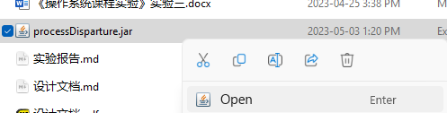
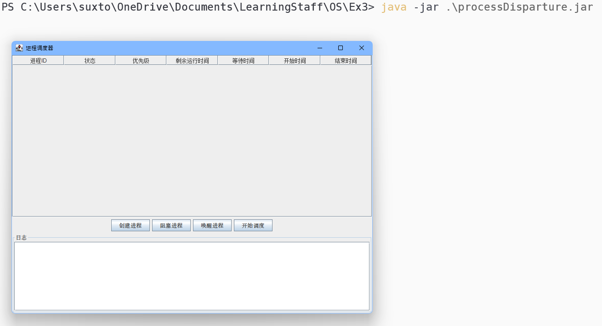
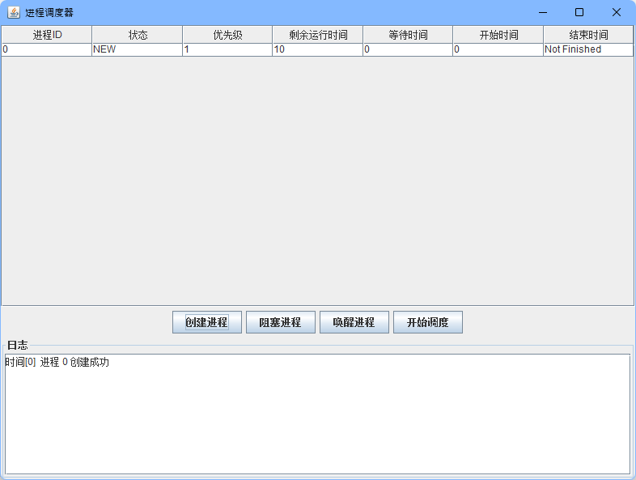
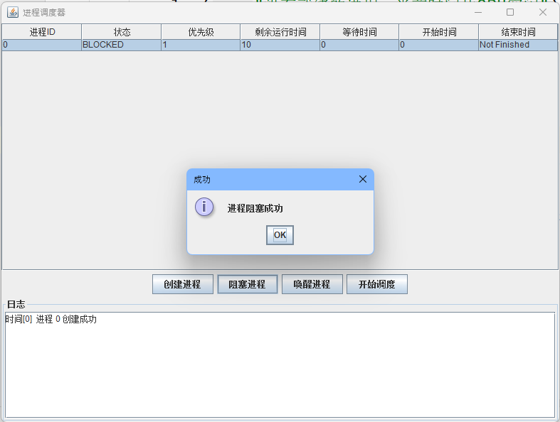
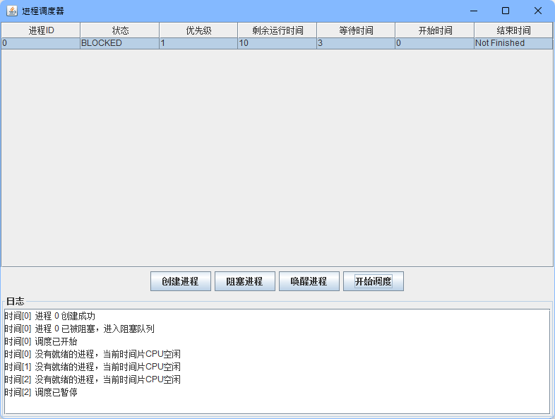
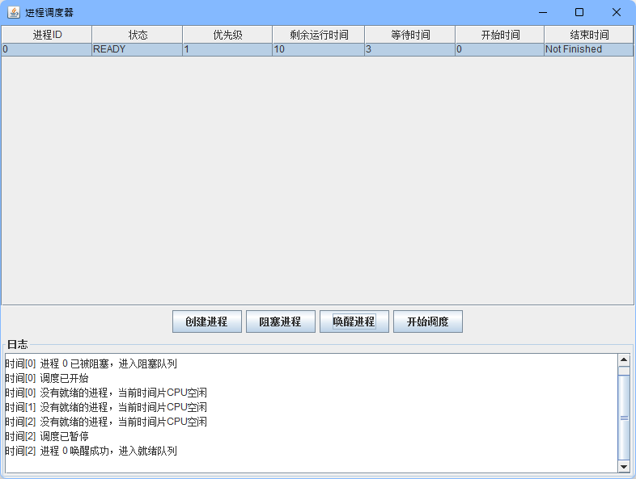
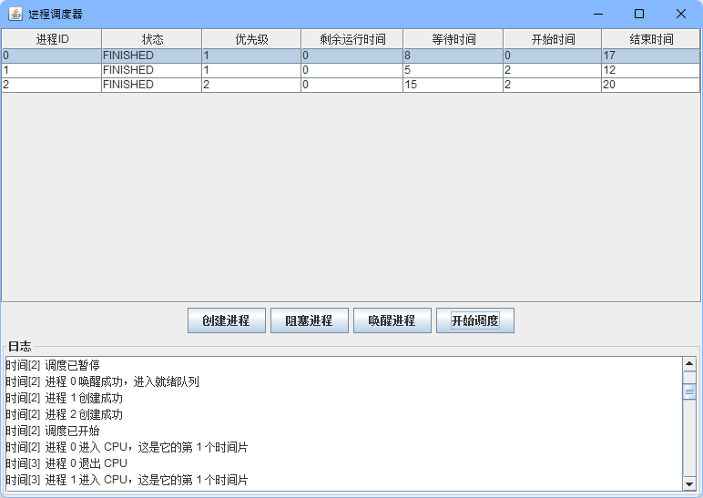
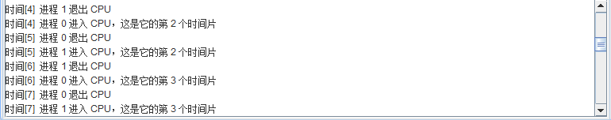
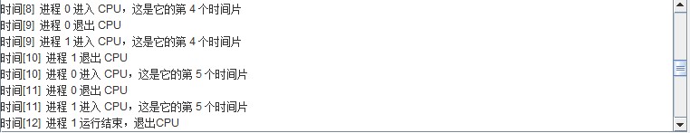

# 实验报告

##  简述：

为了方便使用GUI，本次实验使用Java完成，图形化框架使用的是Java自带的swing。程序我已经打包成Jar文件，可以直接运行。运行本程序需要Java1.8及以上的版本。

+ 如果系统中有JRE，可以直接双击文件运行

    

+ 如果只有JDK的话，可以使用命令行运行

    

## 功能介绍

提示：在打开软件的时候，为了方便在0时刻创建进程，默认没有开启进程调度。需要点击“开始调度”按钮才会开始调度。

### 创建进程

点击创建进程按钮，会弹出对话框询问需要插入进程的优先级和剩余时间。

在进程列表和log中都有展示。

### 阻塞进程

在表格中点击进程的那一行，点击阻塞进程，就能将进程阻塞

此时开始调度的话会因为进程0在阻塞队列里面，就绪进程为空而没有可以运行的进程。

### 唤醒进程

选择需要唤醒的进程，点击唤醒进程，就可以将进程的状态切换到就绪状态。

### 调度控制

在开始调度之后，每个时间片的结束都会将当前的进程撤出CPU并放在队列的最后。然后找到在队列中优先级最高（数字最小）的进程，将其设为运行状态。处于就绪队列或者阻塞队列的等待时间会增加。

### 日志记录

进程每次变动都会记录。上面已经展示过效果。

