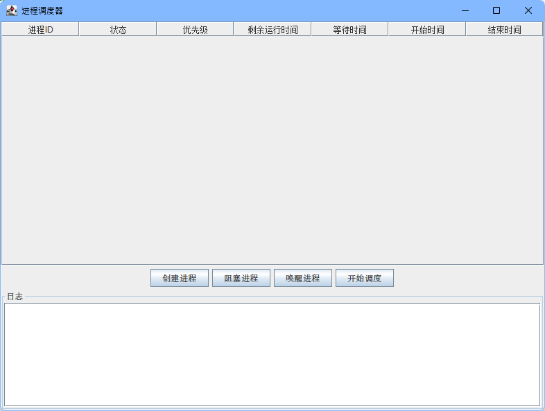
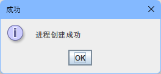
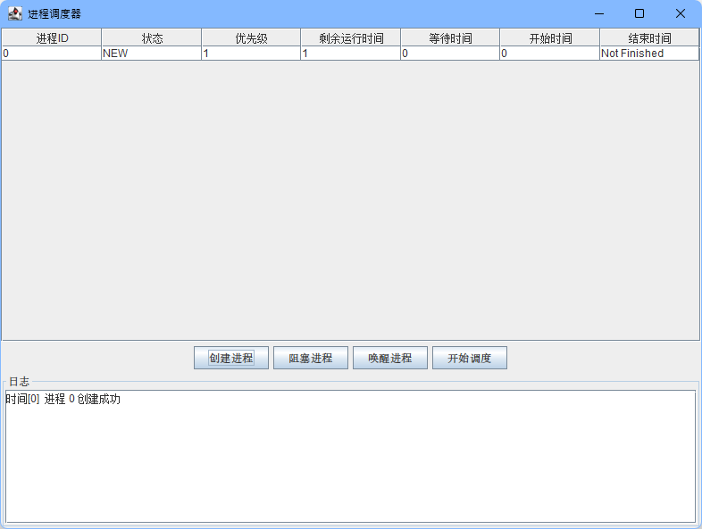

# 进程调度器

## 功能介绍

进程调度器是一个简单的带图形界面的进程调度器，可以创建进程、阻塞进程、唤醒进程和控制进程调度。同时有日志显示，用于了解当前进程状态。

代码在`processDisparture`下，打包好的可执行文件为`processDisparture.jar`（需要Java1.8及以上的运行时）。

## 界面组件

#### 进程列表

- 显示所有进程的信息，包括进程ID、状态、优先级、剩余运行时间、等待时间、开始时间和结束时间。

#### 创建进程按钮

- 点击后弹出对话框，输入新进程的优先级和剩余运行时间，创建新进程并添加到进程列表中。

#### 阻塞进程按钮

- 选中某个进程后，点击该按钮可以将该进程阻塞。

#### 唤醒进程按钮

- 选中某个已阻塞的进程后，点击该按钮可以将该进程唤醒。

#### 调度控制按钮

- 当计时器没有暂停的时候，按钮显示为“暂停调度”，此时点击可以启动计时器，并开始调度。
- 当计时器暂停的时候，按钮显示为“开始调度”，此时点击可以暂停计时器，进程调度也随之停止。

#### 日志文本框

- 显示程序运行过程中的日志。比如进程进入或退出CPU，阻塞或是恢复，调度的开始或暂停。

## 功能设计

### 进程调度算法

+ 进程调度算法采用时间片轮转算法，在调度的时候会优先选择优先级高的进程（优先级数字越小越高）。
+ 从运行状态退出的进程会进入就绪队列，每个时间片中，阻塞和就绪队列的进程都会将等待时间加上时间片的长度。
+ 阻塞的进程都会进入阻塞队列，恢复的进程会进入就绪队列。

### 数据结构

#### 进程控制块（PCB）

- PCB包含进程的ID、状态、优先级、剩余运行时间、等待时间、开始时间和结束时间。

#### 运行队列

- 只有一个进程可以运行，因此没有运行队列。
- 取而代之的是 `runningProcessId` 用于存放当前运行的进程的PID。

#### 新建队列

- 存放新创建的进程PID。

#### 就绪队列

- 存放已创建并等待运行的进程PID。

#### 阻塞队列

- 存放被阻塞的进程PID。

### 类

#### `ProcessSchedulerGUI`

- 进程调度器GUI类，用于构建用户界面。
- 包含进程列表、创建进程按钮、阻塞进程按钮、唤醒进程按钮、控制按钮、日志文本框等组件。
- 实现了ActionListener接口，用于处理各种事件。
- 实现了创建进程、阻塞进程、唤醒进程和调度控制等方法。

#### `PCB`

- 进程控制块类，包含进程的ID、状态、优先级、剩余运行时间、等待时间、开始时间和结束时间等信息。
- 包含创建PCB的构造函数和更新PCB信息的方法。

#### `ProcessState`

+ 枚举类，用于表示进程的状态。
+ 有五种：NEW(新建)、READY(就绪)、RUNNING(运行)、BLOCKED(阻塞)、FINISHED(结束)

## 界面设计

### 主界面

上面是进程列表，下面是进程控制按钮，最下面是日志显示。



### 添加进程

询问进程的优先级和运行时间，并输出日志。






## 代码

### `ProcessSchedulerGUI`

构建GUI，并完成程序逻辑

```java
import javax.swing.*;
import javax.swing.table.DefaultTableModel;
import java.awt.*;
import java.awt.event.ActionEvent;
import java.awt.event.ActionListener;
import java.util.ArrayList;

public class ProcessSchedulerGUI extends JFrame implements ActionListener {

    private static final int MAX_PROCESSES = 100;
    private static final int TIME_SLICE = 1;//单位为秒
    private static int timeNow = 0;
    private boolean paused = true;
    private final JTable processTable;//进程列表
    private final DefaultTableModel tableModel;
    private final JButton createButton;//创建进程按钮
    private final JButton blockButton;//阻塞进程按钮
    private final JButton wakeUpButton;//唤醒进程按钮
    private final JButton controlButton;//调度控制按钮
    private final JTextArea logArea; // 日志文本框
    private final PCB[] processes = new PCB[MAX_PROCESSES];//加入的所有进程
    private int processesNum = 0;

    private final ArrayList<Integer> newQueue = new ArrayList<>();//新建列表
    private final ArrayList<Integer> readyQueue = new ArrayList<>();//就绪列表
    private final ArrayList<Integer> blockedQueue = new ArrayList<>();//阻塞列表

    //一次只运行一个，所有没有运行队列
    //结束之后不需要维护PCB，所有没有结束队列
    private int runningProcessId = -1;
    private final Timer timer; // 定时器

    public ProcessSchedulerGUI() {
        //窗口标题
        super("进程调度器");

        // 创建表格模型和表格
        String[] columnNames = {"进程ID", "状态", "优先级", "剩余运行时间", "等待时间", "开始时间", "结束时间"};
        tableModel = new DefaultTableModel(columnNames, 0);
        processTable = new JTable(tableModel);
        processTable.getTableHeader().setReorderingAllowed(false); // 禁止表头拖动


        // 创建按钮
        createButton = new JButton("创建进程");
        blockButton = new JButton("阻塞进程");
        wakeUpButton = new JButton("唤醒进程");
        controlButton = new JButton("开始调度");

        // 添加按钮监听器
        createButton.addActionListener(this);
        blockButton.addActionListener(this);
        wakeUpButton.addActionListener(this);
        controlButton.addActionListener(this);

        // 创建面板
        JPanel buttonPanel = new JPanel();
        buttonPanel.setLayout(new FlowLayout());
        buttonPanel.add(createButton);
        buttonPanel.add(blockButton);
        buttonPanel.add(wakeUpButton);
        buttonPanel.add(controlButton);
        // 日志文本框面板
        JPanel logPanel = new JPanel(new BorderLayout());
        logPanel.setBorder(BorderFactory.createTitledBorder("日志"));
        logArea = new JTextArea();
        logArea.setEditable(false);
        JScrollPane scrollPane = new JScrollPane(logArea);
//        scrollPane.setVerticalScrollBarPolicy(JScrollPane.VERTICAL_SCROLLBAR_ALWAYS); // 设置垂直滚动条总是可见
        scrollPane.setPreferredSize(new Dimension(200, 150));
        logPanel.add(scrollPane);


        //底部元素
        JPanel bottomContents = new JPanel();
        //纵向排布
        bottomContents.setLayout(new BoxLayout(bottomContents, BoxLayout.Y_AXIS));
        bottomContents.add(buttonPanel);
        bottomContents.add(logPanel);
        // 添加组件到窗口
        add(new JScrollPane(processTable), BorderLayout.CENTER);
        add(bottomContents, BorderLayout.SOUTH);

        // 设置窗口属性
        setDefaultCloseOperation(JFrame.EXIT_ON_CLOSE);
        setSize(800, 600);
        setVisible(true);

        // 时间片
        int timeSlice = 1000 * TIME_SLICE;//单位转换
        timer = new Timer(timeSlice, this);
//        timer.start();
    }

    // 创建进程
    private void createProcess(int priority, int remainTime) {
        if (processesNum >= MAX_PROCESSES) {
            JOptionPane.showMessageDialog(this, "进程数已达上限", "错误", JOptionPane.ERROR_MESSAGE);
            return;
        }

        // 创建新进程并添加到数组中
        PCB process = new PCB(processesNum, priority, timeNow, remainTime);
        newQueue.add(processesNum);//加入新建列表
        log("进程 " + processesNum + " 创建成功");
        processes[processesNum++] = process;

        // 添加进程信息到表格中
        Object[] rowData = {process.pid, process.state, process.priority, process.remainingTime, process.waitingTime, process.startTime, "Not Finished"};
        tableModel.addRow(rowData);

        JOptionPane.showMessageDialog(this, "进程创建成功", "成功", JOptionPane.INFORMATION_MESSAGE);
    }

    // 阻塞进程
    private void blockProcess() {
        int pid = processTable.getSelectedRow();
        if (pid == -1) {
            JOptionPane.showMessageDialog(this, "请选择要阻塞的进程", "错误", JOptionPane.ERROR_MESSAGE);
            return;
        }

        PCB process = processes[pid];
        if (process.state.equals(ProcessState.BLOCKED)) {
            JOptionPane.showMessageDialog(this, "该进程已被阻塞", "错误", JOptionPane.ERROR_MESSAGE);
            return;
        }
        if (process.state.equals(ProcessState.FINISHED)) {
            JOptionPane.showMessageDialog(this, "该进程已结束", "错误", JOptionPane.ERROR_MESSAGE);
            return;
        }
        if (process.state.equals(ProcessState.NEW)) {
            newQueue.remove((Integer) pid);
        }
        if (process.state.equals(ProcessState.RUNNING)) {
            runningProcessId = -1;
        }
        if (process.state.equals(ProcessState.READY)) {
            readyQueue.remove((Integer) pid);
        }

        blockedQueue.add(pid);
        process.state = ProcessState.BLOCKED;

        tableModel.setValueAt(process.state, pid, 1);//更新表格
        JOptionPane.showMessageDialog(this, "进程阻塞成功", "成功", JOptionPane.INFORMATION_MESSAGE);
        log("进程 " + pid + " 已被阻塞，进入阻塞队列");
    }

    // 唤醒进程
    private void wakeUpProcess() {
        int pid = processTable.getSelectedRow();
        if (pid == -1) {
            JOptionPane.showMessageDialog(this, "请选择要唤醒的进程", "错误", JOptionPane.ERROR_MESSAGE);
            return;
        }

        PCB process = processes[pid];
        if (!process.state.equals(ProcessState.BLOCKED)) {
            JOptionPane.showMessageDialog(this, "该进程未处于阻塞状态", "错误", JOptionPane.ERROR_MESSAGE);
            return;
        }
        blockedQueue.remove((Integer) pid);
        process.state = ProcessState.READY;//"ready";
        readyQueue.add(pid);//加入就绪队列
        tableModel.setValueAt(process.state, pid, 1);//更新表格
        JOptionPane.showMessageDialog(this, "进程唤醒成功", "成功", JOptionPane.INFORMATION_MESSAGE);
        log("进程 " + pid + " 唤醒成功，进入就绪队列");
    }

    // 调度进程
    private void scheduleProcess() {
        if (runningProcessId != -1) {
            processes[runningProcessId].remainingTime -= TIME_SLICE;//过了一个时间片，减少剩余时间
            if (processes[runningProcessId].remainingTime <= 0) {//如果进程结束
                processes[runningProcessId].state = ProcessState.FINISHED;
                processes[runningProcessId].remainingTime = 0;
                processes[runningProcessId].endTime = timeNow;//标记结束时间
                log("进程 " + runningProcessId + " 运行结束，退出CPU");
                runningProcessId = -1;
            } else {
                //未结束的进程放回就绪列表
                processes[runningProcessId].state = ProcessState.READY;//"ready";
                readyQueue.add(runningProcessId);
                // 如果有正在运行的进程，暂停它并将其添加到队列末尾
                log("进程 " + runningProcessId + " 退出 CPU");
            }
        }
        if (!newQueue.isEmpty()) {
            //将新进程放入就绪队列，并修改状态
            for (int pid : newQueue) {
                processes[pid].state = ProcessState.READY;
                readyQueue.add(pid);
            }
            //放入之后可以将队列清除
            newQueue.clear();
        }
        for (int pid : blockedQueue) {
            processes[pid].blockTime += TIME_SLICE;//增加阻塞列表中进程的阻塞时间
            processes[pid].waitingTime += TIME_SLICE;//增加阻塞列表中进程的等待时间
        }
        if (readyQueue.isEmpty()) {
            log("没有就绪的进程，当前时间片CPU空闲");
            return;
        }
        //选择一个优先级最高的就绪进程
        runningProcessId = readyQueue.get(0);
        for (int pid : readyQueue) {
            processes[pid].waitingTime += TIME_SLICE;//增加未能运行的进程的等待时间
            if (processes[pid].priority < processes[runningProcessId].priority) {
                runningProcessId = pid;//找到优先值最小的
            }
        }
        if (readyQueue.contains(runningProcessId))
            //将选选择运行进程移出就绪队列
            readyQueue.remove((Integer) runningProcessId);
        //选定好了要运行的进程
        //更新状态为运行
        processes[runningProcessId].state = ProcessState.RUNNING;
        processes[runningProcessId].cpuTime++;
        log("进程 " + runningProcessId + " 进入 CPU，这是它的第 " + processes[runningProcessId].cpuTime + " 个时间片");
        processes[runningProcessId].waitingTime--;//被选中运行的程序不需要等待
    }

    // 事件处理函数
    @Override
    public void actionPerformed(ActionEvent e) {
//        System.out.println(e.getSource());
        Object ou = e.getSource();//得到事件的源头
        if (ou == createButton) {//创建按钮
            InputDialog inputDialog = new InputDialog(this, "输入要添加的进程信息", "优先级", "剩余时间");
            ArrayList<Integer> arr = inputDialog.getNumbers();
            if (arr == null) return;
            createProcess(arr.get(0), arr.get(1));
        } else if (ou == wakeUpButton) {//唤醒按钮
            wakeUpProcess();
        } else if (ou == blockButton) {//阻塞按钮
            blockProcess();
        } else if (ou == controlButton) {//控制按钮
            if (paused) {
                controlButton.setText("暂停调度");
                log("调度已开始");
                scheduleProcess();
                timer.start();
            } else {
                controlButton.setText("开始调度");
                log("调度已暂停");
                timer.stop();
            }
            paused = !paused;
//            controlButton.repaint();
        } else {//计时器
            timeNow++;//时间片增加
            scheduleProcess();//调度进程
            updateTable();//更新表格
        }
    }

    //更新表格
    private void updateTable() {
        //"进程ID", "状态", "优先级", "剩余运行时间", "等待时间", "开始时间", "结束时间"
        for (int i = 0; i < processesNum; i++) {
            PCB process = processes[i];
            tableModel.setValueAt(process.state, i, 1);//更新表格
            tableModel.setValueAt(process.remainingTime, i, 3);
            tableModel.setValueAt(process.waitingTime, i, 4);
            tableModel.setValueAt(process.startTime, i, 5);
            if (process.endTime != -1)//已完成
                tableModel.setValueAt(process.endTime, i, 6);
        }
    }


    // 更新日志
    private void log(String msg) {
        logArea.append("时间[" + timeNow + "]  " + msg + "\n");
//        logArea.setCaretPosition(logArea.getDocument().getLength());
    }

    public static void main(String[] args) {
        new ProcessSchedulerGUI();//窗口
    }

}
```

### `PCB`

进程类

```java
class PCB {
    int pid; // 进程ID
    //String status;// 进程状态（0：新建，1：就绪，2：运行，3：阻塞，4：完成）
    ProcessState state;// 进程状态
    int priority; // 进程优先级
    int remainingTime; // 进程剩余运行时间
    int waitingTime; // 进程等待时间
    long startTime; // 进程开始时间
    long endTime; // 进程结束时间
    int blockTime; // 进程阻塞时间
    int cpuTime; // 进程使用CPU时间

    public PCB(int pid, int priority, int beginTime, int runTime) {
        this.pid = pid;
        this.state = ProcessState.NEW;//1;
        this.priority = priority;
        this.remainingTime = runTime;
        this.waitingTime = 0;
        this.startTime = beginTime;
        this.endTime = -1;
        this.blockTime = 0;
        this.cpuTime = 0;
    }


    public static void main(String[] args) {

    }
}
```

### `ProcessState`

枚举类，内涵进程的状态

```java
public enum ProcessState {
    NEW,  // 新建
    READY,  // 就绪
    RUNNING,  // 运行
    BLOCKED,  // 阻塞
    FINISHED  // 完成
}
```

### `InputDialog`

弹出窗口，返回询问的值

```java
import javax.swing.*;
import java.awt.*;
import java.util.ArrayList;

public class InputDialog {
    private ArrayList<Integer> numbers;

    public InputDialog(Component parent, String title, String... args) {
        numbers = new ArrayList<>();
        // 将输入框和标签添加到面板中
        JPanel panel = new JPanel();
        ArrayList<JTextField> textFields = new ArrayList<>();
        for (String now : args) {
            JLabel label = new JLabel(now);
            JTextField textField = new JTextField(5);
            textFields.add(textField);
            panel.add(label);
            panel.add(textField);
        }

        // 弹出窗口
        int result = JOptionPane.showConfirmDialog(parent, panel, title, JOptionPane.OK_CANCEL_OPTION);

        // 处理用户输入
        if (result == JOptionPane.OK_OPTION) {
            for (JTextField textField : textFields) {
                try {
                    numbers.add(Integer.parseInt(textField.getText()));
                } catch (Exception ignore) {
                    JOptionPane.showMessageDialog(parent, "请输入整数", "错误", JOptionPane.ERROR_MESSAGE);
                }
            }
        } else {
            numbers = null;
        }
    }

    public ArrayList<Integer> getNumbers() {
        return numbers;
    }
}
```


