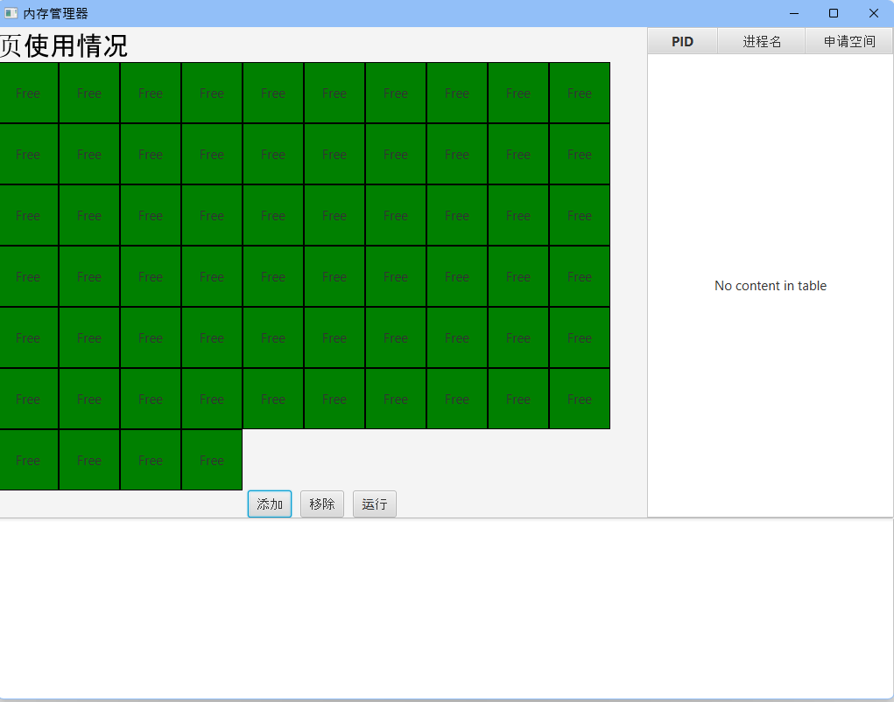
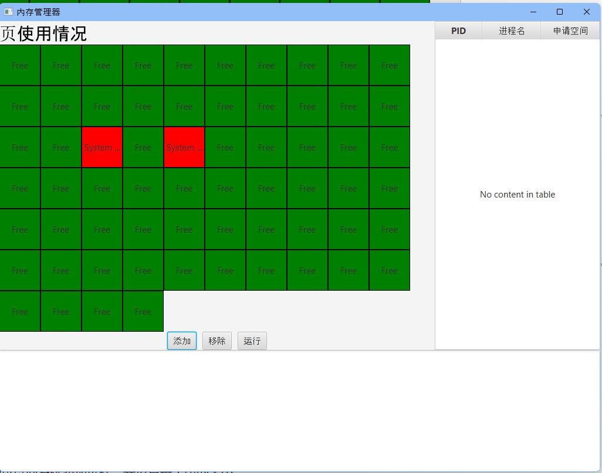
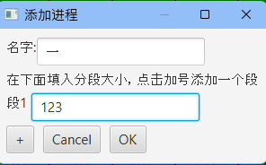
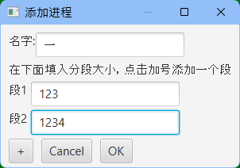
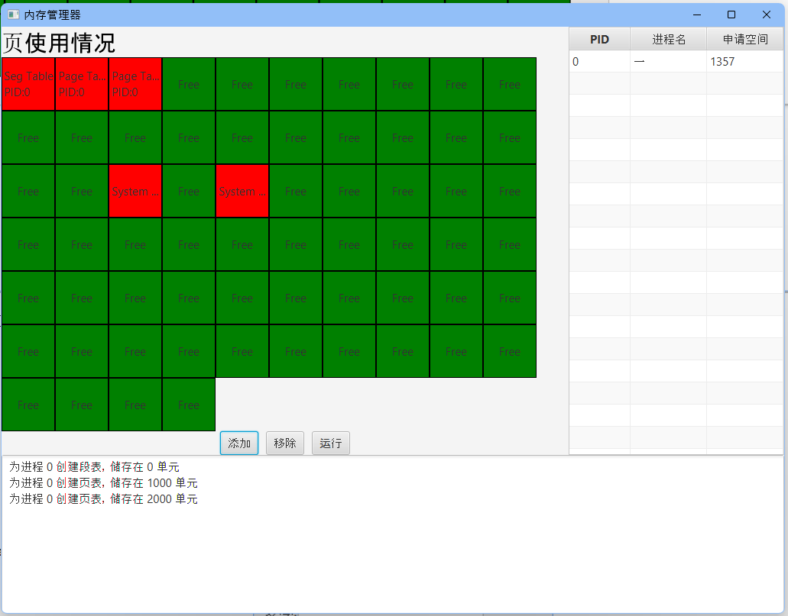
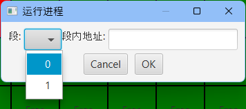
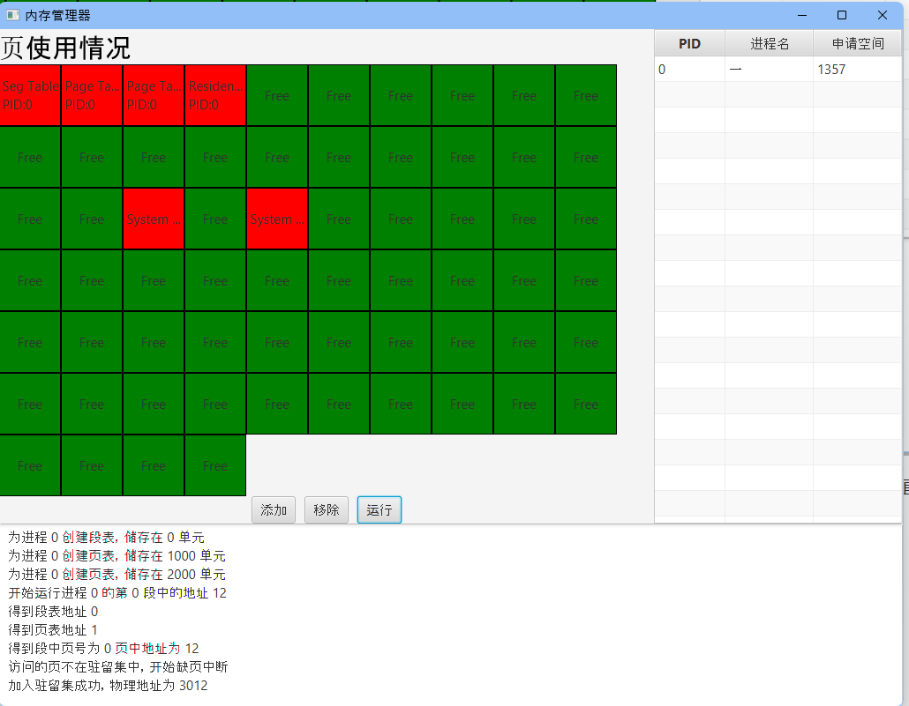
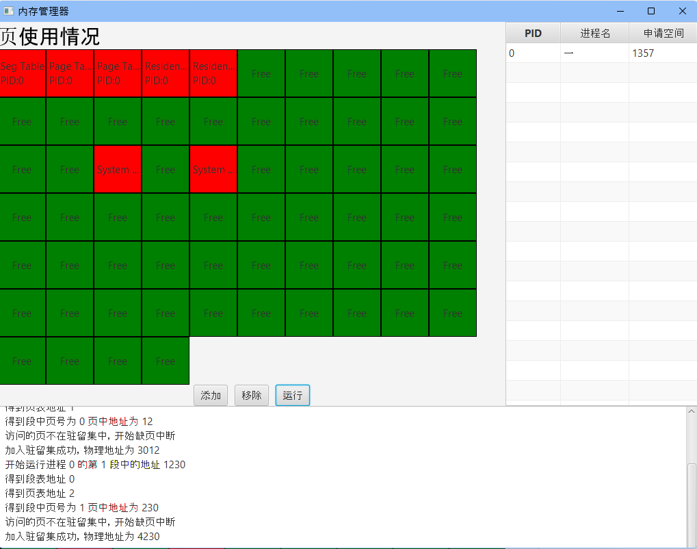
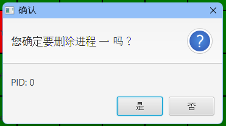
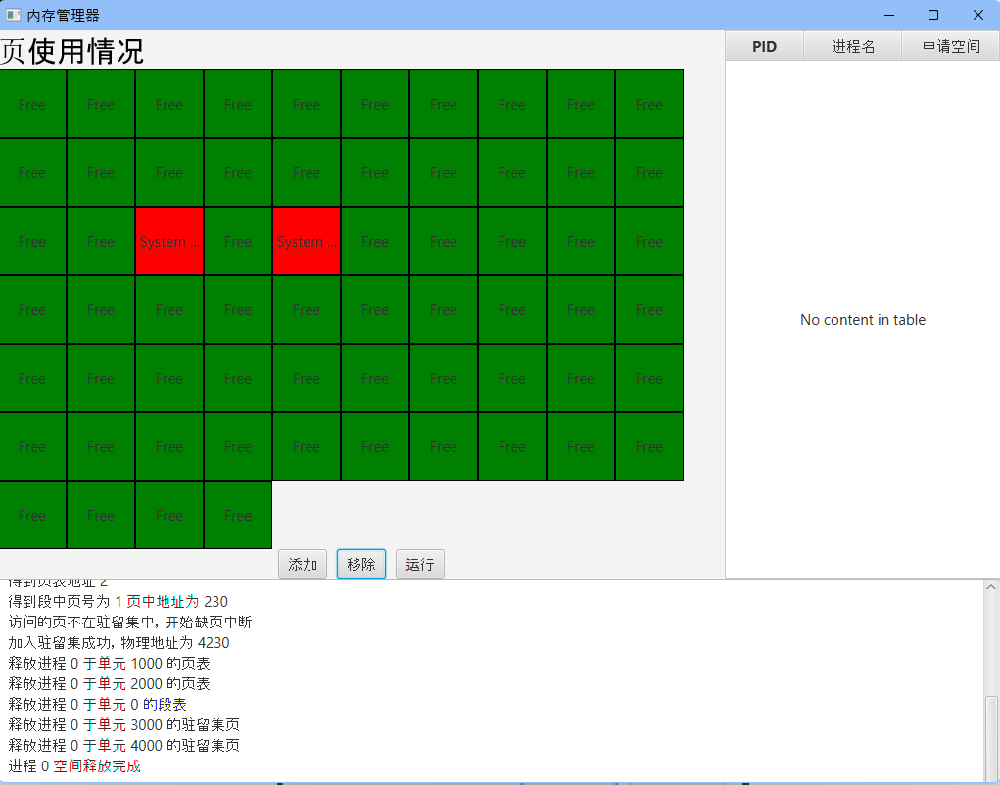

# 段页式存储管理

## 一、项目说明

项目采用JDK1.8构建，使用了JavaFX图形化框架。

在界面的左边是物理页框，展示每个页框的状态，绿色为空闲，红色为使用中。

右边是进程列表，展示进程的基本信息。

下面是日志框，展示所有操作的日志。

## 二、成果演示

1. 刚开始的时候可以用鼠标点击物理页框，将其设为System Use，模拟刚开始就被占用的页框。

   

2. 点击添加可以向系统添加进程，并设置每个段的大小。点击加号可以添加段的数量，最多四个段。

   

   

   

3. 点击运行，并选中的进程。在弹出的窗口中就会询问需要访问哪个段，和段中的地址。如果访问的页在物理页框内，就会直接输出物理地址。如果不在的话，就会调入物理内存中。驻留集采用FIFO策略，会去除最早早进入驻留集的页框。

   

   

   

   

4. 点击移除，可以移除选中的程序，并释放所有占用的资源

   

   

   

