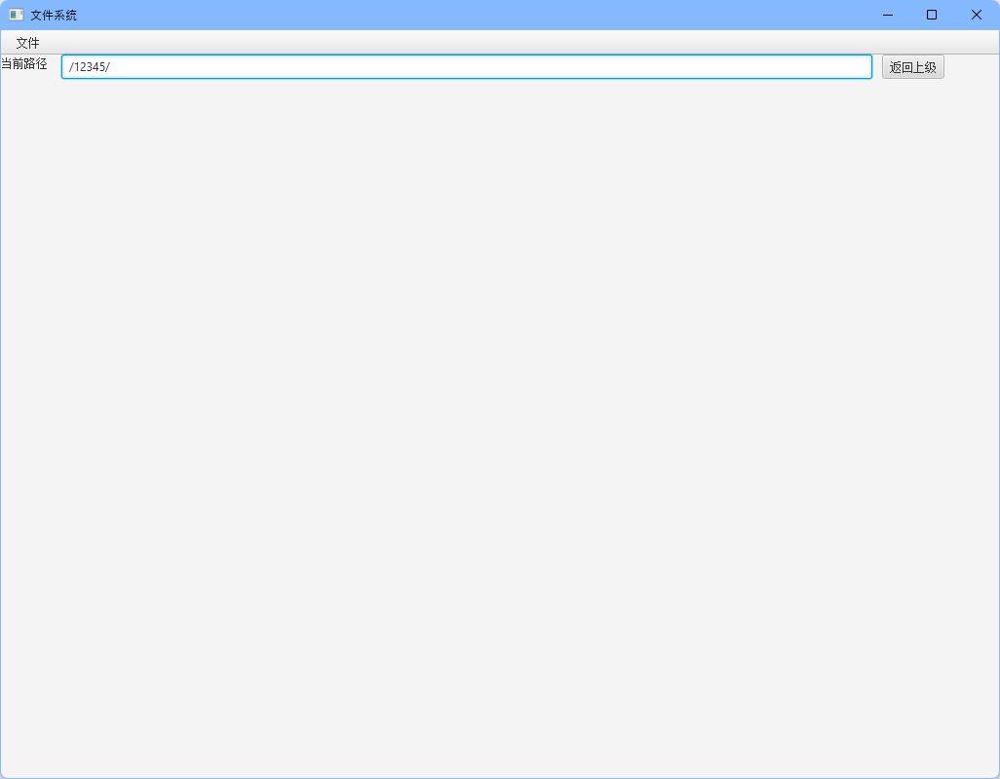
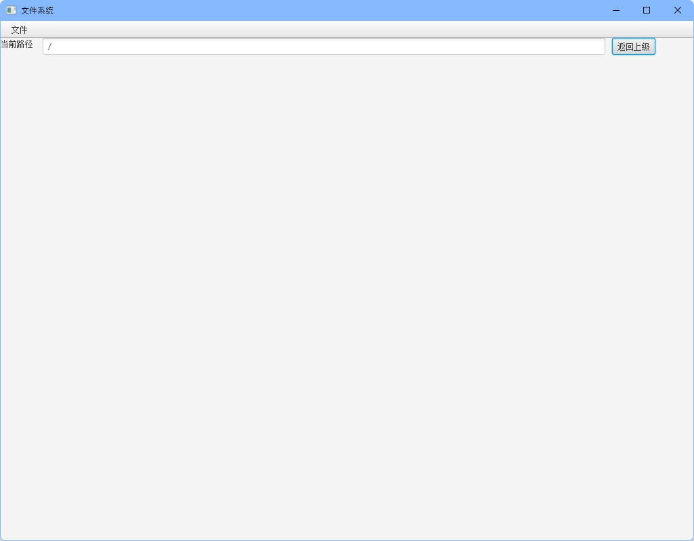

# **实验五： 一个小型磁盘文件管理系统**

## 项目说明

本实验采用JDK1.8和JavaFX图形化框架构建。编译好的可执行文件`FileSystem.jar`在文件夹的根目录，由于新版本的JDK移除了JavaFX，所以最好使用JDK1.8执行。

启动命令：（如果环境变量中是JDK1.8的话，也可以双击执行）

主窗口：

## 功能介绍

基本上仿照Windows 资源管理器，实现了一些最基本的功能。

1. 建立磁盘文件

    在打开软件的时候，会自动在同一目录下建立一个`disk.bin`文件用于模拟磁盘。如果已经存在了一个磁盘文件，就检测其是否有FAT表，没有的话对该文件进行初始化，有的话直接读取文件。

    由于磁盘有128个块，所以但是一个块只有64byte，所以需要使用两个块来储存完整的FAT。使用下面的0个块要指向第1个块。

    刚刚分好区的空磁盘：

    

2. 新建文件夹

    1. 在主界面右键或者使用菜单栏上的文件选项，选择建立文件夹。

    

    

    2. 输入文件夹名称

        

        

    3. 双击可以进入文件夹

        

3. 新建文件

    1. 与文件夹类似，右键或者在文件菜单中可以见到新建文件夹

        

    2. 填入文件的名字和类型

        

    3. 得到文件

        

4. 打开文件

    对文件双击可以打开文件

    

5. 文件编辑

    打开文件之后在里面输入东西可以保存。

    

    

    在2进制文件下验证，在第180行看到了刚刚输入的内容

    

6. 重命名文件

    在文件上右键就可以重命名文件，将123.md改为123.45

    

    

    

    

7. 重命名文件夹

    右键文件夹就能重命名文件夹，将12345改为123

    

    

    

8. 删除文件

    在文件上右键就可以删除文件

    

    

    在二进制文件下验证，刚刚保存到内容已经全部置为0，（180行处）

    

9. 删除文件夹

    支持删除非空的文件夹，在文件夹上右键就好了。

    1. 先在123文件夹内放点内容

    

​		2. 返回上级目录删除123

​			

​			

​			3. 二进制验证，因为删除了根目录下的唯一一个文件夹，所以跟新建的磁盘一样
​				
