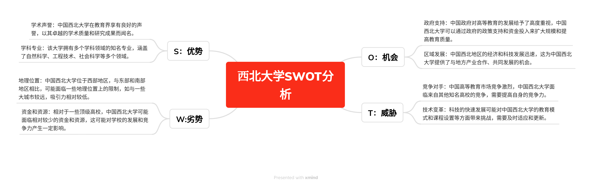

# 第六次作业

1. **第一题**

   1. 根据案例描述，存在几个真正的问题。首先，项目管理存在连续更换项目经理的问题，这会导致项目的连续性和稳定性受到影响。其次，尽管项目团队成功地推出了产品，但项目经理Nick没有充分履行管理职责，如制定准确的进度安排和详细计划，并向高层管理层提交。这导致高层管理对Nick的管理能力不满意。此外，Nick也没有理解高级管理层的关注点，可能缺乏与高层管理层沟通和协调的能力。
   2. 该案例反映了现实中的一个真实场景。在实际项目管理中，经常会出现项目管理层的更替、管理职责不明确以及与高层管理层之间的沟通不畅等问题。这种情况可能导致项目延期、质量问题或者与项目利益相关方的冲突。因此，该案例中描述的问题在实际项目管理中是可能存在的。
   3. 在该案例中，Nick并不是一个好的项目经理。尽管他具备必要的技术背景和解决问题的能力，但他没有充分履行项目经理的职责。他没有制定准确的进度安排和详细计划，并没有向高层管理层提交适当的报告。此外，他对高层管理层的关注点缺乏理解，也没有与他们进行有效的沟通和协调。一个好的项目经理应该能够平衡技术能力和管理能力，并能够有效地与团队成员和高层管理层进行沟通和协调。
   4. 高层管理可以帮助Nick通过以下方式来提升他的项目管理能力：
      1. 提供培训和指导：高层管理可以为Nick提供项目管理培训和指导，帮助他了解项目管理的基本原则和最佳实践。
      2. 明确管理职责：高层管理应该明确告知Nick他在项目中的管理职责和期望，以便他能够正确理解和履行这些职责。
   5. 要成为一个更好的项目经理，Nick可以采取以下措施：
      1. 学习项目管理知识：Nick可以主动学习项目管理的基本原理、方法和工具，通过培训、自学或参与项目管理社群来提升自己的项目管理能力。
      2. 建立准确的进度安排和详细计划：Nick应该学会制定准确的进度安排和详细计划，以确保项目按时交付，并能够向高层管理层提供透明的项目报告。
      3. 提升沟通和协调能力：作为项目经理，沟通和协调是至关重要的技能。Nick可以通过与团队成员和高层管理层保持良好的沟通，建立有效的工作关系，并确保项目目标的理解和达成。
      4. 寻求反馈和持续改进：Nick应该积极寻求反馈，包括从团队成员和高层管理层那里获取反馈。他可以利用这些反馈来识别自己的改进领域，并采取适当的行动来不断提升自己的项目管理能力。

2. **第二题**：对西北大学的SWOT分析

   

3. **第四题**

   1. | Discount Rate             | 7.00%      |           |           |          |           |          |
      | ------------------------- | ---------- | --------- | --------- | -------- | --------- | -------- |
      | Year                      | 1          | 2         | 3         | 4        | Total     |          |
      | Costs                     | 300000     | 40000     | 40000     | 40000    |           |          |
      | Discount factor           | 0.93       | 0.87      | 0.82      | 0.76     |           |          |
      | Discount costs            | 280373.83  | 34937.55  | 32651.92  | 30515.81 | 378479.10 |          |
      |                           |            |           |           |          |           |          |
      | Benefits                  | 120000     | 120000    | 120000    | 120000   |           |          |
      | Discount factor           | 0.93       | 0.87      | 0.82      | 0.76     |           |          |
      | Discount benefits         | 112149.53  | 104812.65 | 97955.75  | 91547.43 | 406465.35 |          |
      |                           |            |           |           |          |           |          |
      | Discount benefits – cost  | -168224.30 | 69875.10  | 65303.83  | 61031.62 | 27986.25  | **←NPV** |
      | Cumulative benefits -cost | -168224.30 | -98349.20 | -33045.37 | 27986.25 |           |          |
      |                           |            |           |           |          |           |          |
      | ROI                       | 0.07       |           |           |          |           |          |

4. **第五题**

   1. | Criteria | Weight  | 学生1 | 学生2 | 学生3 |
      | -------- | ------- | ----- | ----- | ----- |
      | 考试1    | 15.00%  | 100   | 80    | 90    |
      | 考试2    | 25.00%  | 100   | 80    | 75    |
      | 考试3    | 20.00%  | 100   | 80    | 80    |
      | 作业     | 20.00%  | 100   | 90    | 90    |
      | 小组合作 | 20.00%  | 100   | 95    | 70    |
      | Scores   | 100.00% | 100   | 85    | 80.25 |