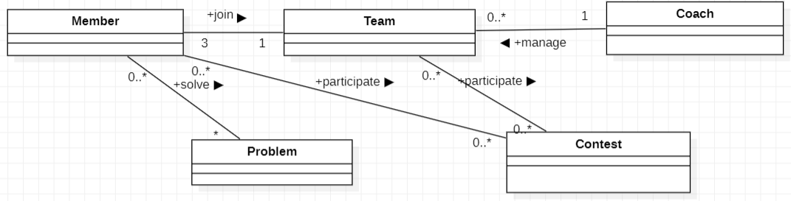
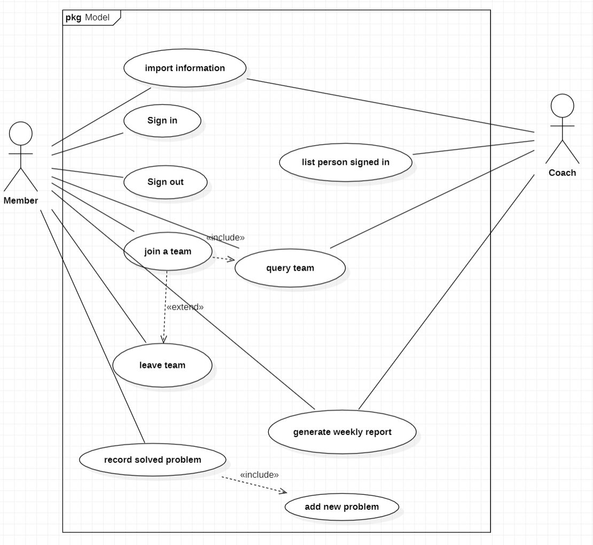
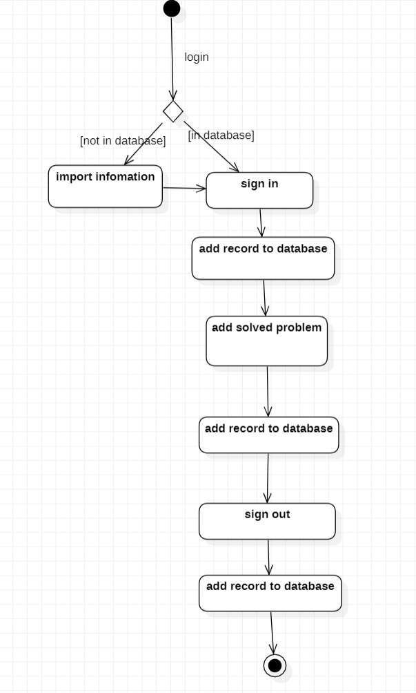

# 系统需求模型

**学号：2021117405**
**姓名：孙潇桐**

### 0. 系统描述

系统名称：集训室队员管理系统。

主要功能：用于管理集训队队员的签到和签退，记录成员信息以及记录日常的训练情况，生成报表等

预期用户：集训室的管理人员和普通队员

第一次迭代的工作范围：先进性系统设计，优先实现签到功能

### 1. 业务建模

#### 1.1 领域模型

**领域类图：**

**术语表**

1. **Team（队伍）:**
   - 队伍的集合，包括队伍ID、队名、教练和队员。
2. **Member（成员）:**
   - 队伍的成员，包括成员ID、姓名、学号和联系方式，根据ICPC的规则，一个队伍3个成员，一个教练
3. **Problem（题目）:**
   - 各个OJ上的题目，包括题目ID和难度。
4. **Coach（教练）:**
   - 队伍管理人员，包括教练的名字。可以查看队员的训练情况。
5. **Contest（比赛）:**
   - 个人或队伍参加的比赛，包括比赛ID、名称、日期和地点。

#### 1.2 用例模型

**用例图：**

**核心用例的描述：**

+ 队员：可以导入自己的信息，签到和签退，加入一个队伍，离开一个队伍（可以在离开后再选择加入另一个队伍），记录自己做出来的题目，查看训练周报
+ 教练：可以导入学生信息，查询队伍情况，生成训练周报

**可选用例**

+ 队员如果发现自己名字打错了可以修改，在系统没有自己信息的时候可以选择录入信息。

#### 1.3 业务流程模型

**活动图：**

