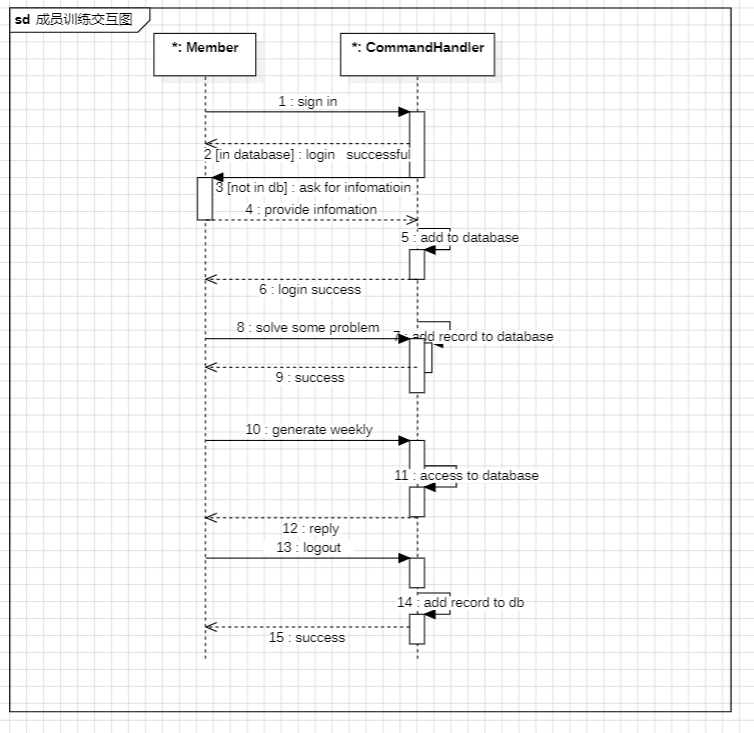
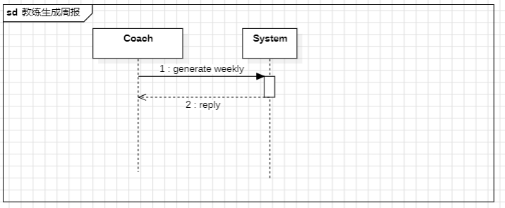
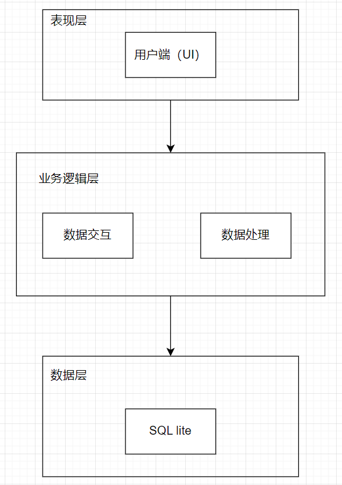
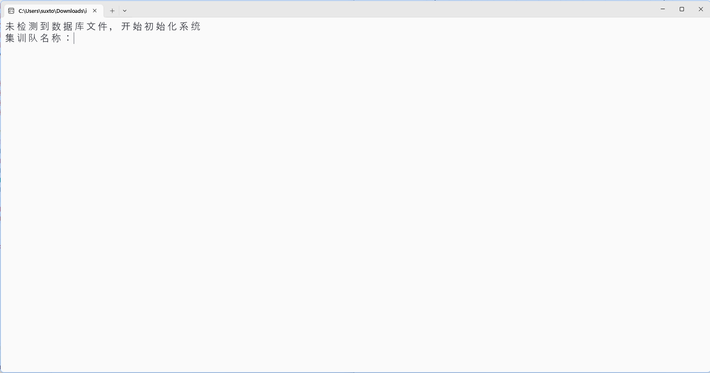
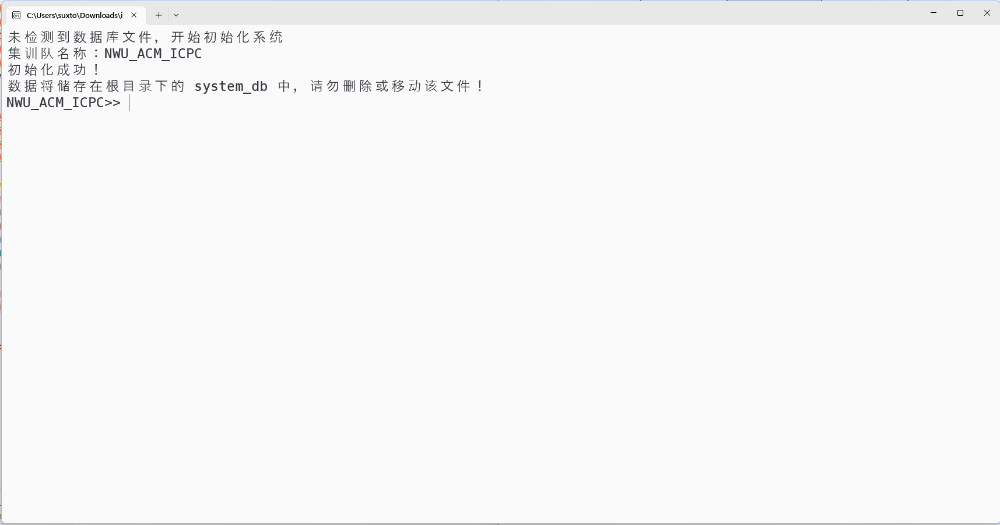
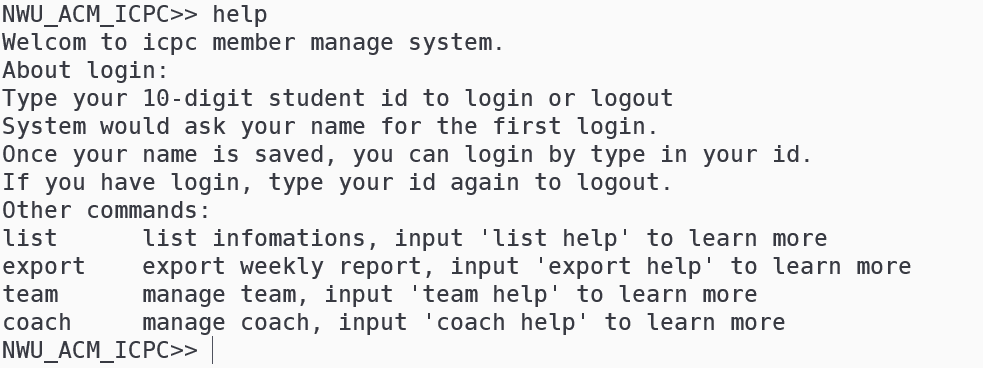
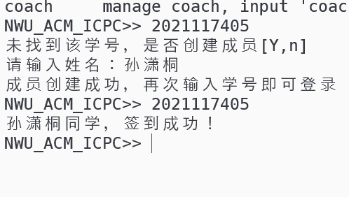
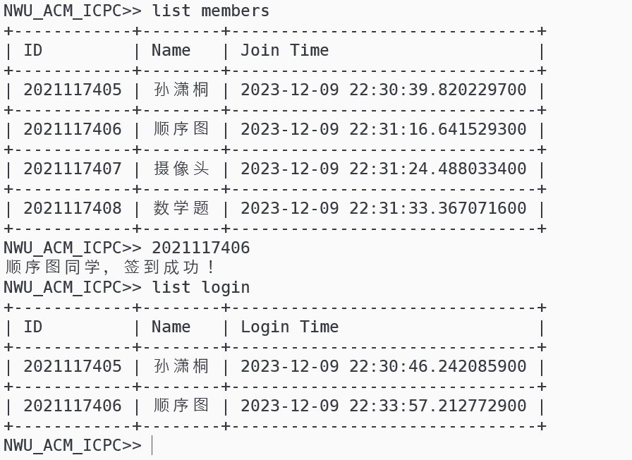
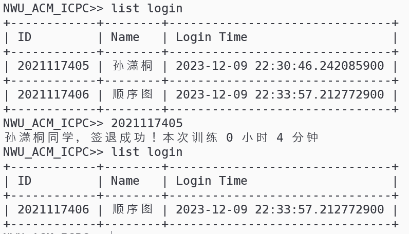
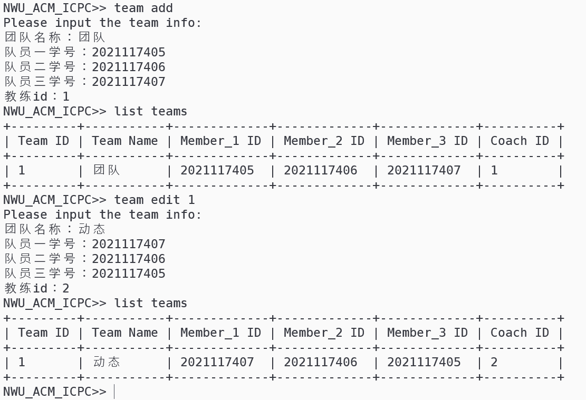

# 系统分析模型

**学号：2021117405**

**姓名：孙潇桐**

### 2. 分析

#### 2.1 用例实现

**成员训练交互图：**

**教练生成周报交互图**

#### 2.2 分析类图

#### 2.3 系统体系结构描述 

**系统架构描述：**

**表现层（UI）、业务逻辑层（BLL）以及数据层（DL）。**

**表现层（UI）**：UI层，主要完成本集训室队员管理系统的UI交互功能，由于我们要跑在服务器上，没有图形化界面，我将使用类似于 `shell` 的方式让用户与系统进行交互

**业务逻辑层（BLL）**：主要完成本集训室队员管理的数据处理功能。用户从表现层传输过来的数据经过业务逻辑层进行处理交付给数据层，系统从数据层读取的数据经过业务逻辑层进行处理交付给表现层。

**数据层（DL）：**由于本集训室队员管理的数据是放在`sql_lite`数据库中，因为要储存的数据不多，而且`sql lite` 可以将数据储存在一个文件中，方便移动系统。

**用户界面原型：**

