# UML 课程实践报告

**学号：2021117405**
**姓名：孙潇桐**

## 系统需求模型

### 0. 系统描述

系统名称：集训室队员管理系统。

主要功能：用于管理集训队队员的签到和签退，记录成员信息以及记录日常的训练情况，生成报表等

预期用户：集训室的管理人员和普通队员

第一次迭代的工作范围：先进性系统设计，优先实现签到功能

### 1. 业务建模

#### 1.1 领域模型

**领域类图：**


**术语表**

1. **Team（队伍）:**
    - 队伍的集合，包括队伍ID、队名、教练和队员。
2. **Member（成员）:**
    - 队伍的成员，包括成员ID、姓名、学号和联系方式，根据ICPC的规则，一个队伍3个成员，一个教练
3. **Problem（题目）:**
    - 各个OJ上的题目，包括题目ID和难度。
4. **Coach（教练）:**
    - 队伍管理人员，包括教练的名字。可以查看队员的训练情况。
5. **Contest（比赛）:**
    - 个人或队伍参加的比赛，包括比赛ID、名称、日期和地点。

#### 1.2 用例模型

**用例图：**

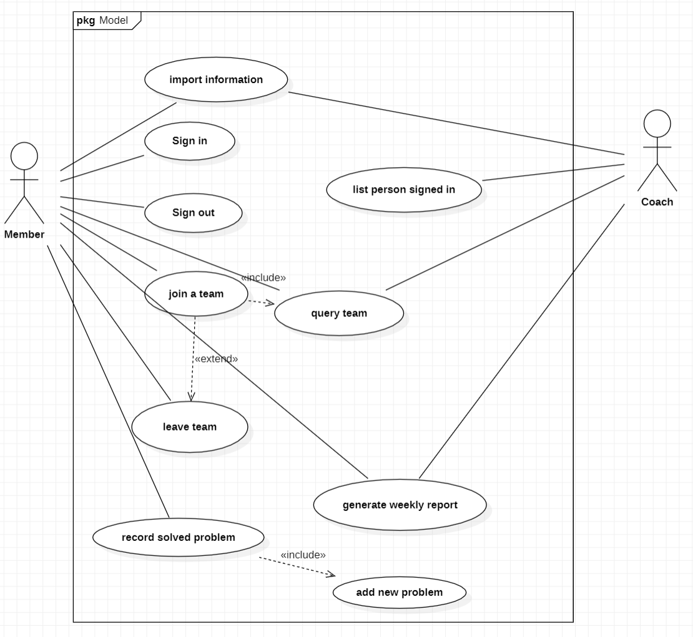

**核心用例的描述：**

+ 队员：可以导入自己的信息，签到和签退，加入一个队伍，离开一个队伍（可以在离开后再选择加入另一个队伍），记录自己做出来的题目，查看训练周报
+ 教练：可以导入学生信息，查询队伍情况，生成训练周报

#### 1.3 业务流程模型

**活动图：**


## 系统分析模型

### 2. 分析

#### 2.1 用例实现

**成员训练交互图：**

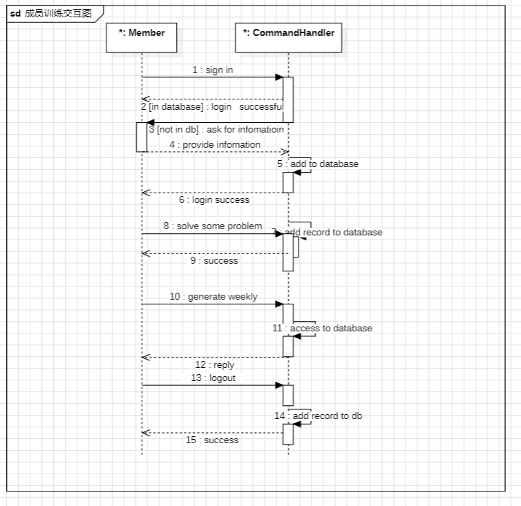

**教练生成周报交互图**


#### 2.2 分析类图

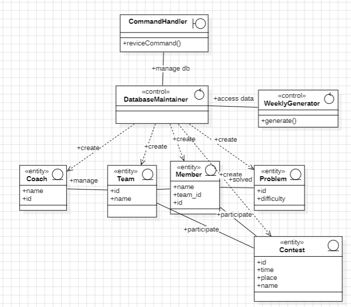

#### 2.3 系统体系结构描述 

**系统架构描述：**

**表现层（UI）、业务逻辑层（BLL）以及数据层（DL）。**

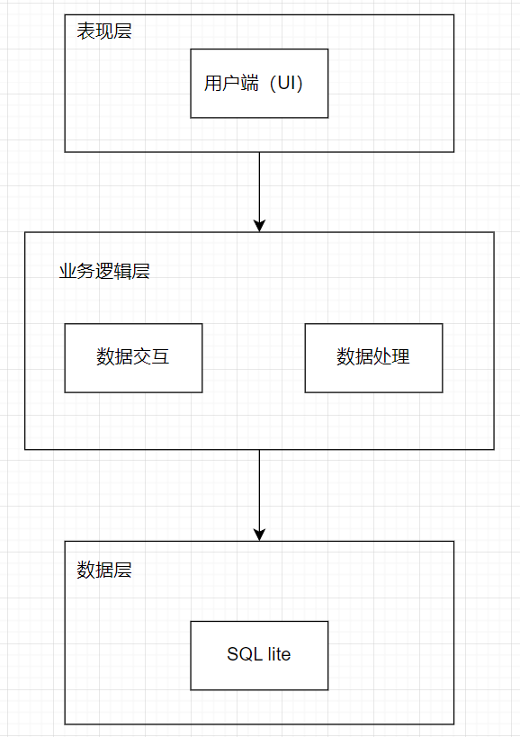

**表现层（UI）**：UI层，主要完成本集训室队员管理系统的UI交互功能，由于我们要跑在服务器上，没有图形化界面，我将使用类似于 `shell` 的方式让用户与系统进行交互

**业务逻辑层（BLL）**：主要完成本集训室队员管理的数据处理功能。用户从表现层传输过来的数据经过业务逻辑层进行处理交付给数据层，系统从数据层读取的数据经过业务逻辑层进行处理交付给表现层。

**数据层（DL）：**由于本集训室队员管理的数据是放在`sql_lite`数据库中，因为要储存的数据不多，而且`sql lite` 可以将数据储存在一个文件中，方便移动系统。

**用户界面原型：**

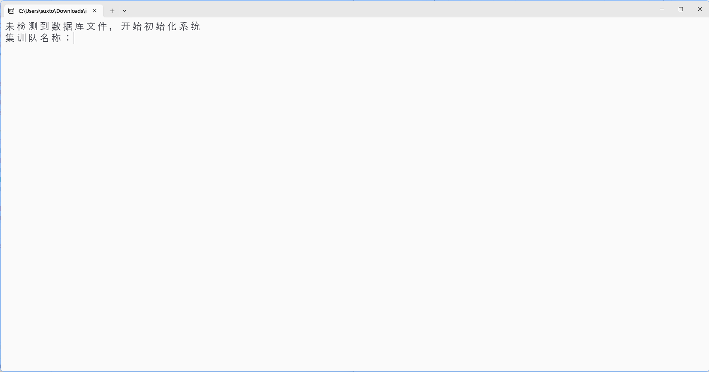

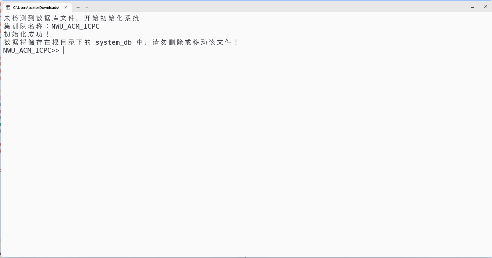


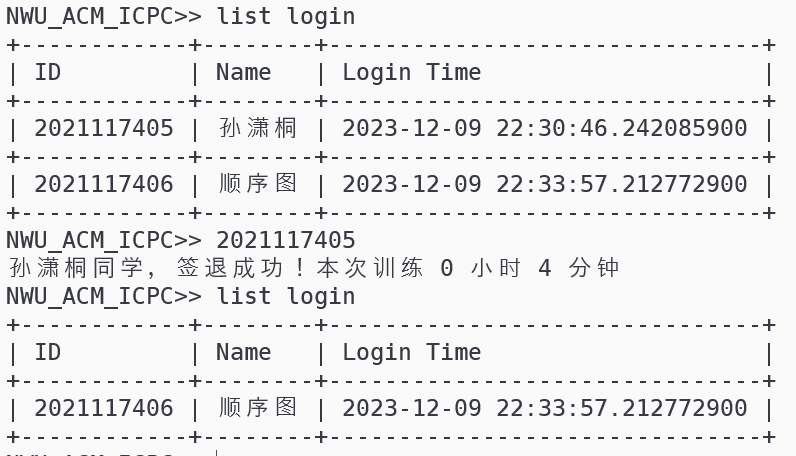


## 系统设计模型

### 3. 设计

#### 3.1 对象设计

**交互图：**

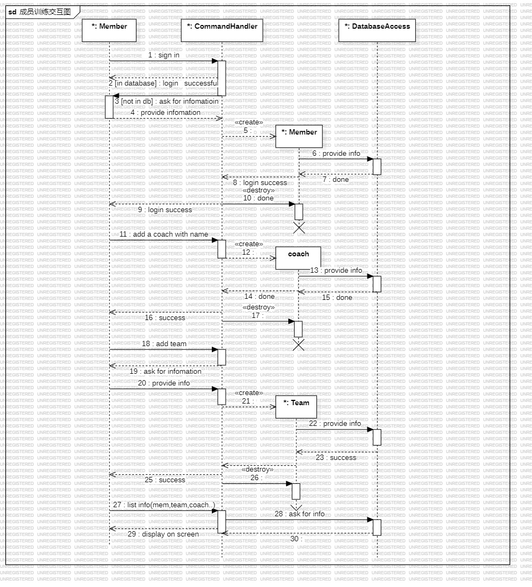

**设计类图：**

**概要类图**，分为三个层次，最上面的是UI类，下面的是业务层，最小面的是实体和数据库访问类。

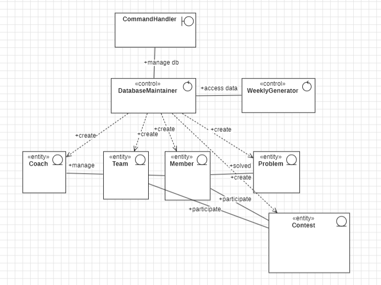

**关键类详细设计：**

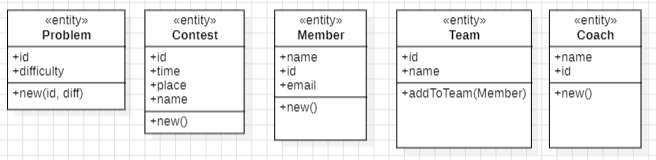

**状态图：重要对象的状态机**

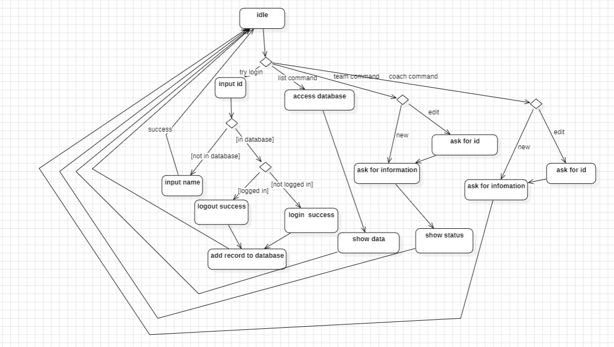

#### 3.2 用户界面设计

**实现的语言：** **Rust语言**，因为 `rust`  的效率很高，运行开销小，而且是跨平台的，在不同的系统下编译即可。还有一点最重要的是 `rust` 内部编码就是 `UTF-8`  这让用 `rust` 编写的程序能很轻易的支持中文的输入、输出和处理，不用担心乱码的问题。

**界面原型：**因为我的这个系统需要放在集训室的服务器上在命令行运行，所以只实现了命令行界面，但是尽可能在命令行界面下实现的简单易用，我使用了 `rustyline` 库，使得用户可以像与 `shell` 交互一样与集训队管理系统交互。

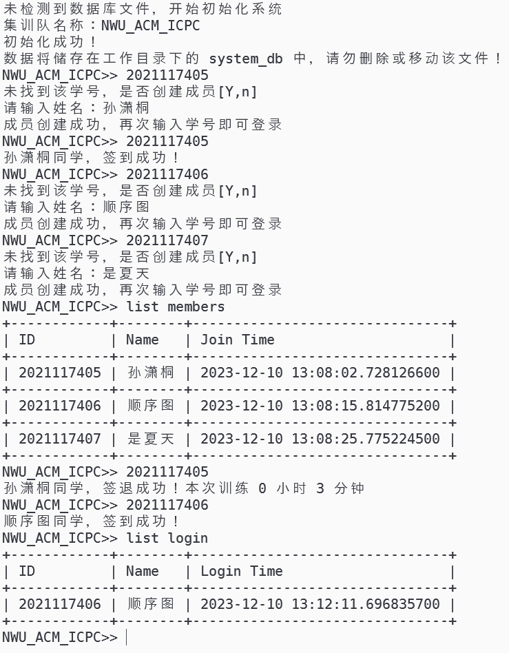

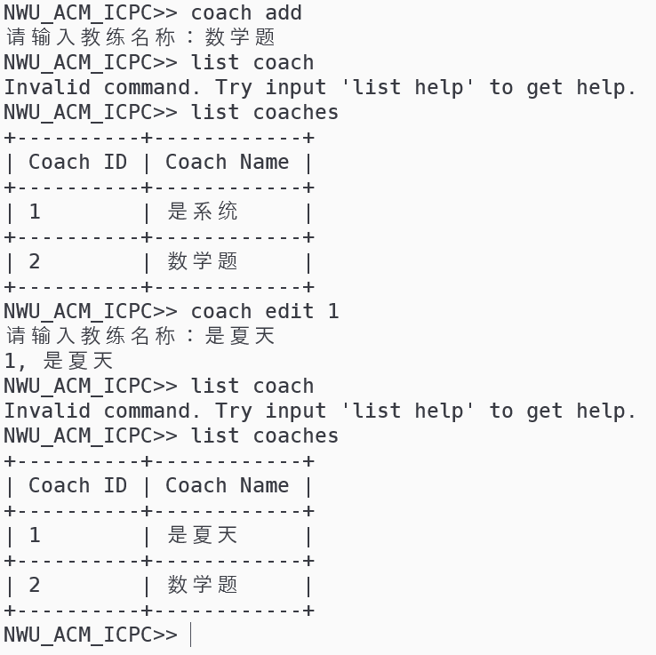

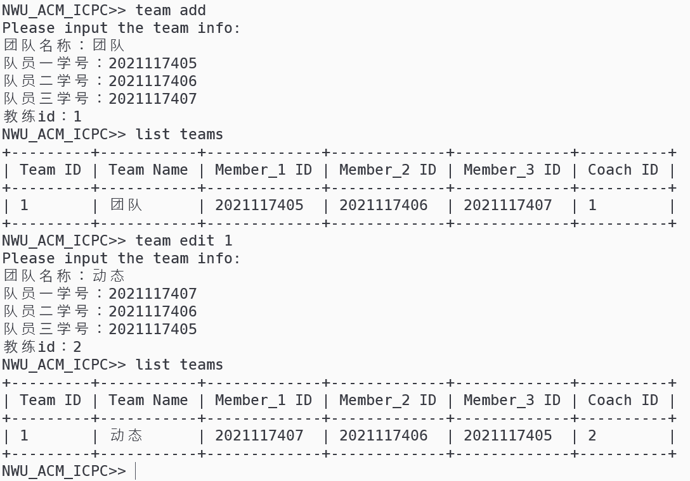

#### 3.3 数据库设计

为了方便移动，使用的是 `sql lite` 数据库，将数据储存在工作目录下的 `system_db` 中，使用了 `rusqlite` 库与数据库交互。

**ER图：**

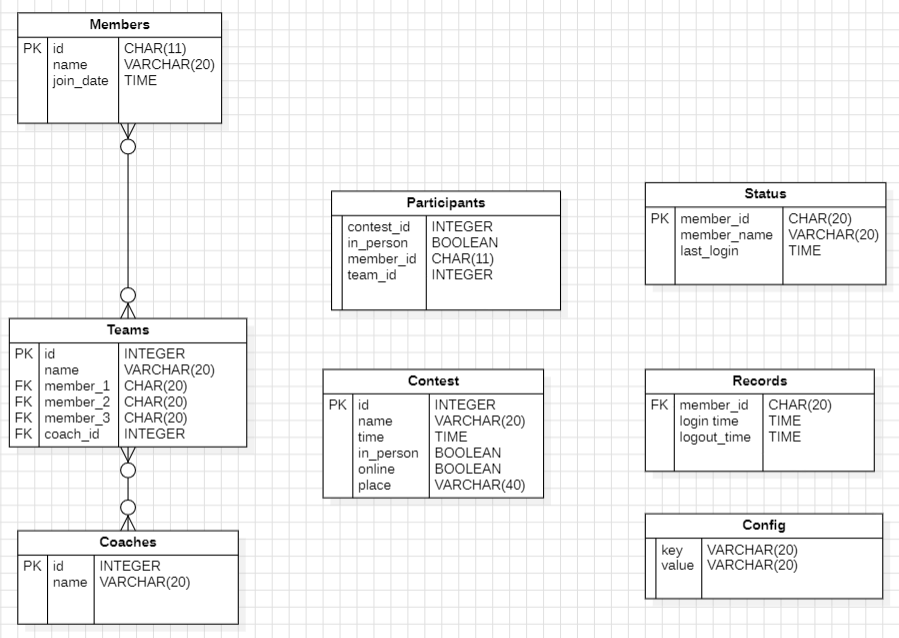

**数据库访问类**：我对带有 `SQL` 语句的操作都进行了包装，都放在了 `database_access` 模块中，在业务层都是完全面向对象的。

下面是：`database_access.rs`

```rust
use super::entities::*;
use chrono::{Local, NaiveDateTime};
use rusqlite::Error;
use rusqlite::{params, Connection};

pub fn init_db(name: String, connection: &Connection) -> Result<(), Error> {
    connection.execute(
        "CREATE TABLE Config (
            key VARCHAR(20),
            value VARCHAR(20)
        )",
        params![],
    )?;
    connection.execute(
        "INSERT INTO Config (key,value) VALUES (?1,?2)",
        ["training_squad_name".to_string(), name],
    )?;
    connection.execute(
        "CREATE TABLE Members(
             id        CHAR(11) PRIMARY KEY,
             name      VARCHAR(20),
             join_time DATETIME
        );",
        params![],
    )?;
    connection.execute(
        "CREATE TABLE Teams(
                id       INTEGER PRIMARY KEY AUTOINCREMENT,
                name     VARCHAR(20),
                member_1 CHAR(20),
                member_2 CHAR(20),
                member_3 CHAR(20),
                coach_id INTEGER
        )",
        [],
    )?;
    connection.execute(
        "CREATE TABLE Contests(
                id        INTEGER PRIMARY KEY AUTOINCREMENT,
                name      VARCHAR(20),
                time      DATETIME,
                in_person BOOLEAN,
                online    BOOLEAN,
                place     VARCHAR(40)
        )",
        [],
    )?;
    connection.execute(
        "CREATE TABLE Coaches(
            id   INTEGER PRIMARY KEY AUTOINCREMENT,
            name VARCHAR(20)
        )",
        [],
    )?;
    connection.execute(
        "CREATE TABLE Participants(
            contest_id INTEGER,
            in_person  BOOLEAN,
            member_id  CHAR(11),
            team_id    INTEGER
        )",
        [],
    )?;
    connection.execute(
        "CREATE TABLE Status(
            member_id  CHAR(20) PRIMARY KEY,
            member_name VARCHAR(20),
            last_login DATETIME
        );",
        [],
    )?;
    connection.execute(
        "CREATE TABLE Records(
            member_id   CHAR(11),
            login_time  DATETIME,
            logout_time DATETIME
        )",
        [],
    )?;

    // connection.execute(
    //     "",
    //     [],
    // )?;
    Ok(())
}

pub fn add_member(connection: &Connection, member: &Member) -> Result<(), Error> {
    let [id, name] = member.to_arr();
    connection.execute(
        "INSERT INTO Members
        VALUES (?1, ?2, ?3)",
        [id, name, &Local::now().naive_local().to_string()],
    )?;
    connection.execute(
        "INSERT INTO Status
        VALUES (?1, ?2, NULL)",
        [id, name],
    )?;
    Ok(())
}

pub fn log_in_or_out(connection: &Connection, member: &Member) -> Result<(), Error> {
    let [id, name] = member.to_arr();
    match connection.query_row(
        "SELECT last_login FROM Status WHERE member_id = ?1",
        [id],
        |row| row.get(0),
    ) {
        Ok(time) => {
            let time: String = time;
            let last_login = NaiveDateTime::parse_from_str(&time, "%Y-%m-%d %H:%M:%S%.f").unwrap();
            let current_time = Local::now().naive_local();
            let time_difference = current_time.signed_duration_since(last_login);
            let hours = time_difference.num_hours();
            let minutes = time_difference.num_minutes() % 60;
            connection.execute(
                "UPDATE Status SET last_login = NULL WHERE member_id = ?1",
                [id],
            )?;
            connection.execute(
                "INSERT INTO Records VALUES (?1, ?2, ?3)",
                [id, &time, &current_time.to_string()],
            )?;
            println!("{name}同学，签退成功！本次训练 {hours} 小时 {minutes} 分钟");
        }
        Err(_) => {
            connection.execute(
                "UPDATE Status SET last_login = ?1 WHERE member_id = ?2",
                [&Local::now().naive_local().to_string(), id],
            )?;
            println!("{name}同学，签到成功！");
        }
    }
    Ok(())
}

pub fn query_member(connection: &Connection, id: &String) -> Result<Member, Error> {
    let (id, name) =
        connection.query_row("SELECT id, name FROM Members WHERE id = ?1", &[id], |row| {
            Ok((row.get(0)?, row.get(1)?))
        })?;
    Ok(Member::new(&id, &name))
}

pub fn get_squad_name(connection: &Connection) -> Result<String, Error> {
    let name: String = connection.query_row(
        "SELECT value FROM Config WHERE key = 'training_squad_name'",
        [],
        |row| row.get(0),
    )?;
    Ok(name)
}

pub fn get_members(conn: &Connection, get_login: bool) -> Result<Vec<Member>, Error> {
    let sql = match get_login {
        true => {
            "SELECT member_id, member_name, last_login FROM Status WHERE last_login IS NOT NULL"
        }
        false => "SELECT id, name, join_time FROM Members",
    };
    let mut stmt = conn.prepare(sql)?;
    let member_iter = stmt.query_map([], |row| {
        Ok(Member::new_with_time(
            &row.get(0)?,
            &row.get(1)?,
            &row.get(2)?,
        ))
    })?;
    let members: Vec<Member> = member_iter.filter_map(Result::ok).collect();
    Ok(members)
}
pub fn get_teams(conn: &Connection) -> Result<Vec<Team>, Error> {
    let sql = "SELECT id, name, member_1, member_2, member_3, coach_id FROM Teams";
    let mut stmt = conn.prepare(sql)?;
    let team_iter = stmt.query_map([], |row| {
        Ok(Team::new(
            row.get(0)?,
            row.get(1)?,
            row.get(2)?,
            row.get(3)?,
            row.get(4)?,
            row.get(5)?,
        ))
    })?;
    let teams: Vec<Team> = team_iter.filter_map(Result::ok).collect();
    Ok(teams)
}

pub fn add_team(conn: &Connection, team: &Team) -> Result<(), Error> {
    let sql = "INSERT INTO Teams(name, member_1, member_2, member_3, coach_id) VALUES (?1, ?2, ?3, ?4, ?5)";
    conn.execute(sql, team.to_arr_without_id())?;
    Ok(())
}

pub fn update_team(conn: &Connection, team: &Team) -> Result<(), Error> {
    let sql = "UPDATE Teams SET name = ?1, member_1 = ?2, member_2 = ?3, member_3 = ?4, coach_id = ?5 WHERE id = ?6";
    conn.execute(sql, team.to_arr())?;
    Ok(())
}

pub fn get_coaches(conn: &Connection) -> Result<Vec<Coach>, Error> {
    let sql = "SELECT id, name FROM Coaches";
    let mut stmt = conn.prepare(sql)?;
    let coach_iter = stmt.query_map([], |row| Ok(Coach::new(row.get(0)?, row.get(1)?)))?;
    let coaches: Vec<Coach> = coach_iter.filter_map(Result::ok).collect();
    Ok(coaches)
}

pub fn add_coach(conn: &Connection, coach_name: &String) -> Result<(), Error> {
    let sql = "INSERT INTO Coaches(name) VALUES (?1)";
    conn.execute(sql, [coach_name])?;
    Ok(())
}

pub fn update_coach(conn: &Connection, coach: &Coach) -> Result<(), Error> {
    let sql = "UPDATE Coaches SET name = ?1 WHERE id = ?2";
    conn.execute(sql, coach.to_arr())?;
    Ok(())
}

#[cfg(test)]
mod tests {
    use rusqlite::{Connection, OpenFlags};

    use crate::database_access::get_members;
    #[allow(dead_code)]
    fn get_connection() -> Connection {
        Connection::open_with_flags(
            "system_db",
            OpenFlags::SQLITE_OPEN_READ_WRITE | OpenFlags::SQLITE_OPEN_CREATE,
        )
        .unwrap()
    }
    #[allow(dead_code)]
    #[test]
    fn test_query() {
        let conn = get_connection();
        println!("{:?}", get_members(&conn, true));
        // println!("{}", chrono::Local::now().date_naive().to_string())
    }
}

```

### 4. 实现

**源代码清单：**将提交附件`icpc_member_manager.rar` ，解压后得到一个 cargo 工程，在工程文件夹下使用 `cargo run` 就能编译运行（按照cargo以及rust工具链）。清单：

```
icpc_member_manager
│   Cargo.lock 
│   Cargo.toml // rust的项目配置文件
└───src
        command_handler.rs // 命令处理类
        database_access.rs // 与数据库交互的类
        entities.rs // 实体类
        main.rs // 主程序入口
```

**可执行程序：** 为了方便运行，我编译了一份在Windows下可以运行的 `release` 版本，用于测试，名字叫 `icpc_member_manager.exe`

**系统测试和评估报告：**

系统已经在我们的 `ACM_ICPC` 协会集训室用于签到和队伍的管理，当前运行良好，未发现任何 bug。

