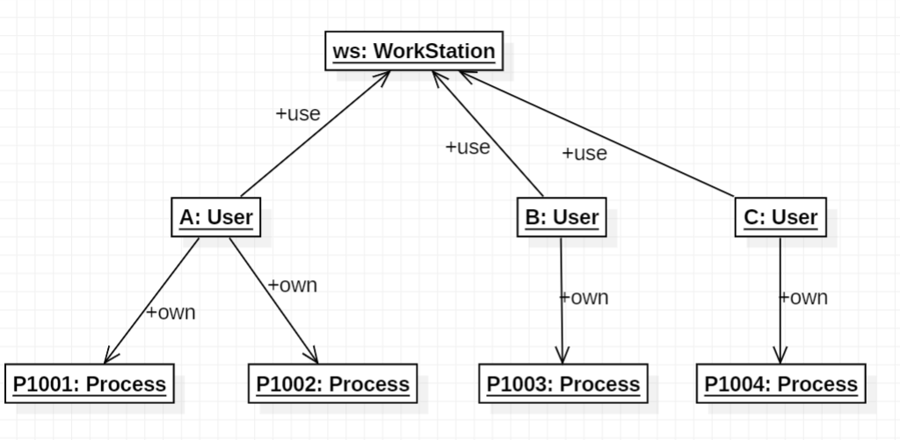
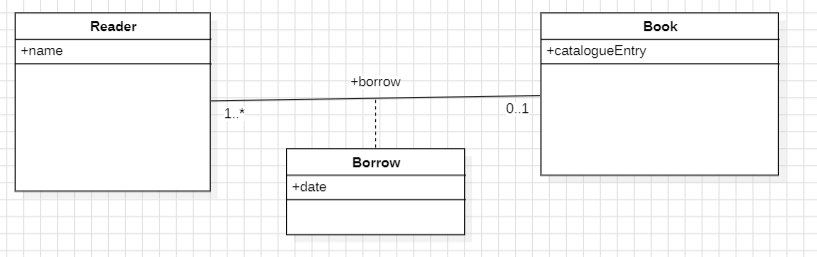
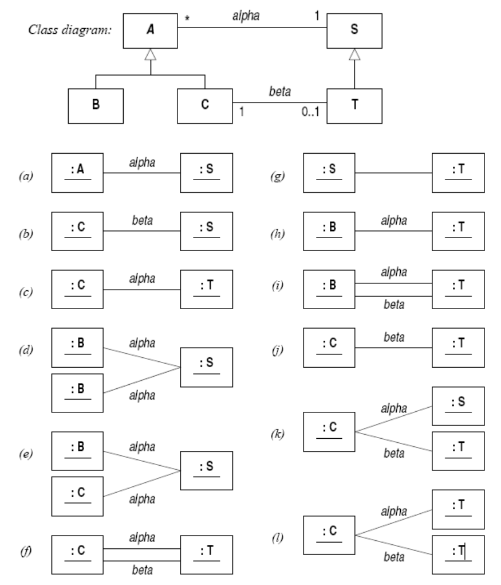
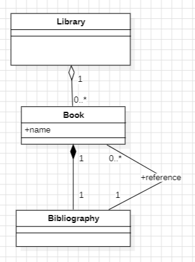

# 9-19 类图作业题

1. **窗户和矩形**

   

2. **监测站**

   1. 对象图
      1. 
   2. 我将在对象图中用数字标记顺序
      1. 
   3. 类图
      1. 

3. **工作站**

   1. 对象图

      1. 

   2. 操作

      1. 类图

      2. 信息传递

         

4. **交通灯**

   1. 

   2. 

   3. 

5. **多重性关系**

   1. 寄出
       1. 
   2. 阅读
       1. 
   3. 占据
       1. 
   4. 配偶
       1. 
   5. 父母
       1. 

6. **类图辨析**

    

    1. 合法
    2. 不合法，C不能单独存在，必须关联一个D
    3. 不合法，不能有两个C与D关联
    4. 不合法，C不能关联两个D
    5. 不合法，D不能与自己关联
    6. 合法

7. **类图辨析**

    ​										

    1. 合法
    2. 不合法，D必须链接一个C
    3. 合法
    4. 不合法，不能有两个C与D关联
    5. 合法
    6. 不合法，有个D连接了两个C

8. **修改类图**

    1. 

9. **类图辨析**

    

    1. a合法
    2. b不合法，S没有其子类中的beta联系
    3. c合法
    4. d合法
    5. e合法
    6. f合法
    7. g不合法，父类和子类之间没有直接关联
    8. h不合法，T必须与一个C关联
    9. i不合法，B与T没有beta联系
    10. j不合法，A类必须alpha链接一个S类
    11. k合法
    12. l不合法，不能只有beta链接，必须同时存在alpha链接

10. **图书馆存款**

    1. 

11. **绘图工作站**

        1. 

12. **订单**

        

13. **英国银行**

        

14. **编程语言**

       

15. **电子桌子**

      

16. **Emacs**

      

17. **桌面**

      

18. **工作站**

     

19. **图书馆**

     

20. **EN**
     